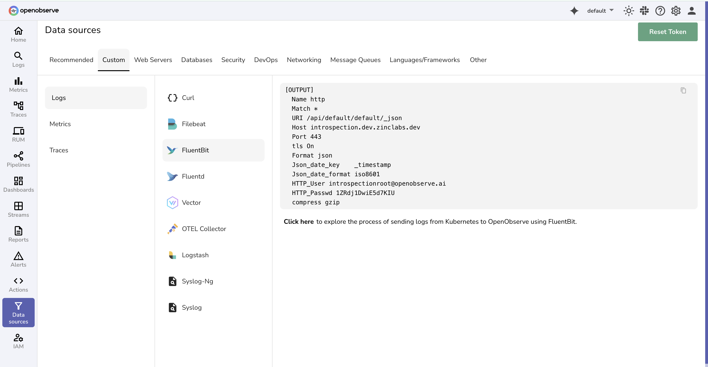

# Ingest logs from Amazon ECS using AWS firelens

This guide provides step-by-step instructions to integrate Amazon Elastic Container Service (ECS) with OpenObserve for log ingestion using AWS FireLens.

## Introduction

To send logs from ECS tasks (Fargate or EC2, Linux) to OpenObserve, use AWS FireLens with a Fluent Bit sidecar. FireLens routes container logs in ECS tasks to Fluent Bit, which then forwards them to OpenObserve.

We recommend Fluent Bit over Fluentd due to its lower resource usage. For existing tasks, update the task definition to include the Fluent Bit sidecar.

> A sidecar is just an extra container that runs in the same ECS task (or Kubernetes pod) as your main application container, but it provides a supporting service rather than running the main app.


## Steps to Integrate

??? "Prerequisites"

    1. An [OpenObserve Cloud](https://cloud.openobserve.ai) account or OpenObserve self hosted setup.
    1. A running ECS cluster that supports fargate. If you don't already have one, create one by following the [documentation](https://docs.aws.amazon.com/AmazonECS/latest/userguide/create-cluster-console-v2.html).

    We will run our tasks using fargate for this demonstration.

??? "Get OpenObserve Credentials"

    You can find the config details under Data sources -> fluentbit

    

    You can use the configuration details from this section in your task definition

??? "Create ECS task definition"

    1. Create the following file and save it as "nginx_firelens_zo_task_def.json"
    ```json title="ECS task definition - nginx_firelens_zo_task_def.json" linenums="1" hl_lines="4 24 44-54"
    {
      "family": "nginx_firelens_zo1",
      "taskRoleArn": "arn:aws:iam::058694856476:role/ecsTaskBasicRole",
      "executionRoleArn": "arn:aws:iam::058694856476:role/ecsTaskExecutionRole",
      "cpu": "512",
      "memory": "1024",
      "requiresCompatibilities": ["FARGATE"],
      "networkMode": "awsvpc",
      "containerDefinitions": [
        {
          "name": "log_router",
          "image": "docker.io/amazon/aws-for-fluent-bit:latest",
          "essential": true,
          "firelensConfiguration": {
            "type": "fluentbit",
            "options": {
              "enable-ecs-log-metadata": "true"
            }
          },
          "logConfiguration": {
            "logDriver": "awslogs",
            "options": {
              "awslogs-create-group": "true",
              "awslogs-group": "firelens-container",
              "awslogs-region": "us-west-2",
              "awslogs-stream-prefix": "firelens"
            }
          }
        },
        {
          "name": "nginx",
          "image": "nginx",
          "portMappings": [
            {
              "containerPort": 80
            }
          ],
          "essential": true,
          "environment": [],
          "logConfiguration": {
            "logDriver": "awsfirelens",
            "secretOptions": [],
            "options": {
              "Name": "http",
              "Match": "*",
              "uri": "/api/default/ecs_firelens1/_json",
              "host": "api.openobserve.ai",
              "Port": "443",
              "Format": "json",
              "tls": "on",
              "Json_date_key": "_timestamp",
              "Json_date_format": "iso8601",
              "http_User": "userid@domain.com",
              "http_Passwd": "67qlgdw673R2905"
            }
          }
        }
      ]
    }
    ```
     >  - `logDriver` in this case is `awsfirelens`. All the logs for nginx container will be sent to fluentbit using `awsfirelens`.
     > - `options` section has [http output plugin](https://docs.fluentbit.io/manual/pipeline/outputs/http) configuration for fluentbit. Configure this section with the values you got from OpenObserve.

    2. Register the task definition using the below command:
      ```shell
      aws ecs register-task-definition --cli-input-json file://nginx_firelens_zo_task_def.json
      ```
      We will also need to provide network configuration when using networkMode as `awsvpc` during service creation. Let's create a json file for that:
      ```json title="Network configuration - network_config.json" linenums="1" hl_lines="10"
      {
        "awsvpcConfiguration": {
          "subnets": ["subnet-12345678", "subnet-23456789"],
          "securityGroups": ["sg-12345678"],
          "assignPublicIp": "ENABLED"
        }
      }
      ```

    > **Note**: `Do not` set `assignPublicIp` on line `10` as ENABLED for real world scenarios. You do not want to access tasks directly. We are doing this now only for demonstration. You should always either front the services with a load balancer or AWS `Cloud Map`.

??? "Create ECS service"

    Now let's create an ECS `service` that will use this task definition.

    Assuming the name of your cluster - `ecs1_fargate_cluster1` run below command:

    ```shell
    aws ecs create-service --cluster ecs1_fargate_cluster1 \
        --service-name nginx_zo1 \
        --task-definition nginx_firelens_zo1 \
        --network-configuration file://network_config.json \
        --desired-count 1 \
        --launch-type "FARGATE"
    ```

??? "Verify result"

    1. If all goes well, you should see a running service on ECS console:
      

    2. Now click on the tasks tab. You should see a task running as part of the service:
      

    3. Now click on the task:
      

    4. You should see the `Public IP` for the task. Click `open address`. You should see the following page:
      
    
    5. Now head on the OpenObserve / OpenObserve Cloud and see the logs flowing in there.
      

## Conclusion

AWS firelens provides an easy way to send ECS container logs to OpenObserve. We configured AWS firelens in few steps to send logs to OpenObserve / OpenObserve Cloud. to easily view and analyze logs.
