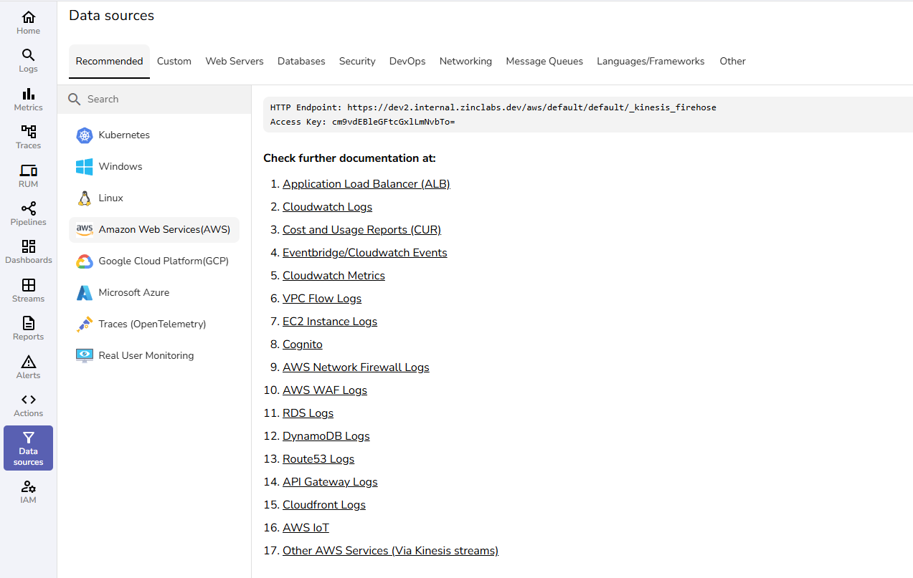

# AWS Monitoring & Cloud Observability Integration

OpenObserve provides comprehensive AWS monitoring integrations to collect logs, metrics, and events from AWS services. Monitor AWS infrastructure, serverless applications, containers, and cloud resources with unified observability for AWS CloudWatch, EC2, Lambda, ECS, RDS, and more.

These AWS monitoring integrations enable cloud observability, infrastructure monitoring, and application performance monitoring across your AWS cloud workloads.

## AWS Services Integration Guides

- [Amazon EC2](ec2.md)
- [Application Load Balancer(ALB)](alb.md)
- [Amazon Virtual Private Cloud](vpc-flow.md)
- [Amazon Cognito](cognito.md)
- [AWS Network Firewall](network-firewall.md)
- [AWS Cloudwatch logs](cloudwatch-logs.md)
- [AWS Cloudwatch metrics](cloudwatch-metrics.md)
- [Amazon Relational Database Service (RDS)](rds.md)
- [Amazon Elastic Container Service (ECS)](ecs.md)
- [AWS Route 53](route-53.md)
- [AWS Web Application Firewall (WAF)](waf.md)
- [API Gateway logs](api-gateway.md)
- [Amazon CloudFront](cdn.md)
- [Amazon EventBridge](eventbridge.md)