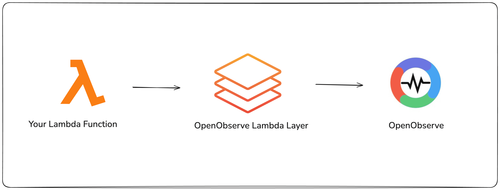
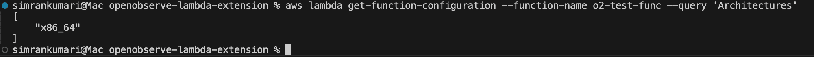
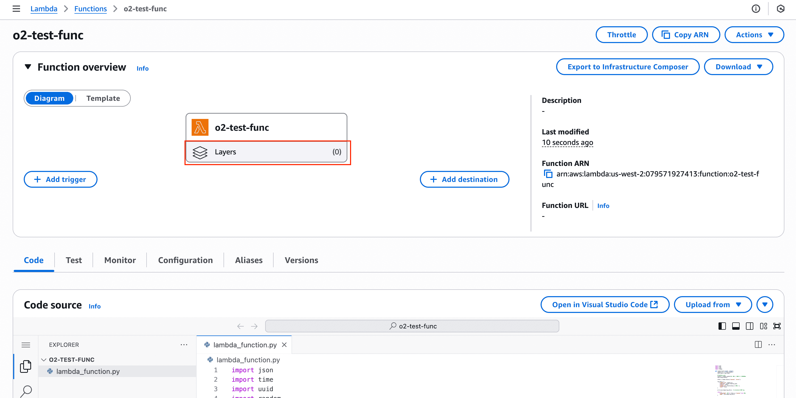
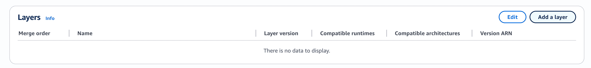
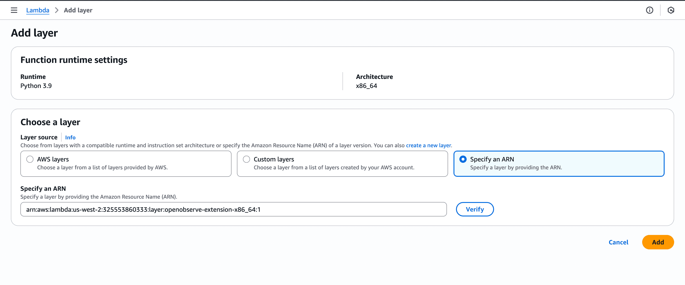
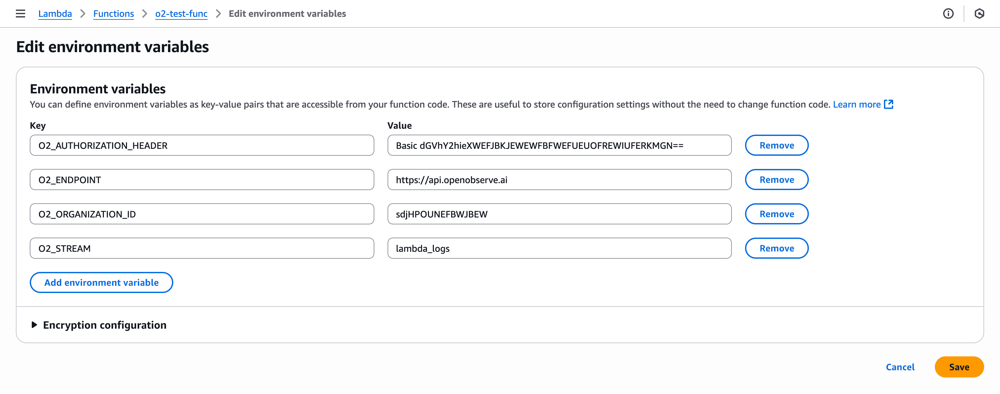
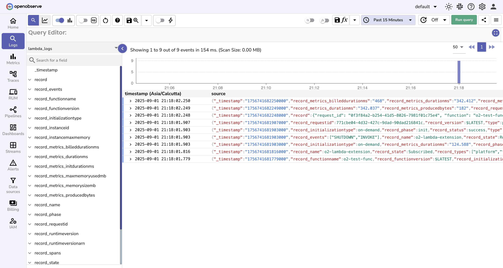
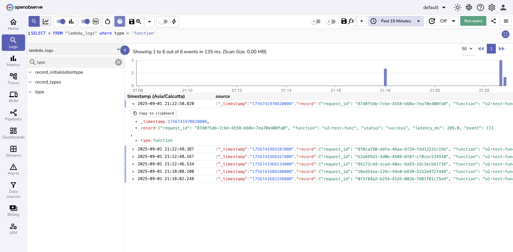

# Integration with AWS Lambda Extension

This guide explains how to stream **AWS Lambda logs directly to OpenObserve** using the OpenObserve Lambda Extension.  
With this integration, you can bypass CloudWatch, reduce costs, and achieve **real-time observability** for serverless workloads.

## Overview

The [OpenObserve Lambda Extension](https://github.com/openobserve/openobserve-lambda-extension) runs alongside your Lambda function and forwards logs directly to OpenObserve.  
This eliminates the need to store or process logs in CloudWatch, while still giving you centralized log analysis, dashboards, and alerts in OpenObserve.

{:style="height:300px"}

## Steps to Integrate

??? "Prerequisites"
    - OpenObserve account ([Cloud](https://cloud.openobserve.ai/web/) or [Self-Hosted](../../../getting-started/#self-hosted-installation))  
    - AWS account with:
        - A Lambda function  
        - IAM permissions to update environment variables and layers  
    - AWS CLI installed and configured

??? "Step 1: Check Your Lambda Architecture"
    You can check your Lambda architecture using the command:

    ```
    aws lambda get-function-configuration --function-name <function_name> --query 'Architectures'
    ```
    
    Based on the returned architecture (x86_64 or arm64), copy the compatible ARN values for the OpenObserve Lambda Extension layer.

    - For x86_64: `arn:aws:lambda:<aws_region_id>:325553860333:layer:openobserve-extension-x86_64:1`
    - For arm64: `arn:aws:lambda:<aws_region_id>:325553860333:layer:openobserve-extension-arm64:1`

    > Note: Make sure <aws_region_id> matches the region where your Lambda function is deployed, as Lambda layers are regional. Using an ARN from a different region will not work.

??? "Step 2: Add OpenObserve Lambda Extension Layer"

    1. In AWS Lambda console, open your target function  
    
    2. Go to **Layers → Add a Layer**  
    
    3. Choose “Specify an ARN” and Paste the ARN you got from Step 1
    
    4. Save the changes  

??? "Step 3: Configure Environment Variables"

    1. Go to your Lambda function → Configuration tab → Environment variables
    2. Add the following environment variables in your Lambda function:  

    | Key                       | Value Example                                |
    |---------------------------|----------------------------------------------|
    | `O2_ENDPOINT`             | `https://<your-domain>:5080`                 |
    | `O2_AUTHORIZATION_HEADER` | `Basic <your-api-key>`                      |
    | `O2_ORGANIZATION_ID`      | `<your-org-id>`                              |
    | `O2_STREAM`               | `<stream_name>` |

    > Note: You can fetch these credentials from OpenObserve UI, Go to Data Sources -> Logs -> OTEL Collector
    
    

    > Security Note: Use AWS Secrets Manager to store credentials like O2_AUTHORIZATION_HEADER securely.

??? "Step 4: Invoke the Function"
    Invoke the function to generate some logs
    ```
    aws lambda invoke \
    --function-name <function-name>\
    response.json
    ```

??? "Step 5: Verify Logs in OpenObserve"

    1. Go to **Logs** in OpenObserve -> Select your log stream. 
    2. Set a recent time range and click **Run Query**  
          
    3. Filter out on logs where type= function using SQL query:
        ```
        SELECT * FROM "<log-stream>" where type = 'function'
        ```
        


## Troubleshooting

**Not seeing logs in OpenObserve?**

- **Stream mismatch**  
  Ensure the `O2_STREAM` environment variable matches the stream configured in OpenObserve.  

- **Missing/incorrect environment variables**  
  Double-check `O2_ENDPOINT`, `O2_AUTHORIZATION_HEADER`, and `O2_ORGANIZATION_ID`.  

- **Architecture mismatch**  
  Function runs but extension does not load if the wrong layer architecture is used. Verify with `aws lambda get-function-configuration`.  

!!! tip "Bypass CloudWatch Logging"

    To ensure logs only flow to OpenObserve, remove these IAM permissions from the Lambda role:  

    - `logs:CreateLogGroup`  
    - `logs:CreateLogStream`  
    - `logs:PutLogEvents`  


## Next Steps

Once logs are flowing into OpenObserve, you can:  

- **Build [dashboards](../../user-guide/dashboards/index.md)** around function latency, memory usage, and errors  
- **Set up [alerts](../../user-guide/alerts/alerts.md)** on anomalies or failures  


