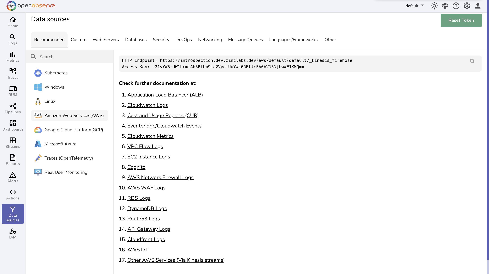
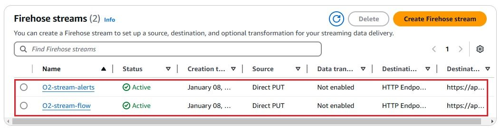
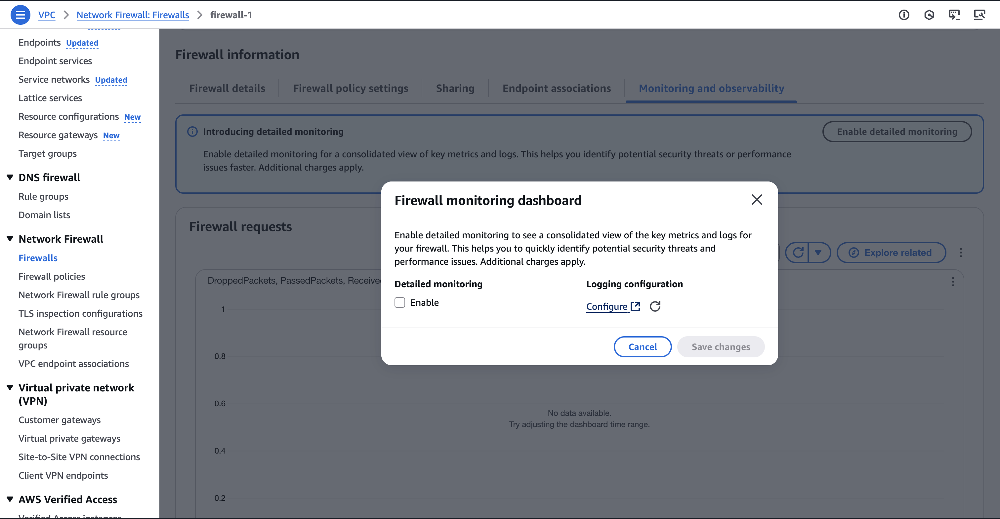
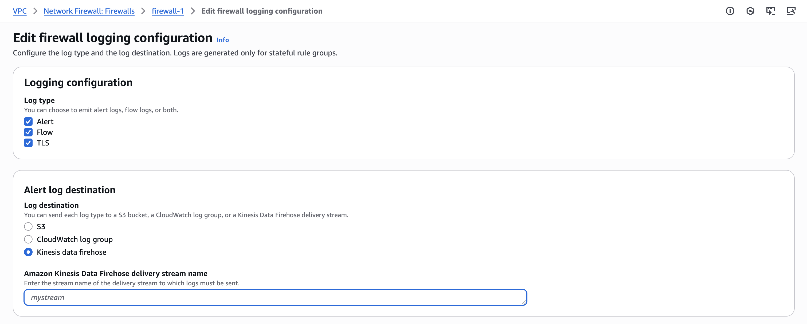
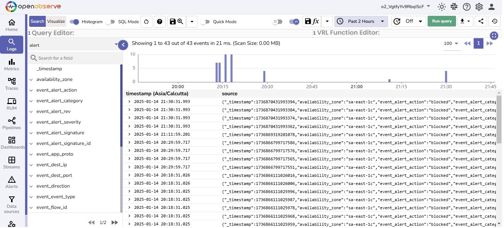
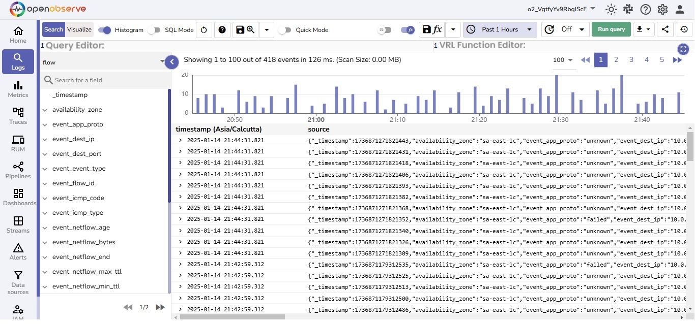

# Integration with AWS Network Firewall Logs via Firehose

This guide explains how to configure AWS Network Firewall to stream flow and alert logs to OpenObserve using Kinesis Data Firehose.

## Overview

AWS Network Firewall allows you to log network traffic data, including both flow logs and alert logs ,and stream it to destinations like Amazon S3 and Amazon Kinesis. This integration forwards logs to OpenObserve via Firehose, enabling real-time monitoring of your VPC traffic.

## Steps to Integrate

??? "Prerequisites"
    - OpenObserve account ([Cloud](https://cloud.openobserve.ai/web/) or [Self-Hosted](../../../getting-started/#self-hosted-installation))
    - AWS IAM permissions to manage Network Firewall, Kinesis Firehose, and IAM roles
    - S3 bucket for backup (recommended)
    - A configured AWS Network Firewall deployment

??? "Step 1: Get OpenObserve Ingestion URL and Access Key"

    1. In OpenObserve: go to **Data Sources → Recommended → AWS**
    2. Copy the HTTP ingestion URL and Access Key

    

    > Example ingestion URL:
    > ```
    > https://<your-openobserve-domain>/aws/default/<stream_name>/_kinesis_firehose
    > ```

??? "Step 2: Create a Kinesis Data Firehose Delivery Stream"

    1. Go to **Kinesis → Firehose → Create delivery stream**
    2. Choose:
        - **Source**: `Direct PUT`
        - **Destination**: `HTTP Endpoint`
    3. Provide:
        - **Endpoint URL**: OpenObserve Firehose ingestion URL
        - **Access Key / Secret Key**: from OpenObserve
    4. Optionally configure an S3 bucket as a backup
    5. Name the delivery stream (e.g., `network-firewall-logs`)
    6. Complete stream creation

    > NOTE: You can create multiple streams for different types of logs
    
    

??? "Step 3: Enable Logging in AWS Network Firewall"

    1. Go to **VPC → Network Firewall → Firewalls**
    2. Select your firewall → Navigate to the **Monitoring and Observability** tab → Enable Detailed Monitoring
    3. Click **Configure** button under **logging configuration**
        
        

    4. Enable logging for alerts and Flow logs 
    5. Set the **Log destination type** to **Kinesis Data Firehose**
    6. Select the delivery stream you created earlier 
        > NOTE: In case you created multiple firehose streams, select respective streams for each log type
    7. Save the configuration

        


??? "Step 4: Generate Traffic to Create Logs (Optional)"

    1. Deploy an EC2 instance into a subnet protected by the Network Firewall
    2. Allow outbound internet access (via NAT or Internet Gateway)
    3. From the instance, generate traffic:
        ```bash
        curl -I https://google.com
        ```

    This will help trigger flow and alert logs.

??? "Step 5: Verify Log Ingestion in OpenObserve"

    1. Go to **Logs** → select your log stream → Set time range → Click **Run Query**

        
        


??? "Troubleshooting"

    - No logs visible in OpenObserve
        - Ensure logging is enabled in Network Firewall and that network traffic is actually flowing through it. 
        - Also, confirm that your delivery stream is properly configured.

    - Firehose delivery failures
        - Verify that the OpenObserve ingestion URL and access credentials (Access Key and Secret Key) are correct. 
        - Check if the Firehose role has the necessary permissions.

    - Log fields are missing or incomplete
        - Check your S3 backup (if enabled) for any malformed or truncated records. This can help identify issues with the Firehose delivery configuration or log formatting.

    - No alert logs are received
        - Confirm that your firewall policies include rules with the alert action. Only these rules generate alert logs. Without such rules, only flow logs will be produced.


