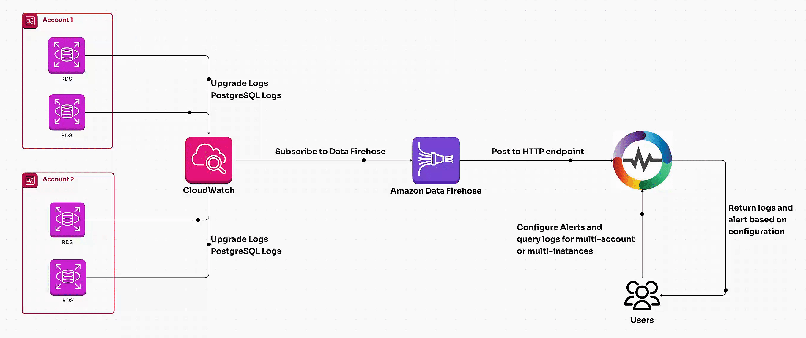
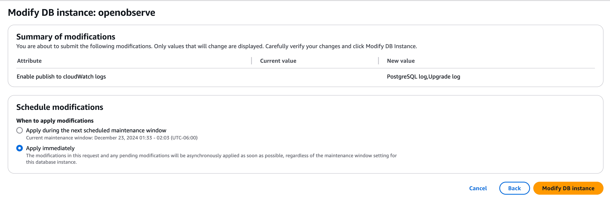
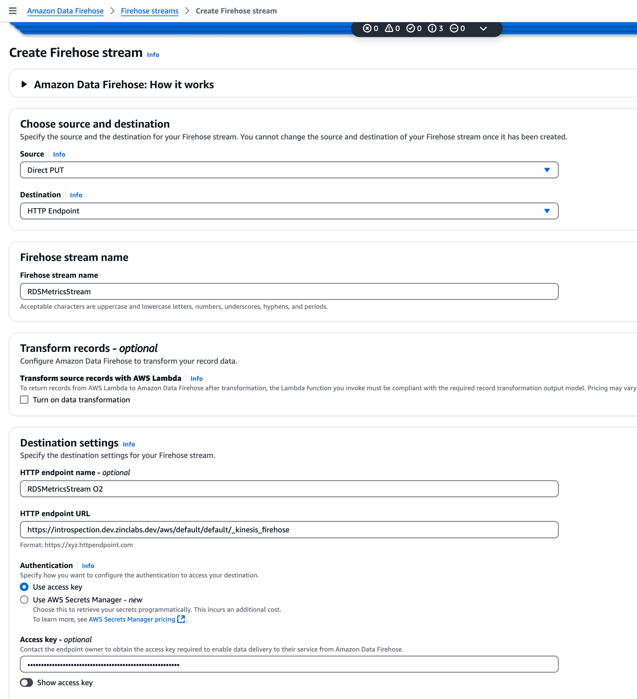
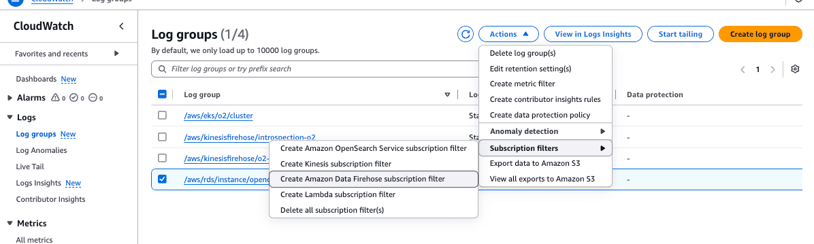
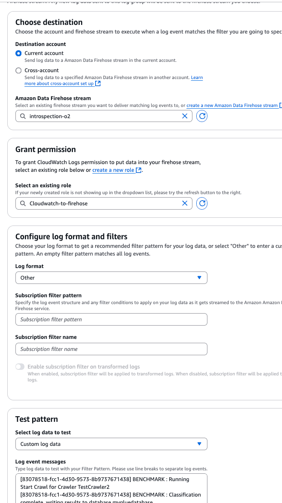
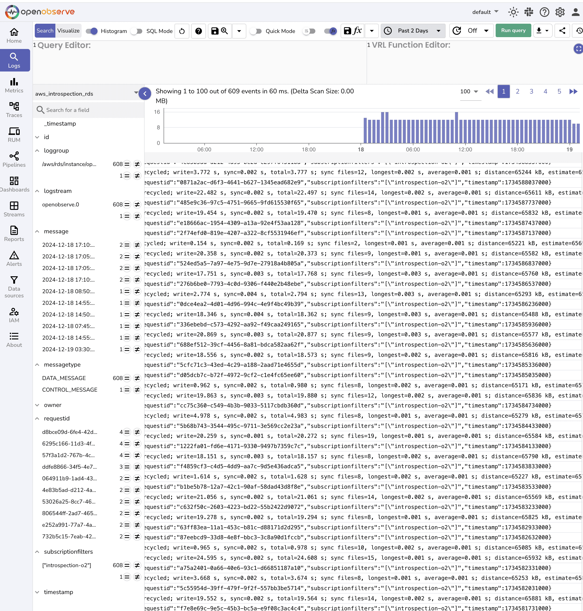

# Integration with Amazon RDS Logs via CloudWatch

This guide explains how to stream Amazon RDS logs (slow query, general, and error logs) into OpenObserve using CloudWatch Logs and Kinesis Firehose.

## Overview

Amazon RDS can export logs to CloudWatch Logs. These can be forwarded to OpenObserve using Kinesis Firehose with an HTTP endpoint. This enables real-time log monitoring, correlation with application activity, and alerting based on RDS behavior.



## Steps to Integrate

??? "Prerequisites"
    - OpenObserve account ([Cloud](https://cloud.openobserve.ai/web/) or [Self-Hosted](../../../quickstart/#self-hosted-installation))
    - Amazon RDS instance with log exports enabled
    - AWS permissions for RDS, CloudWatch Logs, IAM, and Kinesis Firehose
    - S3 bucket for Firehose backup (recommended)

??? "Step 1: Get OpenObserve Ingestion URL and Access Key"

    1. In OpenObserve: go to **Data Sources → Recommended → AWS**
    2. Copy the ingestion URL and Access Key

    
    
    > Update the URL to have the stream name of your choice:
        ```
        https://<your-openobserve-domain>/aws/default/<stream_name>/_kinesis_firehose
        ```

??? "Step 2: Enable RDS Log Exports"

    1. Go to **RDS → Databases → Your DB Instance → Modify**
    2. Scroll to **Log exports**, and enable:
        - `error/mysql`
        - `general/mysql`
        - `slowquery/mysql`
        > Different database engines in Amazon RDS support different log export options. When enabling log exports, you’ll only see options supported by your selected engine.
    3. Save and apply changes (immediately or during the next maintenance window)

    

??? "Step 3: Locate RDS Log Groups in CloudWatch"

    1. Go to **CloudWatch → Logs → Log groups**
    2. Find log group like: `/aws/rds/instance/<db-name>/<log_group_name>`

??? "Step 4: Create a Firehose Delivery Stream"

    1. In AWS Kinesis Firehose, Create delivery stream with Source: `Direct PUT` and Destination: `HTTP Endpoint`.
    2. Provide OpenObserve's HTTP Endpoint URL and Access Key, and set an S3 backup bucket.
    3. Give the stream a meaningful name and Create it.

    {: style="height:800px"}

??? "Step 5: Create Log Subscription Filter"

    1. In **CloudWatch Logs → Log Groups**, select the RDS log group
    2. Click **Actions → Create subscription filter**
        
    3. Choose:
        - Destination: `Kinesis Firehose`
        - Delivery stream: select the one you created
    4. Leave filter pattern blank to capture all logs
    5. Click **Start streaming**

    {: style="height:800px"}

??? "Step 6: Verify Logs in OpenObserve"

    1. Go to **Logs** → select your log stream → Set time range → Click **Run Query**

    

??? "Troubleshooting"

    **No logs?**
    
    - Check if RDS logs are correctly configured and reaching CloudWatch
    - Confirm the subscription filter is active and pointing to the correct Firehose stream
    - Ensure the Firehose stream is delivering logs successfully
    - Verify the OpenObserve ingestion URL and access key
    - Review your S3 backup bucket for failed logs
