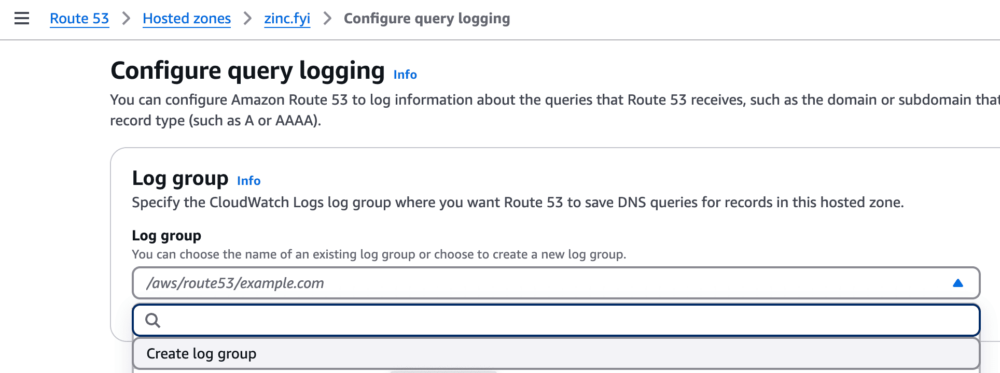

# Integration with AWS Route 53 Query Logging via CloudWatch & Firehose

This guide explains how to configure AWS Route 53 query logging, stream logs to OpenObserve using CloudWatch Logs and Kinesis Firehose, and optionally transform them with VRL for advanced analysis.

## Overview

Route 53 query logs capture DNS requests processed by public or private hosted zones. These logs can be streamed into OpenObserve for real-time monitoring and analysis of DNS patterns, resolver behavior, and potential anomalies.


## Steps to Integrate

??? "Prerequisites"
    - OpenObserve account ([Cloud](https://cloud.openobserve.ai/web/) or [Self-Hosted](../../../getting-started/#self-hosted-installation))
    - AWS IAM permissions to manage Route 53, CloudWatch Logs, IAM roles, and Firehose
    - S3 bucket for Firehose backup (optional but recommended)
    - OpenObserve ingestion URL and Access Key

??? "Step 1: Enable Route 53 Query Logging"

    1. Go to **Route 53 → Hosted Zones**
    2. Select a hosted zone → Click **Enable query logging**
    3. Provide or create a **CloudWatch Log Group** (e.g., `/aws/route53/logs`)
    4. Save changes
    

    > Optional: Set a **retention policy** on the log group in CloudWatch to manage storage.

??? "Step 2: Create a Kinesis Data Firehose Delivery Stream"

    1. Navigate to **Kinesis → Firehose → Create delivery stream**
    2. Choose:
        - **Source**: `Direct PUT`
        - **Destination**: `HTTP Endpoint`
    3. Input:
        - **Endpoint URL**: your OpenObserve Firehose ingestion URL
        - **Access Key / Secret Key**: from OpenObserve
    4. (Optional) Enable **S3 backup** for failed records
    5. Name the stream (e.g., `route53-query-logs`) and create it

??? "Step 3: Create CloudWatch Logs Subscription Filter"

    1. Go to **CloudWatch → Log groups**
    2. Select your Route 53 log group (e.g., `/aws/route53/logs`)
    3. Click **Actions → Create subscription filter**
    4. Configure:
        - **Destination**: `Kinesis Data Firehose`
        - **Delivery stream**: select the one you created
        - **Filter pattern**: leave blank to capture all logs
    5. Click **Start streaming**

??? "Step 4: Verify Log Ingestion in OpenObserve"

    1. Go to **Logs** → select your log stream → Set time range → Click **Run Query**
    

??? "Optional: Transform Logs with VRL"

    You can parse and enrich the Route 53 log lines using VRL in your OpenObserve ingestion pipeline.

    ```vrl
    parsed = parse_regex!(.message, r'^(?P<version>\d+\.\d+) (?P<timestamp>[^ ]+) (?P<hosted_zone_id>[^ ]+) (?P<query_name>[^ ]+) (?P<query_type>[^ ]+) (?P<response_code>[^ ]+) (?P<protocol>[^ ]+) (?P<edge_location>[^ ]+) (?P<resolver_ip>[^ ]+) (?P<answer>[^ ]+)$')

    .route53_version = parsed.version
    .route53_query_timestamp = parsed.timestamp
    .route53_hosted_zone_id = parsed.hosted_zone_id
    .route53_query_name = parsed.query_name
    .route53_query_type = parsed.query_type
    .route53_response_code = parsed.response_code
    .route53_protocol = parsed.protocol
    .route53_edge_location = parsed.edge_location
    .route53_resolver_ip = parsed.resolver_ip
    .route53_answer = parsed.answer
    ```

    > **Tip:** Enrich resolver IPs with geo-location using MaxMind:
    ```vrl
    if is_ipv4(string!(.route53_resolver_ip)) {
        .geo = get_geoip(.route53_resolver_ip, "maxmind_city")
    }
    ```
    > NOTE: You can download our prebuilt dashboards from our [git repository.](https://github.com/openobserve/dashboards/tree/main/AWS_Route53)

??? "Troubleshooting"

    - **No logs in OpenObserve?**
        - Check Route 53 query logging is enabled
        - Validate CloudWatch Logs retention
        - Ensure subscription filter is active
        - Confirm Firehose stream is healthy (review S3 failed backups)
        - Check OpenObserve URL and access keys

    - **VRL parsing errors**
        - Confirm log lines match the regex
        - Adjust grouping to fit custom field formats
        - Test VRL transformations with individual log samples in pipeline preview

    - **Geo-IP enrichment fails**
        - Confirm MaxMind tables (`maxmind_city`, `maxmind_asn`) are available and referenced
        - Verify `route53_resolver_ip` is a valid IPv4/IPv6
