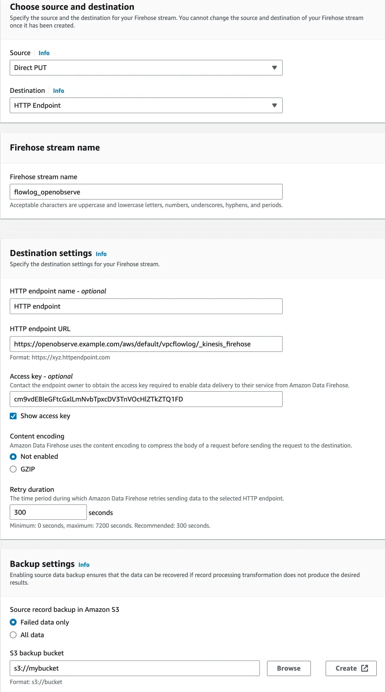
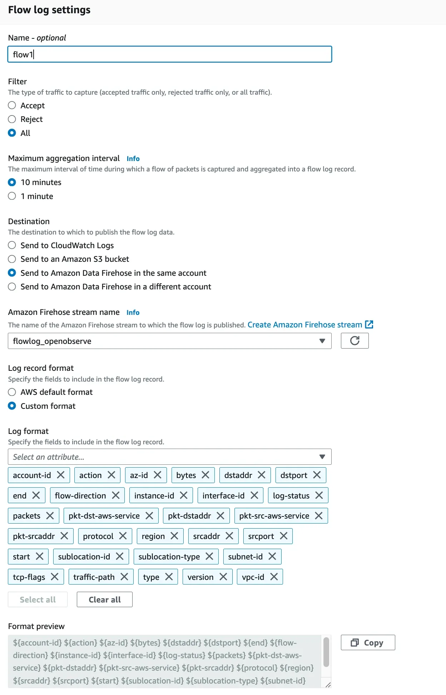
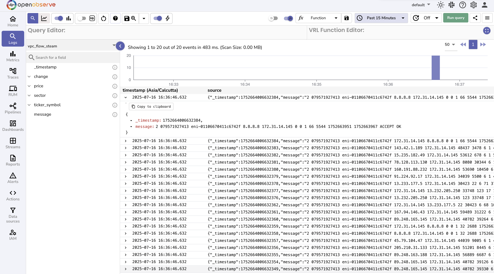

# AWS VPC Flow Logs Monitoring - Network Traffic & Security Analysis

Monitor AWS VPC network traffic with comprehensive VPC Flow Logs monitoring for network traffic analysis, security monitoring, and network visibility. This guide explains how to stream AWS VPC Flow Logs directly to OpenObserve using Amazon Kinesis Firehose for AWS network monitoring, cloud security, and network performance analysis.

## Overview
Capture and forward AWS VPC Flow Logs to OpenObserve via Kinesis Firehose for real-time network visibility, network traffic monitoring, and security analysis.

## Steps to Integrate

??? "Prerequisites"
    - OpenObserve account ([Cloud](https://cloud.openobserve.ai/web/) or [Self-Hosted](../../../getting-started/#self-hosted-installation))
    - AWS account with access to VPC and Firehose
    - S3 bucket for failed log backup (recommended)

??? "Step 1: Get OpenObserve Ingestion URL and Access Key"

    1. In OpenObserve: go to **Data Sources → Recommended → AWS**
    2. Copy the ingestion URL and Access Key

    
    
    > Update the URL to have the stream name of your choice:
        ```
        https://<your-openobserve-domain>/aws/default/<stream_name>/_kinesis_firehose
        ```

??? "Step 2: Create Firehose Delivery Stream"
    
    1. In AWS Kinesis Firehose, Create delivery stream with Source: `Direct PUT` and Destination: `HTTP Endpoint`.
    2. Provide OpenObserve's HTTP Endpoint URL and Access Key, and set an S3 backup bucket.
    3. Give the stream a meaningful name and Create it.

    {: style="height:800px"}
   
??? "Step 3: Enable VPC Flow Logs"

    1. Go to **VPC → Your VPC → Flow Logs → Create Flow Log**
    2. Set:
        - Filter: `All`
        - Destination: `Kinesis Data Firehose`
        - Delivery stream: Select the stream you created in step 2
        - Log format: `All fields`
    3. Create the flow log

        {: style="height:800px"}

??? "Step 4: Verify Logs in OpenObserve"

    1. Go to **Logs** → select your log stream → Set time range → Click **Run Query**

        


??? "Troubleshooting"

    **No logs?**

    - Ensure Firehose is `ACTIVE` and logs are reaching it
    - Check S3 bucket for failed deliveries
    - Confirm URL and Access Key are correct


