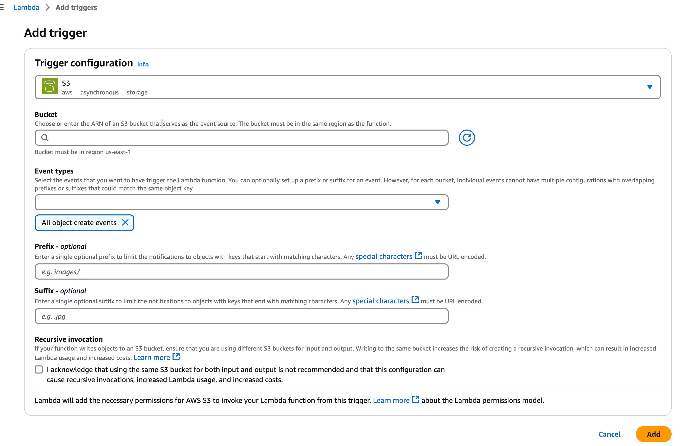

# Integration with AWS WAF via Firehose

This guide explains how to configure AWS WAF to stream logs to OpenObserve using S3, Lambda, and Kinesis Data Firehose.

## Overview

AWS WAF logs include detailed information about requests evaluated against your WebACL rules (e.g., `ALLOW`, `BLOCK`, `CAPTCHA` actions). This integration forwards those logs to OpenObserve via Firehose, enabling real-time monitoring of web traffic security and threat analysis.

## Steps to Integrate

??? "Prerequisites"
    - OpenObserve account ([Cloud](https://cloud.openobserve.ai/web/) or [Self‑Hosted](../../../quickstart/#self‑hosted‑installation))
    - AWS IAM permissions to manage WAF, S3, Lambda, Kinesis Firehose, CloudFormation
    - An existing AWS WAF WebACL attached to CloudFront, ALB, or API Gateway
    - An S3 bucket to receive WAF logs

??? "Step 1: Enable WAF Logging to S3"

    1. Go to **AWS Console → WAF & Shield**
    2. Select the WebACL you want to log
    3. In the sidebar, click **Logging and metrics → Enable logging**
        

    4. Choose your target S3 bucket (must be in the same region as the WebACL)

        

    > Make sure your S3 bucket has proper permissions to receive logs from AWS WAF.

??? "Step 2: Get OpenObserve Ingestion URL and Access Key"

    1. In OpenObserve: go to **Data Sources → Recommended → AWS**
    2. Copy the HTTP ingestion URL and Access Key
    
        

    > Example ingestion URL:
    > ```
    > https://<your-openobserve-domain>/aws/default/<stream_name>/_kinesis_firehose
    > ```

??? "Step 3: Deploy CloudFormation Stack to Set Up Lambda and Firehose"

    1. Use the [CloudFormation template](https://github.com/openobserve/cloudformation-templates/blob/main/aws_waf/cloudformation_waf.yaml) from Openobserve Template Repository.
    2. Go to **CloudFormation → Create Stack → With new resources (standard)**
    3. Upload the template file
    4. Set the following parameters:
        - **OpenObserve Ingestion URL**
        - **Access Key**
        - **Source S3 Bucket (WAF Logs)**
        - **Backup S3 Bucket (Optional)**
        
    5. Complete the stack creation process
    6. Ensure the IAM roles, Lambda function, Kinesis Firehose, and S3 configurations are created successfully.
        {: style="height:600px"}

    > NOTE: Due to AWS limitations, the S3 trigger for Lambda must be added manually after stack creation.
    
    


??? "Step 4: Verify Log Ingestion in OpenObserve"

    1. Go to **OpenObserve → Logs**
    2. Select your stream and click **Run Query**
    
    

    > You can also import a [sample AWS WAF dashboard JSON](https://github.com/openobserve/dashboards/tree/main/AWS_WAF) to visualize top IPs, blocked requests, and more.

??? "Troubleshooting"

    - No logs visible in OpenObserve  
        - Confirm WAF logging is enabled and logs are being written to the S3 bucket  
        - Check Lambda logs in **CloudWatch** for errors  
        - Ensure the Firehose stream is active and the endpoint and credentials are correct

    - CloudFormation stack fails  
        - Review error messages—common issues include invalid S3 bucket names or missing permissions  
        - Ensure the IAM roles for Lambda and Firehose are created successfully

    - Firehose shows delivery errors  
        - Check that your OpenObserve ingestion URL includes the correct stream  
        - Validate that your access key is correct  
        - Confirm that the HTTP endpoint is reachable and accepts Firehose POST requests


