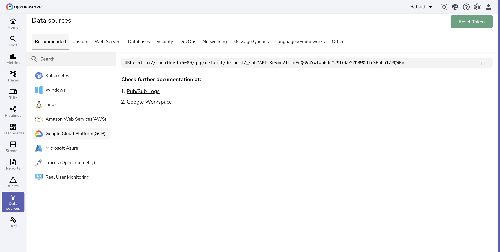

# GCP Monitoring & Google Cloud Observability Integration

OpenObserve provides comprehensive GCP monitoring integrations to collect logs, metrics, and events from Google Cloud Platform services. Monitor GCP infrastructure, serverless applications, and cloud resources with unified observability for Google Cloud Run, Cloud Functions, GKE, and more GCP services.

These GCP monitoring integrations enable Google Cloud observability, cloud infrastructure monitoring, and application performance monitoring across your Google Cloud workloads.

## GCP Services Integration Guides

- [GCP Logs](gcp-logs.md)
- [Google Cloud Run](cloud-run.md)