# Integration with Cribl

[Cribl Stream](https://cribl.io/) is a data engine designed to manage the flow of observability and security data. It allows you to route, filter, enrich, and transform data before forwarding it to your observability backend.  

## Overview

**OpenObserve** is a high-performance, open-source observability platform built for real-time log and trace analytics. By integrating Cribl with OpenObserve, you can optimize data ingestion while reducing costs and improving monitoring.  

## Steps to Integrate

???  "Prerequisites"

    - Running **Cribl Stream** instance with access to the UI  
    - OpenObserve account ([Cloud](https://cloud.openobserve.ai/web/) or [Self-Hosted](../../getting-started.md))

???  "Step 1: Configure an Internal Source in Cribl"

    First configure an internal Cribl source to generate sample logs.

    1. Open **Cribl Stream UI** → navigate to **Worker Group → Routing → QuickConnect**.  
        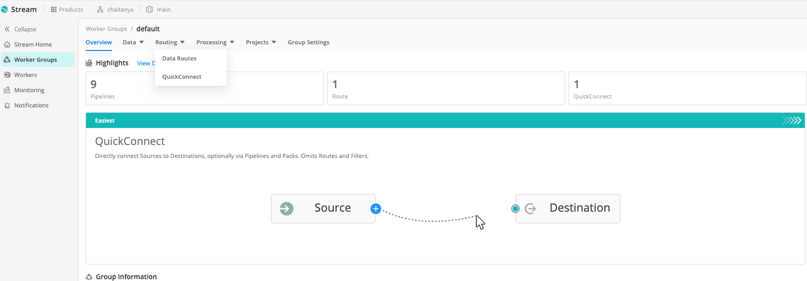

    2. Select **Sources** from the left menu → **Add Source**.  
        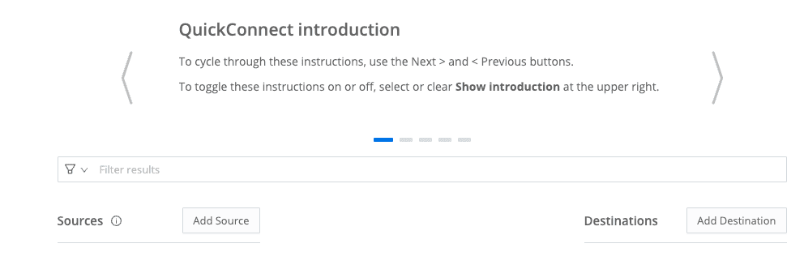

    3. Choose **System → Internal** as the source type, and select **Cribl Internal**.  
        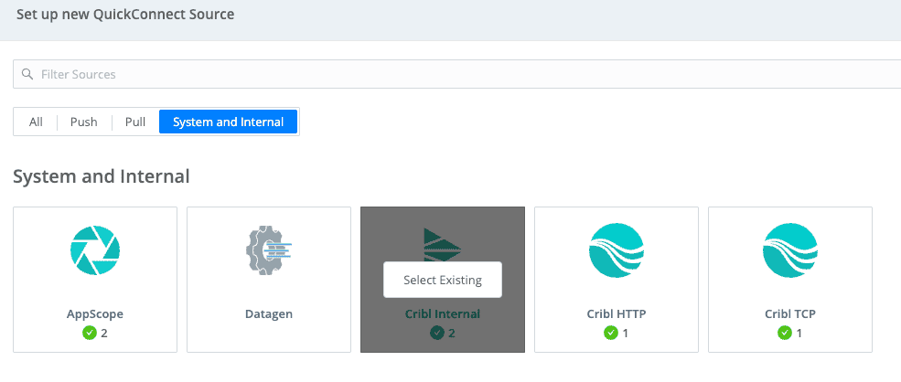

    4. Provide a name (e.g., `cribl`) → Save & Start.  
        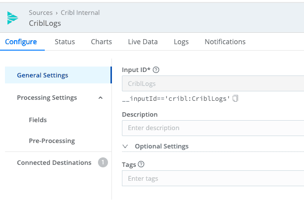

    At this point, Cribl will generate test logs.

???  "Step 2: Configure a Webhook Destination in Cribl"

    1. In the Cribl UI, go to **Destinations** → **Add Destination**.Select **Webhook**.  
        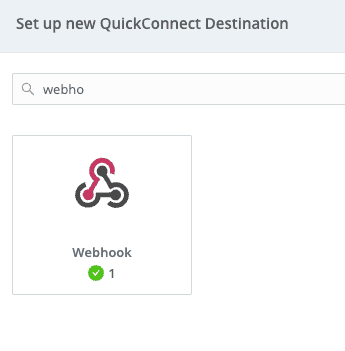

    2. Configure the webhook:  

        - **Name:** `OpenObserve_Webhook`  
        - **Webhook URL:**  
            ```
            http://<OPENOBSERVE_HOST>/api/default/cribl/_json
            ```
        - **HTTP Method:** `POST`
            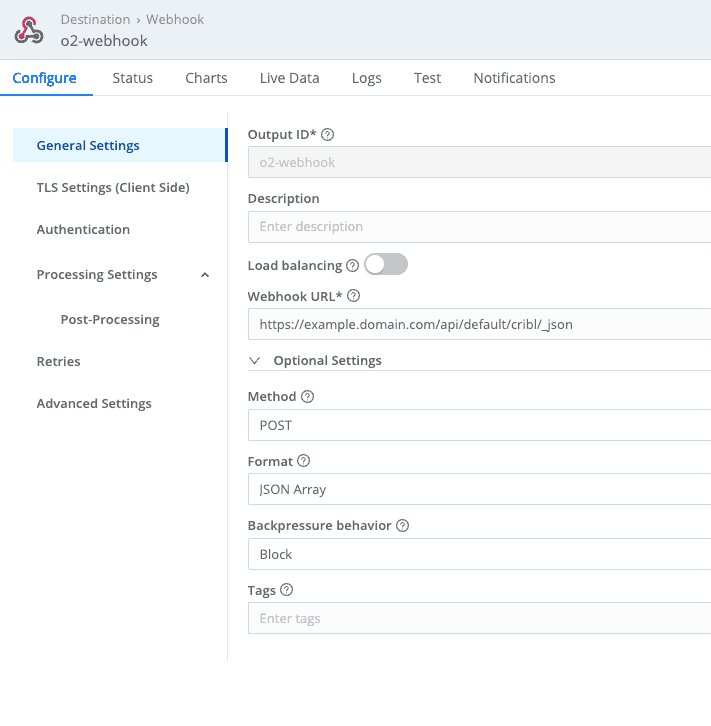    
        - **Authentication:**  
            - Type: **Basic**  
            - Username: `O2_USER`  
            - Password: `O2_PASSWORD`  

        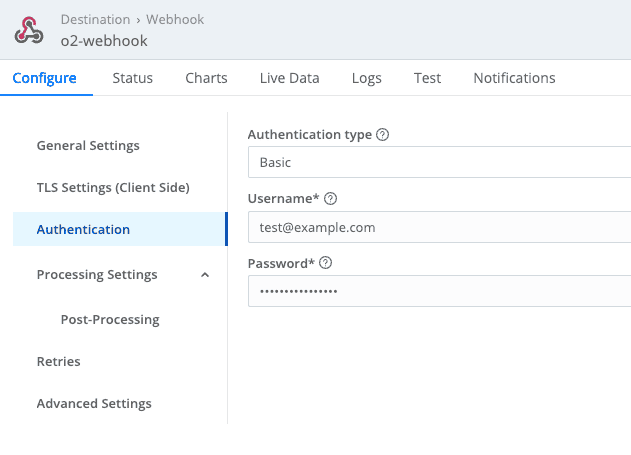  

    3. Save and activate the destination.

???  "Step 3: Route Source Data to OpenObserve"

    1. In Cribl, create a **Route**.  
    2. Connect the **Internal Source (cribl)** → **Webhook Destination (OpenObserve_Webhook)**.  
    3. Use **Passthru** for a simple route, then save.  
        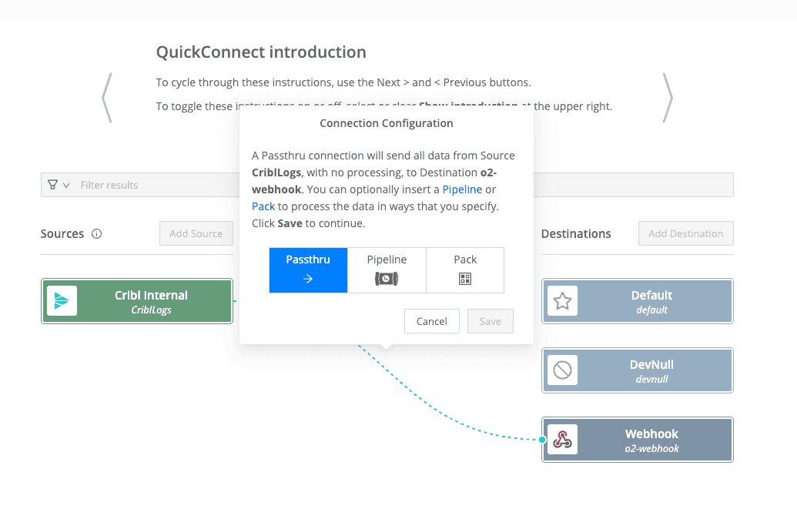

    > You can test the setup by sending sample logs. A success message indicates that OpenObserve received the data.  
    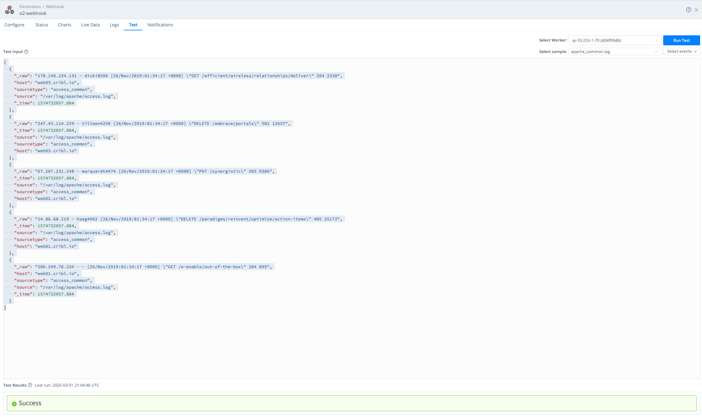

???  "Step 4: Monitor Data in OpenObserve"

    - Query Logs
        - Go to **Logs → Streams → cribl**. You should see logs ingested from Cribl.  
        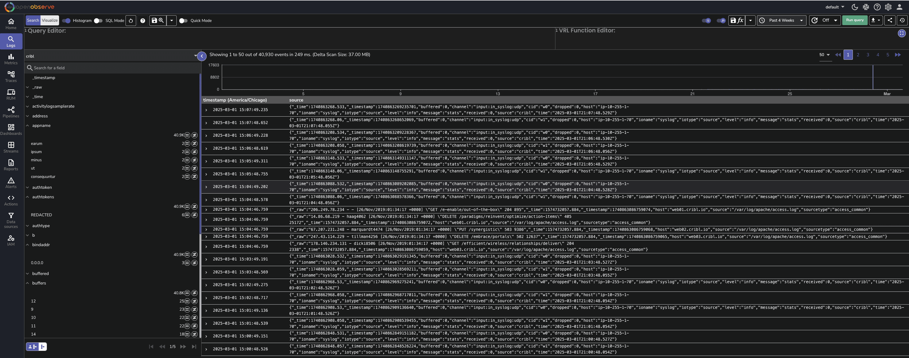

    - Query Traces
        - Go to **Traces → Streams → cribl**. You should see traces ingested from Cribl.  
        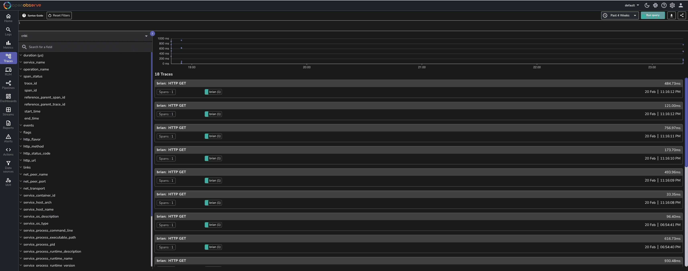  
        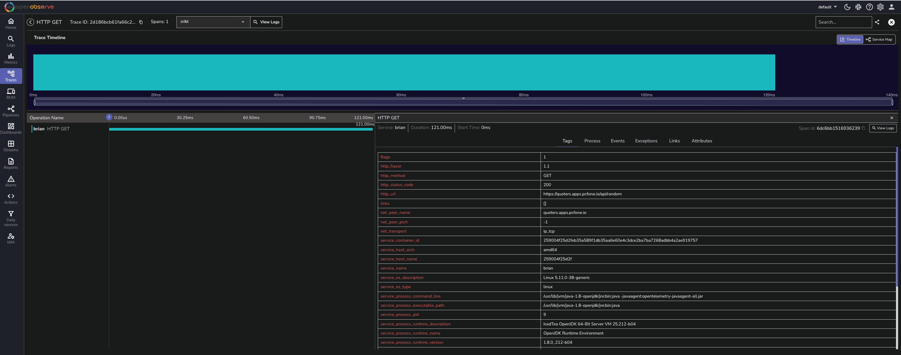  

## Troubleshooting

??? "No data appearing in OpenObserve"
    - Verify the **Route** in Cribl is active and connected to the Webhook destination.  
    - Double-check the **Webhook URL** format:  
        ```
        http://<OPENOBSERVE_HOST>/api/default/cribl/_json
        ```
    - Ensure the correct **stream name** (`cribl`) is set in the URL.  

??? "Authentication failures (401 Unauthorized)"
    - Confirm the `O2_USER` and `O2_PASSWORD` are correct.  
    - Check if the user has **ingest permissions** in OpenObserve.  

??? "Connection errors / timeouts"
    - Make sure the OpenObserve host is reachable from Cribl.  
    - If using OpenObserve Cloud, ensure your firewall/VPC rules allow outbound connections.  

??? "Logs are ingested but not parsed correctly"
    - Confirm you’re using the `_json` endpoint in the Webhook URL.  
    - Check if the incoming data structure matches what OpenObserve expects (JSON payload).  

