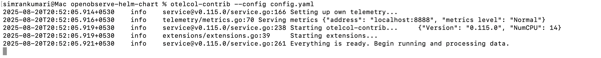

# Aerospike Integration with OpenObserve

This guide provides step-by-step instructions to collect and monitor Aerospike metrics using OpenTelemetry Collector and forward them to OpenObserve.

## Overview

Aerospike is a high-performance, distributed database designed for **low-latency, real-time data processing**. 
By integrating **Aerospike with OpenTelemetry and OpenObserve**, you can: 

- Detect performance bottlenecks  
- Gain insights into resource usage  
- Monitor database health and metrics in real time  

## Steps to Integrate

??? "Prerequisites"
    - Running **Aerospike instance(s)**  
    - OpenObserve account ([Cloud](https://cloud.openobserve.ai/web/) or [Self-Hosted](../../../quickstart/#self-hosted-installation))  

??? "Step 1: Install OpenTelemetry Collector Contrib"

    Download and install the latest release of `otelcol-contrib`:

    ```bash
    curl --proto '=https' --tlsv1.2 -fOL https://github.com/open-telemetry/opentelemetry-collector-releases/releases/download/v0.115.1/otelcol-contrib_0.115.1_darwin_arm64.tar.gz
    tar -xvf otelcol-contrib_0.115.1_darwin_arm64.tar.gz
    sudo mv otelcol-contrib /usr/local/bin/
    otelcol-contrib --version
    ```

    > Replace `v0.115.1` with the latest version for your OS/architecture.

??? "Step 2: Configure the Collector"

    Create a file named `config.yaml` with the following configuration:

    ```yaml
    receivers:
      aerospike:
        endpoint: "localhost:3000"

    processors:
      batch:
        send_batch_size: 10000
        send_batch_max_size: 11000
        timeout: 10s

    exporters:
      otlphttp/openobserve:
        endpoint: https://<your-openobserve-endpoint>/api/default
        headers:
          Authorization: Basic <your_auth_token>
          stream-name: default

    service:
      pipelines:
        metrics:
          receivers: [aerospike]
          processors: [batch]
          exporters: [otlphttp/openobserve]
    ```

    Replace `<your-openobserve-endpoint>` and `<your_auth_token>` with your OpenObserve details.

    


??? "Step 3: Run the Collector"

    Start the Collector with your configuration:

    ```bash
    otelcol-contrib --config /path/to/config.yaml
    ```

    

??? "Step 4: Visualize in OpenObserve"

    1. Open **OpenObserve → Streams** and select your metrics stream.  
         
    2. Explore the metrics, run queries , create dashboards for insights
          


## Troubleshooting

??? "Collector not starting"
    - Check the logs for misconfigurations:

    ```journalctl -u otel-collector -f
    ```

??? "No metrics in OpenObserve"

    - Verify Aerospike is running: systemctl status aerospike
    - Check if the Aerospike receiver is binding to the correct port (default: 3000).
    - Confirm your OPENOBSERVE_TOKEN and OPENOBSERVE_STREAM are correct.