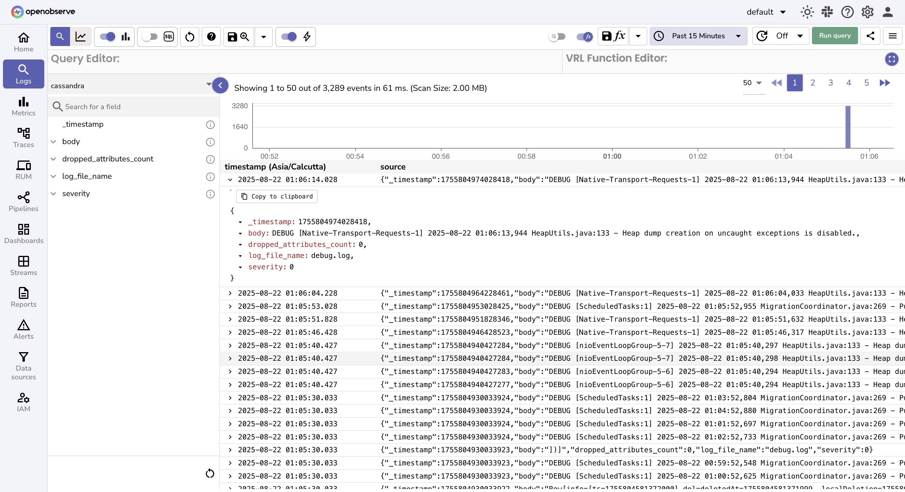

# Integration with Cassandra Metrics and Logs

This guide provides step-by-step instructions to collect and monitor Apache Cassandra metrics and logs using **OpenTelemetry Collector Contrib** and forward them to OpenObserve.

## Overview

Apache Cassandra is a highly scalable, distributed NoSQL database designed for applications that demand high availability and low-latency read/write operations.  

To effectively monitor Cassandra, we will set up OpenTelemetry (OTel) to collect both metrics and logs. OpenTelemetry’s JMX receiver helps gather JVM and Cassandra-specific metrics, while file-based log collection ensures log visibility. The collected logs and metrics will then be forwarded to Openobserve.


## Steps to Integrate

??? "Prerequisites"
    - Running **Apache Cassandra** instance(s)  
    - OpenObserve account ([Cloud](https://cloud.openobserve.ai/web/) or [Self-Hosted](../../../getting-started/#self-hosted-installation))  

??? "Step 1: Download OpenTelemetry JMX Metrics JAR"

    1. The JMX receiver is used to gather Cassandra and JVM metrics. Install it using the command:

    ```bash
    wget https://github.com/open-telemetry/opentelemetry-java-contrib/releases/download/v1.32.0/opentelemetry-jmx-metrics.jar -O /opt/opentelemetry-java-contrib-jmx-metrics.jar
    ```

??? "Step 2: Configure JMX Remote Access in Cassandra"

    1. Edit `/etc/cassandra/cassandra-env.sh` and add:
        ```bash
        JVM_OPTS="$JVM_OPTS -Dcom.sun.management.jmxremote.port=9000"
        JVM_OPTS="$JVM_OPTS -Dcom.sun.management.jmxremote.rmi.port=9000"
        JVM_OPTS="$JVM_OPTS -Dcom.sun.management.jmxremote.authenticate=false"
        JVM_OPTS="$JVM_OPTS -Dcom.sun.management.jmxremote.ssl=false"
        ```

    2. Restart Cassandra:
        ```bash
        systemctl restart cassandra
        ```
    > Note: The file location may vary depending on your system.

??? "Step 3: Configure the OpenTelemetry Collector"

    1. Create or update `/etc/otel-collector-config.yaml`:

    ```yaml
    receivers:
      jmx:
        jar_path: /opt/opentelemetry-java-contrib-jmx-metrics.jar
        endpoint: localhost:9000
        target_system: cassandra,jvm
        collection_interval: 60s

      filelog/std:
        include:
          - /var/log/cassandra/*.log #File location varies, example for macOS: /opt/homebrew/var/log/cassandra/*.log
        start_at: beginning

      otlp:
        protocols:
          grpc:
          http:

    processors:
      resourcedetection:
        detectors: ["system"]
        system:
          hostname_sources: ["os"]
      batch:

    exporters:
      otlphttp/openobserve:
        endpoint: https://<your-openobserve-endpoint>/api/default
        headers:
          Authorization: Basic <your_auth_token>
          stream-name: cassandra

    service:
      pipelines:
        metrics:
          receivers: [jmx]
          processors: [resourcedetection, batch]
          exporters: [otlphttp/openobserve]

        logs:
          receivers: [filelog/std, otlp]
          processors: [batch]
          exporters: [otlphttp/openobserve]
    ```

    Replace `<your-openobserve-endpoint>` and `<your_auth_token>` with values from OpenObserve’s **Data Sources → Metrics/Logs → Otel Collector**.

    

??? "Step 4: Restart the OpenTelemetry Collector"

    1. Restart OpenTelemetry Collector
        ```bash
        systemctl restart otel-collector
        ```

    2. Verify the service:
        ```bash
        systemctl status otel-collector
        ```

??? "Step 5: Visualize in OpenObserve"

    1. Go to **OpenObserve → Streams**.  
    2. Explore metrics such as node health, read/write latency, and JVM performance.  
        
    3. Explore logs to debug errors, failed queries, etc. 
         


## Troubleshooting

??? "No JMX Metrics Collected"
    - Ensure JMX port (9000) is open and Cassandra was restarted after enabling JMX.  
    - Verify `jar_path` points to the correct JMX metrics jar.  

??? "Logs Not Appearing"
    - Confirm Cassandra logs exist under `/var/log/cassandra/`.  
    - Ensure `filelog` receiver has read permissions.  

??? "No Data in OpenObserve"
    - Double-check exporter endpoint and token.  
    - Ensure Collector can reach OpenObserve.  
    - Inspect Collector logs for errors.  
