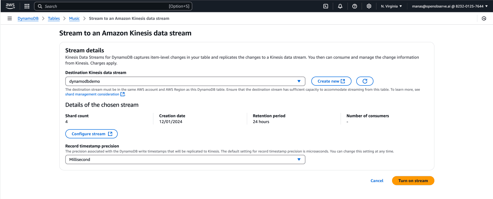
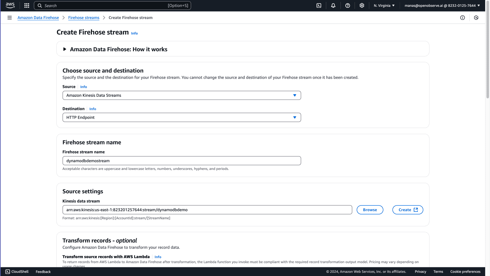
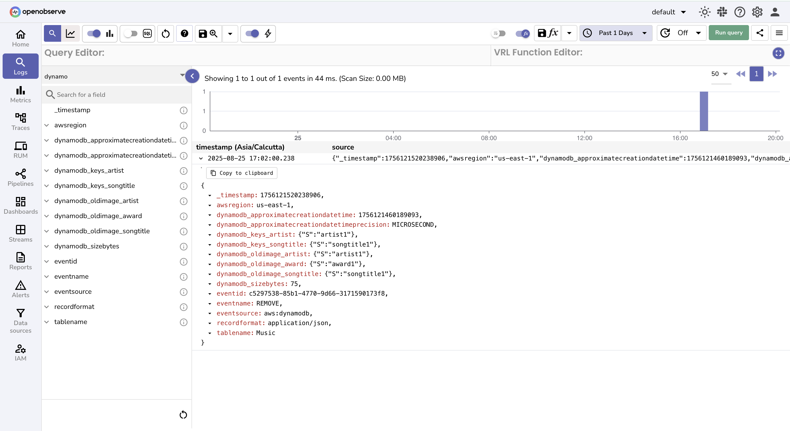

# DynamoDB Integration with OpenObserve

This guide provides step-by-step instructions to capture **DynamoDB table changes** with **Amazon Kinesis** and forward them to OpenObserve for real-time monitoring and analysis.  

## Overview

Applications that rely on **Amazon DynamoDB** often require real-time insights into table changes. By enabling **DynamoDB → Kinesis Data Streams → Kinesis Firehose → OpenObserve**, you can ingest and visualize these changes instantly.

## Steps to Integrate

??? "Prerequisites"
    - AWS account with permissions for **DynamoDB**, **Kinesis Data Streams**, and **Kinesis Firehose**  
    - OpenObserve account ([Cloud](https://cloud.openobserve.ai/web/) or [Self-Hosted](../../../quickstart/#self-hosted-installation)) 
    - Dynamo DB Table

??? "Step 1: Create Kinesis Data Stream"

    1. Open the [Kinesis Console](https://console.aws.amazon.com/kinesis).  
    2. Follow the instructions and create a new data stream.  
        

??? "Step 2: Enable Kinesis Data Stream on DynamoDB"

    1. Go to the **DynamoDB Console → Table → Exports and Streams tab**.  
    2. Enable **Kinesis Data Stream** and select your Kinesis data stream.  

        

??? "Step 3: Create Kinesis Data Firehose Delivery Stream"

    1. Open the [Kinesis Firehose Console](https://console.aws.amazon.com/firehose).  
    2. Create a new **Delivery Stream**.  
    3. Select **Source** → `Kinesis Data Stream` → choose the Kinesis data stream.  
    4. Select **Destination** → `HTTP Endpoint`.  
        - **Endpoint URL**: your OpenObserve Firehose endpoint  
        - **Authentication**: Access Key (from OpenObserve → Ingestions → Amazon Kinesis Firehose)  
    5. (Optional) Configure an **S3 bucket** for backup of failed records.  
    6. Review and **Create Firehose Stream**.  

    

??? "Step 4: Monitor DynamoDB Changes in OpenObserve"

    Once the Firehose is active, DynamoDB changes begin flowing to OpenObserve. Access at Logs -> Stream name 
    

??? "Troubleshooting"

    **No logs appearing in OpenObserve?**

    - Firehose:
        -  Verify the delivery stream is active and error-free.
        - Review the Monitoring tab and look for failed deliveries.  
    
    - OpenObserve:
        - Confirm the HTTP ingestion URL and access key are correct.
        - In the Logs view, select the correct stream and expand the time range to view recent data.