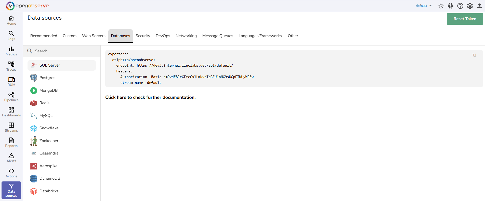

# Database Monitoring & Performance Integration

OpenObserve provides comprehensive database monitoring integrations to collect database metrics, logs, and performance data from popular relational databases (MySQL, PostgreSQL, Oracle) and NoSQL databases (MongoDB, Redis, Cassandra, DynamoDB). Monitor database performance, query optimization, and database health with unified observability.

These database monitoring integrations enable database performance monitoring, query analysis, and database observability across your data infrastructure for SQL and NoSQL databases.

## Database Integration Guides

- [PostgreSQL](postgresql.md)
- [SnowFlake](snowflake.md)
- [PostgreSQL](postgresql.md)
- [Oracle Database](oracle.md)
- [Snowflake](snowflake.md)
- [MySQL](mysql.md)
- [MongoDB](mongodb.md)
- [Redis](redis.md)
- [Amazon DynamoDB](dynamodb.md)
- [Apache Zookeeper](zookeeper.md)
- [Cassandra](cassandra.md)
- [Aerospike](aerospike.md)