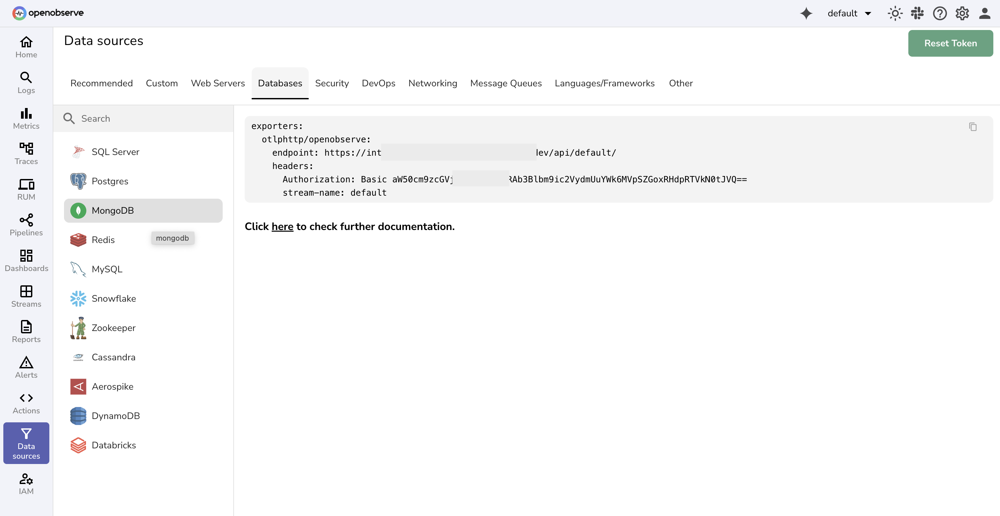
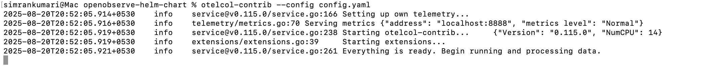
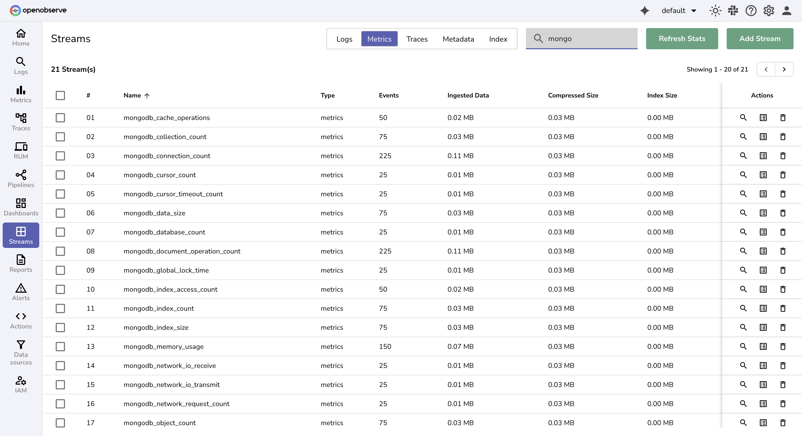

# Integration with MongoDB Metrics

This guide provides step-by-step instructions to collect and monitor MongoDB metrics using **OpenTelemetry Collector Contrib** and forward them to OpenObserve.

## Overview

To effectively monitor MongoDB, we will utilize the OpenTelemetry Collector with the MongoDB receiver. This setup allows us to collect metrics from MongoDB instances and push them to OpenObserve, enabling us to visualize performance data and respond proactively to issues.

Supported MongoDB versions: **4.0+**.

## Steps to Integrate

??? "Prerequisites"
    - Running **MongoDB instance(s)**
    - OpenObserve account ([Cloud](https://cloud.openobserve.ai/web/) or [Self-Hosted](../../../quickstart/#self-hosted-installation))

??? "Step 1: Install OpenTelemetry Collector Contrib"

    Download and install the latest release of `otelcol-contrib`:

    ```bash
    curl --proto '=https' --tlsv1.2 -fOL https://github.com/open-telemetry/opentelemetry-collector-releases/releases/download/v0.115.1/otelcol-contrib_0.115.1_darwin_arm64.tar.gz
    tar -xvf otelcol-contrib_0.115.1_darwin_arm64.tar.gz
    sudo mv otelcol-contrib /usr/local/bin/
    otelcol-contrib --version
    ```

    > Replace `v0.115.1` with the latest version for your OS/architecture.

??? "Step 2: Configure the Collector"

    Create a file named `config.yaml` with the following configuration:

    ```yaml
    receivers:
    mongodb:
        hosts:
        - endpoint: localhost:27017
        username: otel #the user with clusterMonitor permissions
        password: password123 #password
        collection_interval: 60s
        initial_delay: 1s
        tls:
        insecure: true
        insecure_skip_verify: true

    processors:
    batch:
        send_batch_size: 10000
        timeout: 10s

    exporters:
    otlphttp/openobserve:
        endpoint: https://<your-openobserve-endpoint>/api/default
        headers:
        Authorization: Basic <your_auth_token>
        stream-name: default

    service:
    pipelines:
        metrics:
        receivers: [mongodb]
        processors: [batch]
        exporters: [otlphttp/openobserve]
    ```

    Replace `<your-openobserve-endpoint>` and `<your_auth_token>` with your actual OpenObserve API endpoint and authentication token, which you can find in your Data Sources -> Databases -> MongoDB

    

??? "Step 3: Run the Collector"

    Start the Collector with your configuration:

    ```bash
    otelcol-contrib --config /path/to/config.yaml
    ```
    

??? "Step 4: Visualize in OpenObserve"

    1. Open **OpenObserve → Streams**. Select your metrics stream .
        
    2. Explore MongoDB metrics in dashboards or create custom queries.

## Troubleshooting

??? "Authentication Errors"
    - Double-check username/password in config.

??? "Connection Refused"
    - Verify MongoDB is running and accessible on the specified port.
    - Check firewall or container networking settings.

??? "TLS Issues"
    - If using TLS, configure valid certs.
    - Use `tls.insecure_skip_verify: true` for testing only.

??? "No Metrics in OpenObserve"
    - Check Collector logs for errors.
    - Confirm `endpoint` and `Authorization` headers in the exporter are correct.
    - Verify OpenObserve is reachable from the Collector.