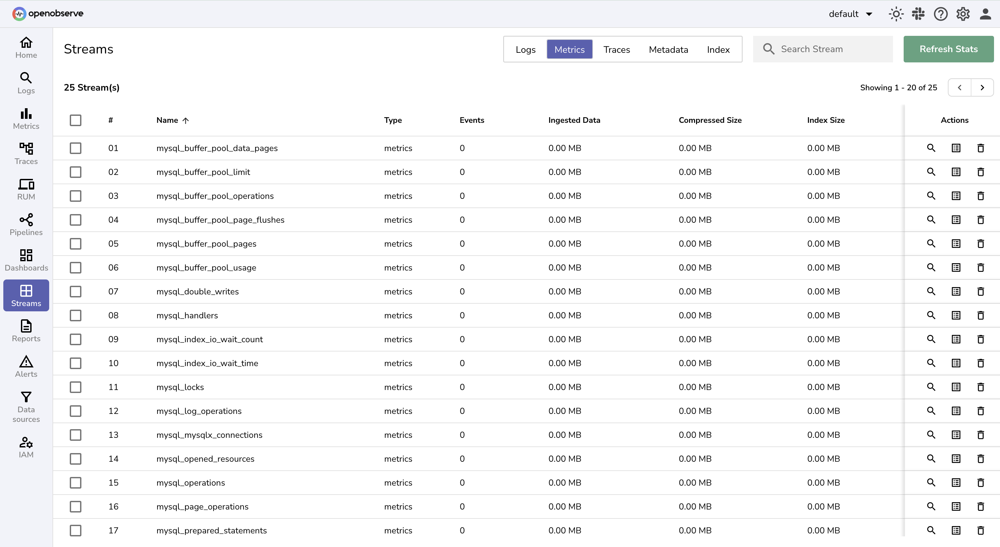

# MySQL Database Monitoring - Performance & Query Optimization

Monitor MySQL databases with comprehensive MySQL database monitoring for collecting MySQL performance metrics, query performance data, and database health metrics. This guide shows you how to set up MySQL monitoring using OpenTelemetry Collector for MySQL database performance monitoring, query optimization, and database observability.

## Overview

MySQL is one of the most widely used open-source relational databases, powering applications from startups to large-scale enterprises. MySQL database monitoring is critical for ensuring database availability, MySQL performance optimization, and query efficiency.

With the **OpenTelemetry Collector** and **OpenObserve**, you can collect MySQL metrics, monitor database health, visualize MySQL performance, and set up proactive database alerts for comprehensive MySQL monitoring.

## Steps to Integrate

??? "Prerequisites"
    - Running **MySQL instance(s)**  
    - OpenObserve account ([Cloud](https://cloud.openobserve.ai/web/) or [Self-Hosted](../../../getting-started/#self-hosted-installation))  

??? "Step 1: Install OpenTelemetry Collector Contrib"

    Download and install the latest release of `otelcol-contrib`:

    ```bash
    curl --proto '=https' --tlsv1.2 -fOL https://github.com/open-telemetry/opentelemetry-collector-releases/releases/download/v0.115.1/otelcol-contrib_0.115.1_darwin_arm64.tar.gz
    tar -xvf otelcol-contrib_0.115.1_darwin_arm64.tar.gz
    sudo mv otelcol-contrib /usr/local/bin/
    otelcol-contrib --version
    ```

    > Replace `v0.115.1` with the latest version for your OS/architecture.

??? "Step 2: Configure the Collector"

    Create a file named `config.yaml` with the following configuration:

    ```yaml
    receivers:
      mysql:
        endpoint: "localhost:3306"
        username: otel
        password: ${env:MYSQL_PASSWORD}

    processors:
      batch:
        send_batch_size: 10000
        send_batch_max_size: 11000
        timeout: 10s

    exporters:
      otlphttp/openobserve:
        endpoint: https://<your-openobserve-endpoint>/api/default
        headers:
          Authorization: Basic <your_auth_token>
          stream-name: default

    service:
      pipelines:
        metrics:
          receivers: [mysql]
          processors: [batch]
          exporters: [otlphttp/openobserve]
    ```

    Replace `<your-openobserve-endpoint>` and `<your_auth_token>` with your OpenObserve details.

    


??? "Step 3: Run the Collector"

    Start the Collector with your configuration:

    ```bash
    otelcol-contrib --config /path/to/config.yaml
    ```

    

??? "Step 4: Visualize in OpenObserve"

    1. Open **OpenObserve → Streams** and select your metrics stream.  
       


??? "Troubleshooting"

    If you encounter connection issues during setup, consider the following:

    - **Check MySQL Configuration**: Ensure that the MySQL instance is running and the configured user has the necessary privileges to read metrics.  
    - **Firewall and Network Settings**: Verify that your network allows traffic on the MySQL port (default: `3306`).  
    - **Authentication Issues**: Confirm that the username and password configured in the OpenTelemetry Collector match your MySQL credentials.  
    - **Endpoint Validation**: If running MySQL on a remote server, make sure you are using the correct hostname/IP in the `endpoint` field of your collector configuration.  
    - **Collector Logs**: Inspect the OpenTelemetry Collector logs for detailed error messages (`journalctl -u otel-collector -f` on Linux). These logs often indicate whether the issue is authentication, connectivity, or configuration related.  

