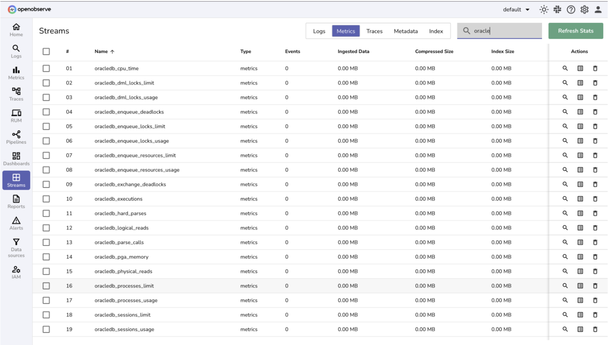

# Oracle Database Integration with OpenObserve

This guide provides step-by-step instructions to collect and monitor **Oracle Database metrics and logs** using the OpenTelemetry Collector and forward them to OpenObserve.

## Overview

Oracle Database is the backbone of many enterprise applications, handling mission-critical workloads. Monitoring Oracle is essential for:

- Identifying performance bottlenecks (CPU, I/O, slow queries).  
- Tracking resource usage (sessions, locks, tablespaces).  
- Analyzing logs for troubleshooting, auditing, and compliance.  

With the **OpenTelemetry Collector** and **OpenObserve**, you can ingest Oracle Database metrics and logs, build dashboards, and set up alerts for proactive monitoring.

## Steps to Integrate

??? "Prerequisites"
    - A running **Oracle Database instance** (local via Docker or remote).  
    - OpenObserve account ([Cloud](https://cloud.openobserve.ai/web/) or [Self-Hosted](../../../quickstart/#self-hosted-installation)).  

??? "Step 1: Configure Oracle Database"

    Once database is ready to use: 

    1. Connect via SQL*Plus:
        ```bash
        sqlplus system/password123@localhost:1521/XE
        ```

    2. Create a monitoring user:

        ```sql
        CREATE USER otel IDENTIFIED BY password123;
        GRANT CONNECT, RESOURCE TO otel;
        GRANT SELECT ON V_$SESSION TO otel;
        GRANT SELECT ON V_$SYSSTAT TO otel;
        GRANT SELECT ON V_$RESOURCE_LIMIT TO otel;
        GRANT SELECT ON DBA_TABLESPACES TO otel;
        GRANT SELECT ON DBA_DATA_FILES TO otel;
        GRANT SELECT ON DBA_TABLESPACE_USAGE_METRICS TO otel;
        EXIT;
        ```

??? "Step 2: Install OpenTelemetry Collector Contrib"

    Download the latest release:

    ```bash
    curl --proto '=https' --tlsv1.2 -fOL \
      https://github.com/open-telemetry/opentelemetry-collector-releases/releases/download/v0.115.1/otelcol-contrib_0.115.1_darwin_arm64.tar.gz
    tar -xvf otelcol-contrib_0.115.1_darwin_arm64.tar.gz
    sudo mv otelcol-contrib /usr/local/bin/
    otelcol-contrib --version
    ```

    > Replace `v0.115.1` with the latest release for your OS/architecture.

??? "Step 3: Configure the Collector"

    Create a file named `config.yaml`:

    ```yaml
    receivers:
      oracledb:
        endpoint: localhost:1521
        username: otel
        password: password123
        service: XE
        collection_interval: 30s
        timeout: 10s

      filelog:
        include:
          - /var/log/oracle/*.log  # Adjust based on your Oracle setup

    processors:
      batch:
        send_batch_size: 10000
        timeout: 10s

    exporters:
      otlphttp/openobserve:
        endpoint: https://<your-openobserve-endpoint>/api/default
        headers:
          Authorization: Basic <your_auth_token>
          stream-name: default

    service:
      pipelines:
        metrics:
          receivers: [oracledb]
          processors: [batch]
          exporters: [otlphttp/openobserve]

        logs:
          receivers: [filelog]
          processors: [batch]
          exporters: [otlphttp/openobserve]
    ```

    Replace `<your-openobserve-endpoint>` and `<your_auth_token>` with your OpenObserve details.  

    

??? "Step 4: Run the Collector"

    Start the Collector:

    ```bash
    otelcol-contrib --config /path/to/config.yaml
    ```

    

??? "Step 5: Visualize in OpenObserve"

    1. Open **OpenObserve → Streams** and select your Oracle metrics/logs stream.  
        
    2. Create dashboards to track:  
        - Active sessions  
        - Tablespace usage  
        - Query executions & rollbacks  
        - CPU and I/O utilization  
  
    > You can make use of pre-built dashboards [here](https://github.com/openobserve/dashboards/tree/main/OracleDB).

## Troubleshooting

Common issues and fixes:  

??? "Database Connectivity"  
      - Verify Oracle is running: `docker ps | grep oracle-xe`  
      - Test port: `telnet localhost 1521`  
      - SQL*Plus login: `sqlplus otel/password123@localhost:1521/XE`  

??? "Authentication Issues"  
      - Check user grants and password.  
      - Ensure correct service name (`XE`).  

??? "Logs Not Flowing"
      - Verify log file paths (`docker exec -it oracle-xe ls /opt/oracle/diag/...`).  
      - Adjust `filelog.include` paths.  

??? "Collector Errors"  
      - Check startup logs: `otelcol-contrib --config config.yaml`.  
      - Increase `timeout` if queries are slow.  