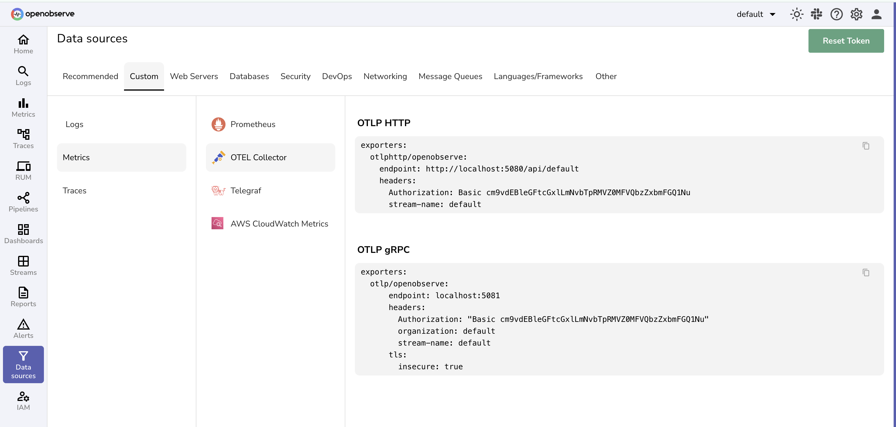
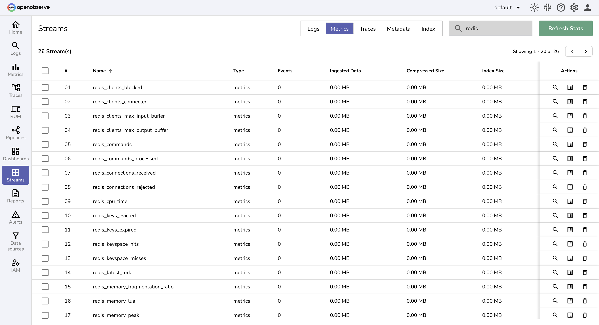

# Redis Monitoring - Cache Performance & In-Memory Database Monitoring

Monitor Redis cache and in-memory database with comprehensive Redis monitoring for collecting Redis performance metrics, cache hit rates, and memory usage. This guide provides step-by-step instructions to collect and monitor Redis metrics using **OpenTelemetry Collector Contrib** for Redis cache monitoring, performance optimization, and database observability.

## Overview

Redis is a powerful in-memory data structure store, widely used as a cache, database, and message broker. Redis cache monitoring is essential for caching performance, session management, and real-time data streaming applications.

Monitor Redis effectively using the **OpenTelemetry Collector Redis receiver**, which fetches Redis performance metrics using the `INFO` command for comprehensive Redis cache monitoring, memory monitoring, and performance analysis.

## Steps to Integrate

??? "Prerequisites"
    - Running **Redis instance(s)**  
    - OpenObserve account ([Cloud](https://cloud.openobserve.ai/web/) or [Self-Hosted](../../../getting-started/#self-hosted-installation))  
    - Basic understanding of OpenTelemetry concepts  

??? "Step 1: Prepare Your Redis Environment"

    Ensure your Redis server is running and accessible on `localhost:6379` (or your target host/port).

    To enable authentication, update `redis.conf`:

    ```conf
    requirepass yourpassword
    ```

    Restart Redis after editing the config.

??? "Step 2: Install OpenTelemetry Collector Contrib"

    Download and install the latest release of `otelcol-contrib`:

    ```bash
    curl --proto '=https' --tlsv1.2 -fOL https://github.com/open-telemetry/opentelemetry-collector-releases/releases/download/v0.115.1/otelcol-contrib_0.115.1_darwin_arm64.tar.gz
    tar -xvf otelcol-contrib_0.115.1_darwin_arm64.tar.gz
    sudo mv otelcol-contrib /usr/local/bin/
    otelcol-contrib --version
    ```

    > Replace `v0.115.1` with the latest version for your OS/architecture.

??? "Step 3: Configure the Collector"

    Create a file named `config.yaml` with the following configuration:

    ```yaml
    receivers:
      redis:
        endpoint: "localhost:6379"
        collection_interval: 10s
        password: ${env:REDIS_PASSWORD}

    processors:
      batch:
        send_batch_size: 10000
        send_batch_max_size: 11000
        timeout: 10s

    exporters:
      otlphttp/openobserve:
        endpoint: https://<your-openobserve-endpoint>/api/default
        headers:
          Authorization: Basic <your_auth_token>
          stream-name: default

    service:
      pipelines:
        metrics:
          receivers: [redis]
          processors: [batch]
          exporters: [otlphttp/openobserve]
    ```

    Replace `<your-openobserve-endpoint>` and `<your_auth_token>` with your OpenObserve details.

    

    > A full list of metrics collected is available in the [Redis receiver documentation](https://github.com/open-telemetry/opentelemetry-collector-contrib/tree/main/receiver/redisreceiver).

??? "Step 4: Run the Collector"

    Start the Collector with your configuration:

    ```bash
    otelcol-contrib --config /path/to/config.yaml
    ```

    

??? "Step 5: Visualize in OpenObserve"

    1. Open **OpenObserve → Streams** and select your metrics stream.  
         
         

    2. Create dashboards to monitor Redis memory, connections, and operations.

## Troubleshooting

??? "Authentication Errors"
    - Check that `requirepass` is set in `redis.conf` if using a password.
    - Ensure `REDIS_PASSWORD` env variable matches your Redis configuration.

??? "Connection Refused"
    - Verify Redis is running and accessible on the specified host/port.
    - Check firewall or container networking.

??? "TLS Issues"
    - If using TLS, configure `ca_file`, `cert_file`, and `key_file` properly.
    - Use `tls.insecure_skip_verify: true` only for testing.

??? "No Metrics in OpenObserve"
    - Inspect Collector logs for errors.
    - Verify exporter endpoint and token configuration.
    - Ensure OpenObserve is reachable from the Collector.
