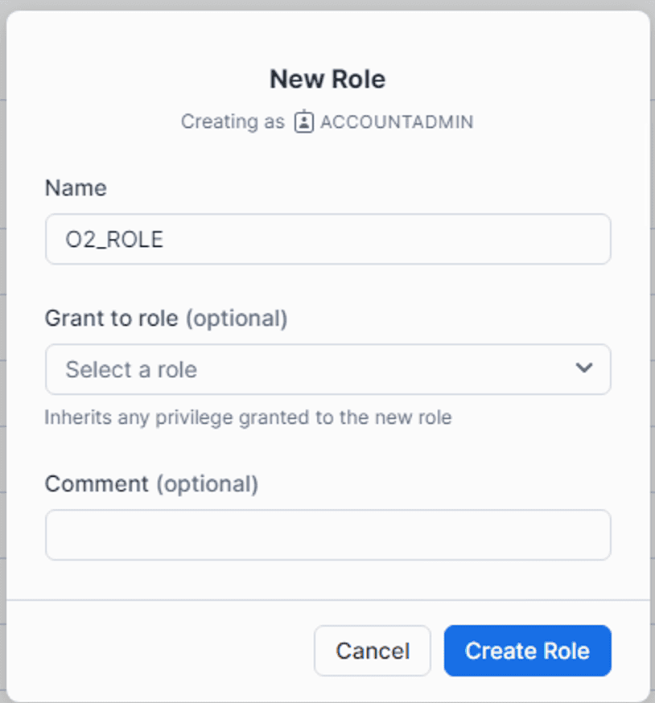
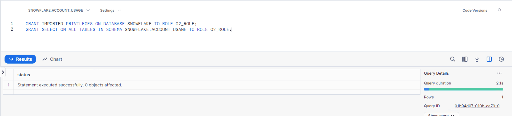

# Integration with Snowflake

This guide provides step-by-step instructions to integrate Snowflake with OpenObserve.

## Overview

The Snowflake integration enables monitoring of Snowflake performance metrics, billing information, storage usage, and query analytics through OpenTelemetry. This integration streams telemetry data from Snowflake to OpenObserve, providing insights into storage utilization, query performance, credit consumption, and operational metrics for comprehensive monitoring and cost optimization.

## Steps to Integrate

??? "Prerequisites"

    - Ubuntu Server, version 20.04 or later is recommended
    - [An active Snowflake account](https://signup.snowflake.com/)
    - [An active OpenObserve account](https://openobserve.ai/pricing/)
    - [A basic understanding of OpenTelemetry](https://github.com/open-telemetry/opentelemetry-collector-contrib)

??? "Step 1: Create a Role in Snowflake"

    Create a role in Snowflake to facilitate monitoring access.

    ```sql
    CREATE ROLE O2_ROLE;
    ```

    You can also create a role from Snowsight.
    

??? "Step 2: Copy the Account Name from Snowflake"

    1. Log in to your Snowflake account.
    2. Navigate to the **Account** tab.
    3. Copy the account name for later use. The account name follows the format `<account_locator>.<region>.<cloud_provider>`.

??? "Step 3: Grant Permissions to the Role"

    Grant the necessary permissions to the role for monitoring purposes:

    ```sql
    GRANT IMPORTED PRIVILEGES ON DATABASE SNOWFLAKE TO ROLE O2_ROLE;
    GRANT SELECT ON ALL TABLES IN SCHEMA SNOWFLAKE.ACCOUNT_USAGE TO ROLE O2_ROLE;
    ```
    

??? "Step 4: Install OpenTelemetry Collector on Ubuntu"

    Install the specific version of OpenTelemetry Collector that is compatible with Snowflake:

    ```bash
    wget https://github.com/open-telemetry/opentelemetry-collector-releases/releases/download/v0.92.0/otelcol-contrib_0.92.0_linux_amd64.deb
    dpkg -i otelcol-contrib_0.92.0_linux_amd64.deb
    ```

    **Important Note**: The Snowflake receiver works with version 0.92.0. Latest versions of the Snowflake receiver have issues with float to int conversions, which is not the case with version 0.92.0.

??? "Step 5: Configure OpenTelemetry Collector for Snowflake"

    Create a `config.yaml` file with the following content. Additionally, refer to the [Snowflake instructions](https://docs.snowflake.com/en/user-guide/tutorials/users-and-roles-tutorial).

    ```yaml
    receivers:
    snowflake:
        username: <SNOWFLAKE_USER>
        password: <PASSWORD>
        account: <accountName>.<accountRegion>
        warehouse: <WAREHOUSE>
        role: <ROLE_OF_SNOWFLAKE>
        schema: ACCOUNT_USAGE
        database: SNOWFLAKE
        collection_interval: 5m
        metrics:
        snowflake.storage.stage_bytes.total:
            enabled: true
        snowflake.storage.storage_bytes.total:
            enabled: true
        snowflake.storage.failsafe_bytes.total:
            enabled: true
        snowflake.rows_inserted.avg:
            enabled: true
        snowflake.database.query.count:
            enabled: true
        snowflake.pipe.credits_used.total:
            enabled: true
        snowflake.query.blocked:
            enabled: true
        snowflake.query.bytes_deleted.avg:
            enabled: true
        snowflake.billing.warehouse.cloud_service.total:
            enabled: true
        snowflake.query.compilation_time.avg:
            enabled: true
        snowflake.billing.warehouse.virtual_warehouse.total:
            enabled: true
        snowflake.billing.virtual_warehouse.total:
            enabled: true
        snowflake.query.bytes_written.avg:
            enabled: true
        snowflake.billing.cloud_service.total:
            enabled: true
        snowflake.billing.total_credit.total:
            enabled: true
        snowflake.database.bytes_scanned.avg:
            enabled: true
        snowflake.logins.total:
            enabled: true
        snowflake.query.data_scanned_cache.avg:
            enabled: true
        snowflake.rows_deleted.avg:
            enabled: true
        snowflake.rows_produced.avg:
            enabled: true
        snowflake.rows_unloaded.avg:
            enabled: true
        snowflake.session_id.count:
            enabled: true

    exporters:
    debug:
        verbosity: detailed
        sampling_initial: 5
        sampling_thereafter: 200
    otlphttp/openobserve:
        endpoint: <OPENOBSERVE_ENDPOINT>
        headers:
        Authorization: <OPENOBSERVE_TOKEN>
        stream-name: <OPENOBSERVE_STREAM>

    service:
    telemetry:
        logs:
        level: "debug"
    pipelines:
        metrics:
        receivers: [snowflake]
        exporters: [otlphttp/openobserve]
    ```

    Replace the following placeholders:
    - `<SNOWFLAKE_USER>`: Your Snowflake username
    - `<PASSWORD>`: Your Snowflake password
    - `<accountName>.<accountRegion>`: Your Snowflake account identifier in the format `<account_locator>.<region>.<cloud_provider>`
    - `<WAREHOUSE>`: Your Snowflake warehouse name
    - `<ROLE_OF_SNOWFLAKE>`: The role created in Step 1 (O2_ROLE)
    - `<OPENOBSERVE_ENDPOINT>`: Your OpenObserve endpoint, for example `http://openobserve.example.com/api/org`
    - `<OPENOBSERVE_TOKEN>`: Your OpenObserve authentication token
    - `<OPENOBSERVE_STREAM>`: Your desired stream name

    You can create Snowflake user, role, database and warehouse by following [Snowflake instructions](https://docs.snowflake.com/en/user-guide/tutorials/users-and-roles-tutorial).

??? "Step 6: Start OpenTelemetry Collector"

    Start the OpenTelemetry Collector service to apply the configuration:

    ```bash
    systemctl restart otelcol-contrib
    ```

??? "Step 7: Confirm Metrics Ingestion in OpenObserve"
    To verify ingestion, go to **Streams**  and search for the stream by the stream name. 


??? "Troubleshooting"
    1. **Version Compatibility Issues**

        - **Problem**: OpenTelemetry Collector fails to collect metrics or shows conversion errors
        - **Solution**: Ensure you are using exactly version 0.92.0 of the OpenTelemetry Collector. Latest versions have known issues with float to int conversions.

    2. **Authentication Errors**

        - **Problem**: Connection to Snowflake fails with authentication errors
        - **Solution**: Verify that the username, password, and account identifier are correct. Ensure the role has the necessary permissions granted in Step 3.
