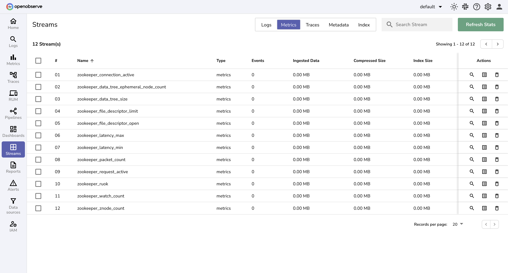

# Integration with Zookeeper Metrics

This guide provides step-by-step instructions to collect and monitor Apache Zookeeper metrics using **OpenTelemetry Collector Contrib** and forward them to OpenObserve.

## Overview

Apache Zookeeper is a centralized service for maintaining configuration information, naming, distributed synchronization, and group services.  
Monitoring Zookeeper is critical to ensure **availability, performance, and stability** across distributed systems.


## Steps to Integrate

??? "Prerequisites"
    - Running **Apache Zookeeper instance(s)**  
    - OpenObserve account ([Cloud](https://cloud.openobserve.ai/web/) or [Self-Hosted](../../../quickstart/#self-hosted-installation))  

??? "Step 1: Update Apache Zookeeper Configuration"

    > The main configuration file for Apache ZooKeeper is named zoo.cfg and is typically located in the <ZOOKEEPER_HOME>/conf directory.

    1. UpdateZookeeper config:  
    Add:
    ```conf
    4lw.commands.whitelist=mntr,ruok,conf,envi,stat
    ```

    2. Restart and check Zookeeper:  
    ```bash
    /opt/zookeeper/bin/zkServer.sh start
    /opt/zookeeper/bin/zkServer.sh status
    ```

??? "Step 2: Install OpenTelemetry Collector Contrib"

    1. Download and install `otelcol-contrib`:
        ```bash
        wget https://github.com/open-telemetry/opentelemetry-collector-releases/releases/download/v0.116.1/otelcol-contrib_0.116.1_linux_amd64.deb
        sudo dpkg -i otelcol-contrib_0.116.1_linux_amd64.deb
        ```

    2. Start and check version:  
        ```bash
        otelcol-contrib --version
        ```

??? "Step 3: Configure the Collector"

    Edit `/etc/otelcol-contrib/config.yaml` with the following configuration:

    ```yaml
    receivers:
      zookeeper:
        endpoint: "localhost:2181"

    exporters:
      otlphttp/openobserve:
        endpoint: https://<your-openobserve-endpoint>/api/default
        headers:
          Authorization: Basic <your_auth_token>
          stream-name: default

    service:
      pipelines:
        metrics:
          receivers: [zookeeper]
          exporters: [otlphttp/openobserve]
    ```

    Replace `<your-openobserve-endpoint>` and `<your_auth_token>` with your actual OpenObserve details.  

    

??? "Step 4: Run the Collector"

    Start the Collector service:

    ```bash
    sudo systemctl start otelcol-contrib
    sudo systemctl status otelcol-contrib
    ```

??? "Step 5: Visualize in OpenObserve"

    1. Navigate to **OpenObserve → Streams** and select your metrics stream.  
    2. Search for Zookeeper metrics.
        
    3. Visualize and Analyze data using Dashboards
    > To make it easy, we have a prebuilt zookeeper dashboard that should help you get started with the metrics monitoring which can be found [here](https://github.com/openobserve/dashboards).

 

## Troubleshooting

??? "Collector Connection Issues"
    - Verify `localhost:2181` is accessible from the Collector.  
    - Confirm the 4-letter words (`mntr`, `stat`) are whitelisted in `zoo.cfg`.  

??? "No Metrics in OpenObserve"
    - Check Collector logs for parsing errors.  
    - Confirm correct endpoint and auth token.  
    - Ensure OpenObserve is reachable from your server.  
