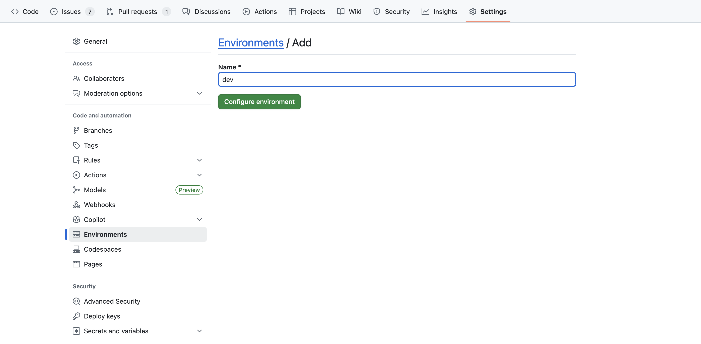

---

title: GitHub Actions Integration Guide  
description: Stream GitHub Actions workflow logs to OpenObserve using the `mdp/openobserve_github_action_logs` action.

---

# Integration with GitHub Actions

This guide explains how to stream **GitHub Actions workflow logs** to OpenObserve using a community-supported GitHub Action. Once integrated, logs from your CI/CD workflows are automatically sent to OpenObserve for monitoring and analysis.

## Overview

This integration captures metadata and logs from GitHub Actions jobs and pushes them directly to OpenObserve using the [mdp/openobserve_github_action_logs](https://github.com/mdp/openobserve_github_action_logs) Action. It requires minimal configuration and enables observability for CI pipelines.

## Steps to Integrate

??? "Prerequisites"

    * OpenObserve account ([Cloud](https://cloud.openobserve.ai/web/) or [Self-Hosted](../../../getting-started/#self-hosted-installation))
    * GitHub repository

??? "Step 1: Get OpenObserve Credentials"

    1. Log in to your OpenObserve instance
    2. Navigate to **Data Sources → custom → logs → curl**
    3. Copy the following values from the generated `curl` command:

        From:

        ```bash
        curl -u you@yourdomain.com:18qlg4b673Rgdgd2 -k https://api.openobserve.ai/api/your_organization/<stream_name>/_json -d [JSON-DATA]
        ```

        Extract values:

        ```
        OPENOBSERVE_ENDPOINT : https://api.openobserve.ai/api/your_organization/<stream_name>/_json
        OPENOBSERVE_USERNAME : you@yourdomain.com
        OPENOBSERVE_KEY : 18qlg4b673Rgdgd2        
        ```

??? "Step 2: Add Secrets to GitHub Environment"

      1. In your GitHub repository, go to **Settings → Environments**
      2. Click **New environment** and name it `dev`

          {: style="height:500px"}
      3. Under the `dev` environment, click **Environment secrets → Add environment secret** and add the following: `OPENOBSERVE_USERNAME`, `OPENOBSERVE_KEY`, and `OPENOBSERVE_ENDPOINT` using the values from Step 1.

          {: style="height:300px"}

??? "Step 3: Add GitHub Action to Your Workflow"

      Add the following to your GitHub Actions YAML file:

      ```yaml
      jobs:
        build-and-test:
          runs-on: ubuntu-latest
          steps:
            - uses: actions/checkout@v3
            - run: |
                npm ci
            - run: |
                npm run all
            - run: npm test

        send_logs_to_openobserve:
          runs-on: ubuntu-latest
          needs: build-and-test  # ensures logs are sent after main job
          environment: dev
          steps:
            - uses: actions/checkout@v3
            - uses: mdp/openobserve_github_action_logs@main
              with:
                openobserve_endpoint: ${{ secrets.OPENOBSERVE_ENDPOINT }} 
                openobserve_username: ${{ secrets.OPENOBSERVE_USERNAME }}
                openobserve_key: ${{ secrets.OPENOBSERVE_KEY }}
                github_token: ${{ secrets.GITHUB_TOKEN }}
      ```

    Once this is in place, all logs from your GitHub Actions jobs will be automatically piped into OpenObserve.

    > Note: The example uses Node.js-specific commands (npm ci, npm run all).
    If your project is not Node.js based, replace these steps with your own project's build/test commands (e.g., make, pytest, go test, etc.).

??? "Step 4: Verify Logs in OpenObserve"

    1. In your Openobserve instance, Go to **Logs** → select your log stream → Set time range → Click **Run Query**

      

## Troubleshooting

??? "No logs appearing?"

    * Double-check that the GitHub secrets were added under the correct **environment (`dev`)**
    * Ensure the `openobserve_endpoint` is correct and matches the `curl` example
    * Confirm the `send_logs_to_openobserve` job ran successfully in GitHub Actions

