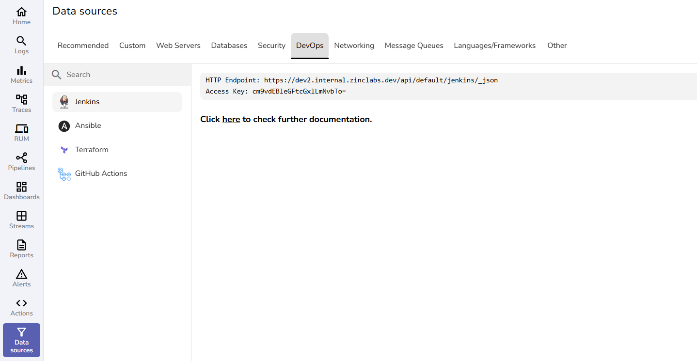

# DevOps Monitoring & CI/CD Pipeline Observability

OpenObserve provides comprehensive DevOps monitoring integrations to collect logs, metrics, and events from CI/CD pipelines, infrastructure automation tools, and DevOps platforms. Monitor Jenkins builds, Terraform deployments, GitHub Actions workflows, and Ansible automation for complete DevOps observability and pipeline monitoring.

These DevOps monitoring integrations enable CI/CD monitoring, deployment tracking, and infrastructure automation observability for streamlined DevOps operations.

## DevOps Tools Integration Guides

- [Jenkins](jenkins.md)
- [Ansible](ansible.md)
- [Terraform](terraform.md)
- [Github Actions](github-actions.md)