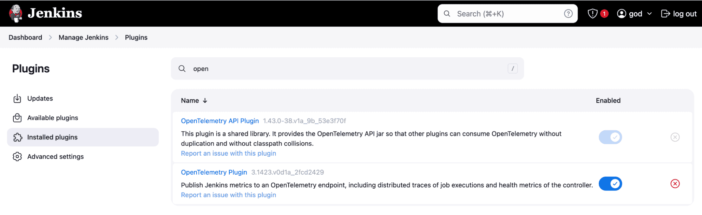
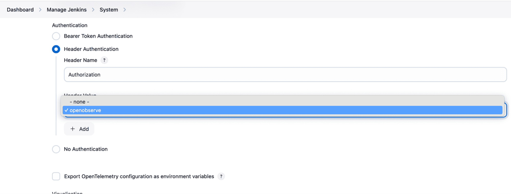
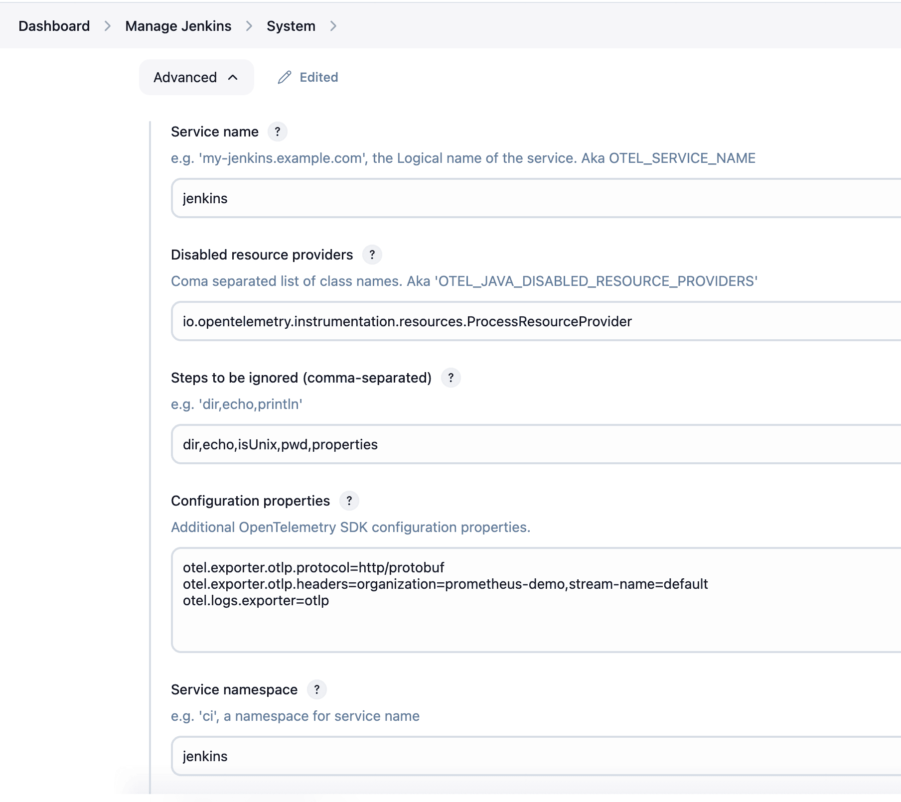
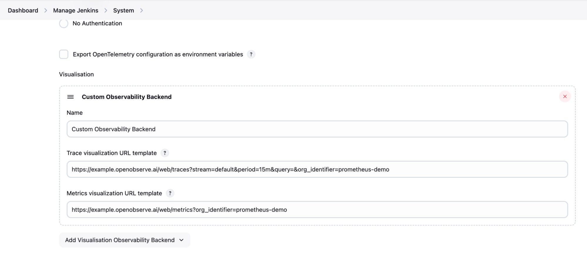
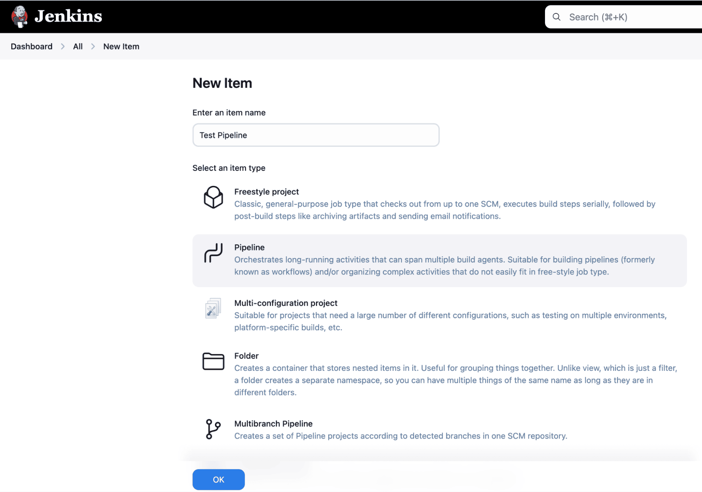

# Integration with Jenkins

This guide explains how to monitor **Jenkins pipelines** using the OpenTelemetry plugin and stream telemetry data to OpenObserve for visualization.

## Overview

The Jenkins integration captures traces, logs, and metrics using the [OpenTelemetry plugin for Jenkins](https://plugins.jenkins.io/opentelemetry/). Once connected to OpenObserve, this setup provides full visibility into pipeline executions , including build stages, test results, and execution time.

## Steps to Integrate

??? "Prerequisites"

    - Jenkins installed on your system
    - OpenObserve account ([Cloud](https://cloud.openobserve.ai/web/) or [Self-Hosted](../../../quickstart/#self-hosted-installation))

??? "Step 1: Install the OpenTelemetry Plugin"

    1. In Jenkins, go to **Manage Jenkins → Manage Plugins**
    2. Under **Available Plugins**, search for **OpenTelemetry**
    3. Select and install the plugin, Restart Jenkins if prompted
    


??? "Step 2: Configure OpenTelemetry with OpenObserve"

    1. In **Manage Jenkins → Configure System**, scroll to the **OpenTelemetry** section
    2. Under **OTLP Endpoint**, enter:
        ```
        https://<O2_HOST>/api/<O2_ORGNAME>
        ```
    3. Next, Select **Header Authentication**
    4. In **Header Value**, enter:
        ```
        Basic <OpenObserveToken>
        ```
        
    5. **Add Configuration Properties (Advanced Settings)** : Under **Advanced → Configuration Properties**, add:

        ```
        otel.exporter.otlp.protocol=http/protobuf
        otel.exporter.otlp.headers=organization=prometheus-demo,stream-name=default
        otel.logs.exporter=otlp
        ```
        {: style="height:500px"}

        > These settings configure the OpenTelemetry plugin to export logs and traces directly to OpenObserve.

    6. Set Observability Backend URLs
        - Under **Visualization Backend**, select **Custom Observability Backend**
        - **Trace Visualization URL Template**: `https://<O2_HOST>/web/traces`
        - **Metrics Visualization URL Template**: `https://<O2_HOST>/web/metrics`
        {: style="height:500px"}
        > These URLs allow Jenkins to link directly to OpenObserve dashboards and trace views.

??? "Step 3: Create a Sample Jenkins Pipeline (Optional)"

    > Note: If you have already existing pipeline, just rebuild to see the traces in Openobserve.

    1. Go to **New Item** → Name: `Test Pipeline` → Select **Pipeline**

        {: style="height:500px"}
    2. In the **Pipeline script** field, paste the following:
        ```groovy
        pipeline {
            agent any

            stages {
                stage('Prepare') {
                    steps {
                        echo 'Preparing environment...'
                        sleep 1
                    }
                }

                stage('Build') {
                    steps {
                        echo 'Building the project...'
                        sleep 2
                    }
                }

                stage('Test') {
                    steps {
                        echo 'Running tests...'
                        script {
                            int totalTests = 10
                            int failedTests = 2
                            echo "Total tests: ${totalTests}"
                            echo "Failed tests: ${failedTests}"
                            if (failedTests > 0) {
                                currentBuild.result = 'UNSTABLE'
                            }
                        }
                    }
                }

                stage('Deploy') {
                    steps {
                        echo 'Deploying to staging...'
                        sleep 1
                    }
                }
            }

            post {
                success {
                    echo 'Pipeline completed successfully!'
                }
                unstable {
                    echo 'Pipeline completed with some test failures.'
                }
                failure {
                    echo 'Pipeline failed.'
                }
            }
        }
        ```
    3. Save and run the pipeline to generate test logs and traces

??? "Step 4: View Pipeline Telemetry from Jenkins UI"

    1. After pipeline execution, go to the Jenkins job panel -> Click the **Observability link**
    2. You will be redirected to OpenObserve with trace and metrics views for that specific job

    

## Troubleshooting

??? "No data in OpenObserve?"

    - Double-check the OTLP endpoint and ensure it uses the full OpenObserve URL
    - Ensure the **Header Authentication** is enabled and token is prefixed with `Basic `
    - Check that `otel.logs.exporter` and `otel.exporter.otlp.headers` are correctly added in **Advanced Configuration Properties**

??? "Observability links not working?"

    - Verify that **Visualization Backend** is set to **Custom**
    - Confirm the URLs:
        - Traces: `https://<O2_HOST>/web/traces`
        - Metrics: `https://<O2_HOST>/web/metrics`


??? "No pipeline logs or metrics?"

    - Ensure your pipeline includes `echo`, `sleep`, and other commands that produce activity
    - Run the pipeline at least once to generate telemetry
    - Check Jenkins logs for any plugin-related errors
