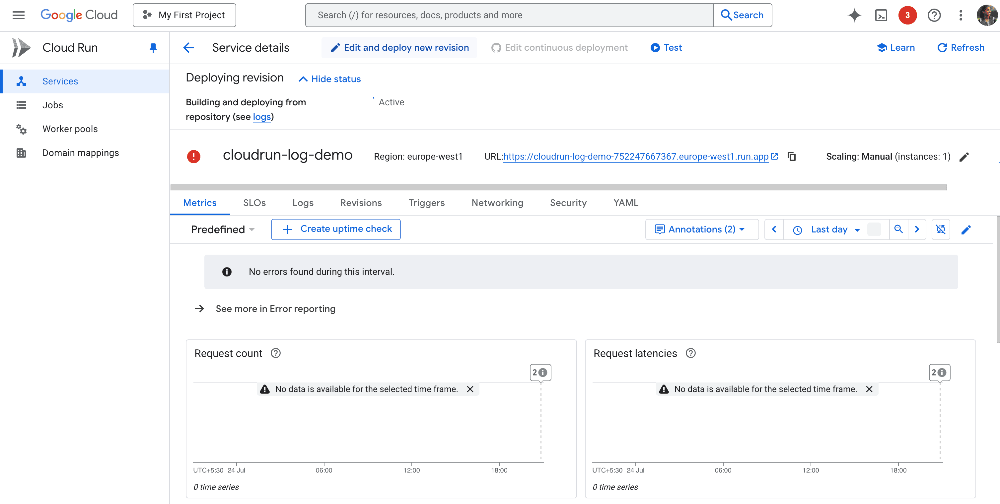
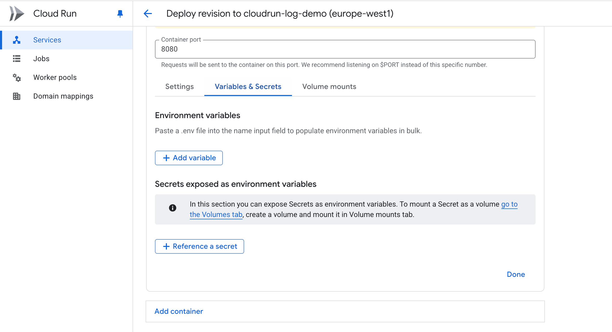
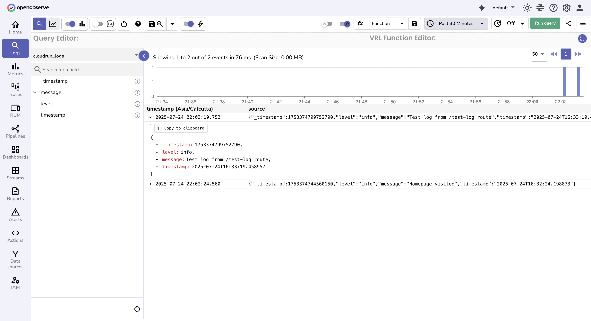

# Integration with Google Cloud Run Logs via HTTP

This guide explains how to send **Google Cloud Run logs** directly to **OpenObserve** using simple HTTP requests.  
Unlike Cloud Logging, which can be costly and slower at scale, this method gives you real-time, structured log ingestion with better retention and cost control.

## Overview

When you deploy a service on Cloud Run, logs are automatically collected in **Cloud Logging**. However, Cloud Logging has limitations for large-scale observability:

- Querying large historical datasets can be slow  
- Limited options for transformations/redactions before storage  
- High costs for long-term log retention  
- No unified view across logs, metrics, and traces  

**OpenObserve** solves these challenges by letting you send structured logs directly from your app into a single observability platform.

## Steps to Integrate

??? "Prerequisites"
    - OpenObserve account ([Cloud](https://cloud.openobserve.ai/web/) or [Self-Hosted](../../../getting-started/#self-hosted-installation))
    - A deployed Google Cloud Run service
    - Basic knowledge of Python or Node.js (examples included)

??? "Step 1: Get OpenObserve Ingestion Details"

    1. Log in to your OpenObserve dashboard
    2. Collect the following values:
        - **URL**: e.g. `https://api.openobserve.ai`
        - **Organization Name**
        - **Stream Name**: any stream you want logs to go to
        - **Authorization Key**: from **Data Sources → Recommended/GCP**
    3. These will be passed to your Cloud Run app as environment variables


??? "Step 2: Add Logging Code to Your App"

    Update your app to send logs via HTTP.

    **Python (Flask/FastAPI example)**

    ```python
    import requests, os
    from datetime import datetime

    def send_log(message):
        try:
            auth = os.environ['OPENOBSERVE_AUTH_KEY']
            url = f"{os.environ['OPENOBSERVE_URL']}/api/{os.environ['OPENOBSERVE_ORG']}/{os.environ['OPENOBSERVE_STREAM']}/_json"
            payload = [{
                "timestamp": datetime.now().isoformat(),
                "message": message,
                "level": "info"
            }]
            response = requests.post(url, json=payload, headers={
                "Authorization": f"Basic {auth}",
                "Content-Type": "application/json"
            })
            print(f"Log sent. Status: {response.status_code}", flush=True)
        except Exception as e:
            print(f"OpenObserve error: {e}", flush=True)

    # Example usage in Flask route
    @app.route('/')
    def hello():
        send_log('Homepage visited')
        return 'Hello World'
    ```

    **Node.js (Express example)**

    ```javascript
    const axios = require('axios');

    async function sendLog(message) {
      try {
        await axios.post(
          `${process.env.OPENOBSERVE_URL}/api/${process.env.OPENOBSERVE_ORG}/${process.env.OPENOBSERVE_STREAM}/_json`,
          [{
            timestamp: new Date().toISOString(),
            message: message,
            level: 'info'
          }],
          {
            headers: {
              'Authorization': `Basic ${process.env.OPENOBSERVE_AUTH_KEY}`,
              'Content-Type': 'application/json'
            }
          }
        );
      } catch (error) {
        console.error('OpenObserve error:', error.message);
      }
    }

    // Example usage in Express route
    app.get('/', (req, res) => {
      sendLog('Homepage visited');
      res.send('Hello World');
    });
    ```

    > Want to test quickly? Use the [cloudrun-openobserve-demo](https://github.com/openobserve/cloudrun-openobserve-demo) sample app.


??? "Step 3: Set Environment Variables in Cloud Run"

    1. Go to **Google Cloud Console → Cloud Run**
    2. Select your service → **Edit & Deploy New Revision**
        
    3. Under **Variables & Secrets → Environment Variables**, add:
        -  `OPENOBSERVE_URL`  :  `https://api.openobserve.ai`
        - `OPENOBSERVE_ORG`      : your org name                
        - `OPENOBSERVE_STREAM`   : desired stream name          
        - `OPENOBSERVE_AUTH_KEY` : API Key from OpenObserve     

            

    4. Click **Deploy**


??? "Step 4: Test and Verify Logs"

    1. Visit your Cloud Run service URL (e.g. `https://my-service-xyz.a.run.app`). The app will log `Homepage visited`
    2. In OpenObserve:
       - Go to **Logs → [Your Stream]** , Set **time range** → Run Query
       - You should see:

       ```json
       {
         "timestamp": "2025-07-24T14:00:00Z",
         "message": "Homepage visited",
         "level": "info"
       }
       ```

    

## Troubleshooting

**Logs not appearing?**

- Double-check `OPENOBSERVE_ORG` and `OPENOBSERVE_STREAM` names  
- `401 Unauthorized`: invalid API key  
- `404 Not Found`: wrong URL or stream path  
- Use `flush=True` in Python `print()` to see debug output in Cloud Run logs  
- Test ingestion with cURL first:

    ```bash
    curl -X POST \
    -H "Authorization: Basic YOUR_AUTH_KEY" \
    -H "Content-Type: application/json" \
    -d '[{"message": "test log"}]' \
    https://YOUR_OPENOBSERVE_URL/api/YOUR_ORG/YOUR_STREAM/_json
    ```