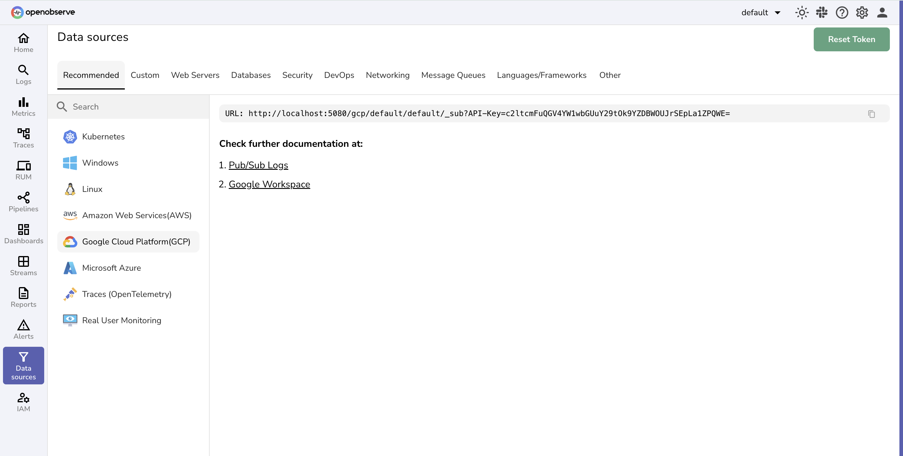

# Integration with Google Cloud Logs via Pub/Sub

This guide explains how to send **Google Cloud logs** into **OpenObserve** by using **Log Router Sink** to route logs into **Google Cloud Pub/Sub**, and then pushing them directly to OpenObserve via a Pub/Sub subscription.

## Overview

The integration flow is: **Google Cloud Logs → Log Router Sink → Pub/Sub → OpenObserve**. By using Pub/Sub with a push subscription, GCP automatically delivers logs to OpenObserve in real time. This enables centralized observability across your cloud infrastructure.

## Steps to Integrate

??? "Prerequisites"
    - OpenObserve account ([Cloud](https://cloud.openobserve.ai/web/) or [Self-Hosted](../../../getting-started/#self-hosted-installation))
    - A Google Cloud Platform (GCP) project with necessary IAM permissions
    - Basic knowledge of GCP Console or `gcloud` CLI

??? "Step 1: Get OpenObserve Ingestion URL and API Key"

    1. In OpenObserve: go to **Data Sources → Recommended → GCP**
    2. Copy the ingestion URL and API Key

    

    Example format:
    ```
    https://api.openobserve.ai/gcp/<org>/<stream>/_sub?API-Key=<YOUR_API_KEY>
    ```


??? "Step 2: Create a Pub/Sub Topic"

    **Using GCP Console**

    1. Navigate to **Pub/Sub → Topics** in GCP Console
    2. Click **Create Topic**
    3. Enter a name (e.g., `my-log-topic`) and Click **Create**

    **Using gcloud CLI**
    ```bash
    gcloud pubsub topics create my-log-topic
    ```

??? "Step 3: Create a Push Subscription to OpenObserve"

    **Using GCP Console**

    1. Go to **Pub/Sub** → Click on the topic you created.
    2. Click **Create Subscription**
    3. Set **Delivery Type**: `Push`
    4. Enter the **OpenObserve ingestion URL** from Step 1 as the Push endpoint
    5. Click **Create**

    

    **Using gcloud CLI**
    ```bash
    gcloud pubsub subscriptions create my-log-subscription \
      --topic=my-log-topic \
      --push-endpoint="https://api.openobserve.ai/gcp/myorg/mystream/_sub?API-Key=<YOUR_API_KEY>"
    ```


??? "Step 4: Create a Log Router Sink"

    **Using GCP Console**

    1. Go to **Logging → Logs Router**
    2. Click **Create Sink** and enter a name (e.g., `my-log-sink`)
    3. Set **Sink Destination**: `Cloud Pub/Sub`
    4. Select your Pub/Sub topic (`my-log-topic`)
    5. In the **Sink Details** section, add **Filter** for which logs to include.Example to collect all logs: `logName: "projects/YOUR_PROJECT_ID/logs/"`
    6. Click **Create Sink**

    **Using gcloud CLI**
    ```bash
    gcloud logging sinks create my-log-sink \
      pubsub.googleapis.com/projects/YOUR_PROJECT_ID/topics/my-log-topic \
      --log-filter='logName: "projects/YOUR_PROJECT_ID/logs/"'
    ```

??? "Step 5: Grant Permissions to Log Router"

    The Log Router requires permission to publish to your Pub/Sub topic.

    **Using GCP Console**

    1. Go to **Pub/Sub → my-log-topic → Permissions**
    2. Click **Add** to add a new Member. In the **New members** field, add the Log Router service account.
       ```
       serviceAccount:cloud-logs@YOUR_PROJECT_ID.iam.gserviceaccount.com
       ```
    3. Assign role: **Pub/Sub Publisher** and Click **Save**

    **Using gcloud CLI**
    ```bash
    gcloud pubsub topics add-iam-policy-binding my-log-topic \
      --member="serviceAccount:cloud-logs@YOUR_PROJECT_ID.iam.gserviceaccount.com" \
      --role="roles/pubsub.publisher"
    ```

??? "Step 6: Verify Logs in OpenObserve"

    1. Generate some activity in your GCP project (e.g., API calls, VM operations)
    2. In OpenObserve, go to **Logs → select stream** (the one you used in the ingestion URL)
    3. Set **time range** and **Run Query**. You should see incoming GCP logs in real time


## Troubleshooting

**No logs in OpenObserve?**

- Check that the Pub/Sub subscription push endpoint is correct (with API Key).
- Verify Log Router Sink filter matches the logs you expect.
- Ensure the Log Router service account has **Pub/Sub Publisher** role.
- Look in **Pub/Sub → Subscriptions → Metrics** to confirm messages are being delivered.
- Check **OpenObserve ingestion page** for error responses.

