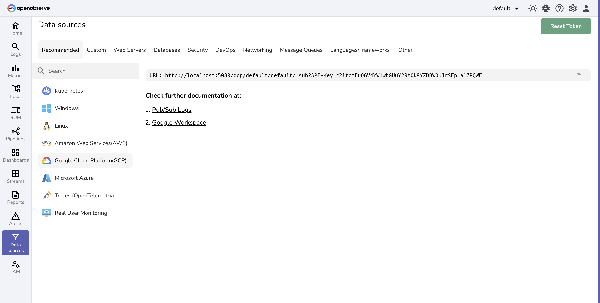

The following user guides provide step-by-step instructions to integrate GCP services with OpenObserve. These integrations allow you to collect logs, metrics, and events directly from various Google Cloud offerings, enabling unified observability across your cloud workloads.

 
Each guide corresponds to a data source listed in the **Data Sources** section of the OpenObserve user interface.

 

 

Learn more:

- [GCP Logs](gcp-logs.md)
- [Google Cloud Run](cloud-run.md)