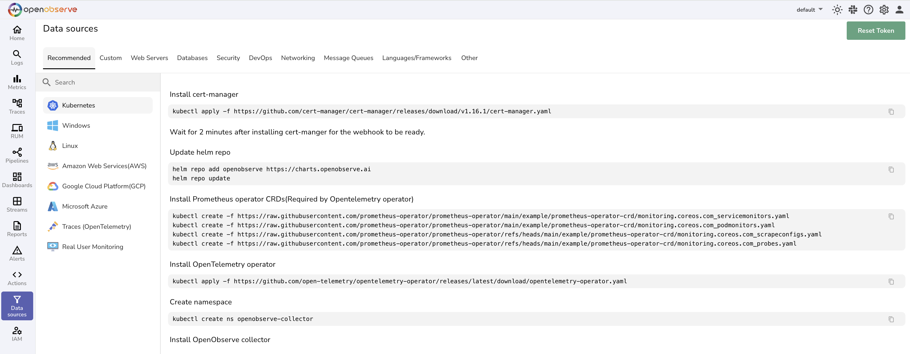

# Monitoring Integrations - Cloud, Infrastructure & Application Observability

OpenObserve provides comprehensive monitoring integrations to collect logs, metrics, and traces from cloud platforms, infrastructure, databases, and applications. These integration guides enable Kubernetes monitoring, AWS monitoring, database monitoring, cloud observability, infrastructure monitoring, and application performance monitoring across your entire technology stack.

Monitor Kubernetes clusters, AWS services, databases (MySQL, PostgreSQL, MongoDB), message brokers (Kafka), web servers (NGINX), and more with unified observability for cloud-native applications and infrastructure.

## Available Integration Guides

- [Kubernetes](system/k8s.md)
- [AWS](cloud/aws)
- [Model Context Protocol (MCP)](ai/mcp)
- [Cloudflare](cloud/cloudflare.md)
- [Database](database)
- [Servers](servers)
- [DevOps](devops)
- [Linux](system/linux.md)
- [Windows](system/windows.md)
- [Vercel](cloud/vercel.md)
- [Heroku](cloud/heroku.md)
- [Message Brokers](message-brokers)