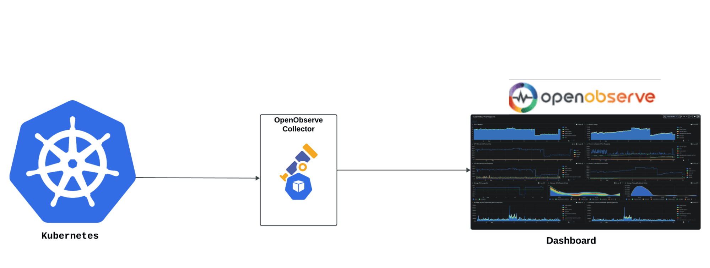
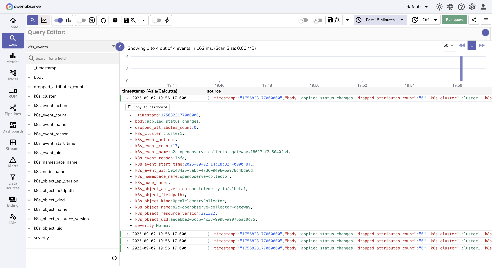
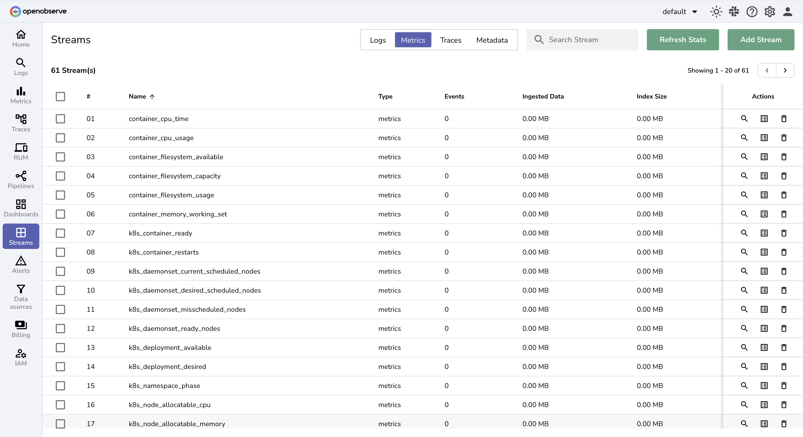
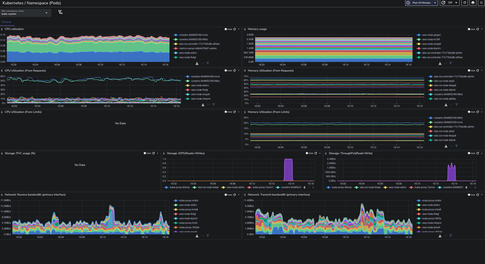

# Integration with Kubernetes

This guide provides step-by-step instructions to integrate Kubernetes with **OpenObserve** for observability.  

## Overview

Kubernetes monitoring differs from traditional server-based monitoring. Instead of only tracking system uptime, you need insights into **pods, services, microservices interactions, events, logs, and traces**.  

OpenTelemetry provides a unified way to collect telemetry data from Kubernetes, and OpenObserve makes it easy to ingest, store, visualize, and analyze that data with minimal setup.  



The integration includes:

- **Metrics**: CPU, memory, storage, and network usage across nodes and pods  
- **Logs**: Container logs for troubleshooting  
- **Events**: Kubernetes system events with severity levels  
- **Traces**: Auto-instrumented application traces without heavy manual changes  

## Steps to Integrate

??? "Prerequisites"
    - A Kubernetes cluster (Minikube, GKE, EKS, or similar)  
    - Helm 3.x installed locally  
    - `kubectl` configured for your cluster  
    - OpenObserve account ([Cloud](https://cloud.openobserve.ai/web/) or [Self-Hosted](../../../quickstart/#self-hosted-installation))


??? "Step 1: Install Cert-Manager"

    Cert-Manager manages TLS certificates in Kubernetes and is required by the OpenTelemetry Operator.  

    ```bash
        kubectl apply -f https://github.com/cert-manager/cert-manager/releases/download/v1.13.1/cert-manager.yaml
    ```
    > Wait about 2 minutes for the webhook to be ready before continuing.


??? "Step 2: Add the OpenObserve Helm Repository"

    ```bash
    helm repo add openobserve https://charts.openobserve.ai
    helm repo update
    ```

    This makes OpenObserve components available for deployment.


??? "Step 3: Install Prometheus Operator CRDs"

    These CRDs are required by the OpenTelemetry Operator for metrics collection.

    ```bash
    kubectl create -f https://raw.githubusercontent.com/prometheus-operator/prometheus-operator/main/example/prometheus-operator-crd/monitoring.coreos.com_servicemonitors.yaml
    kubectl create -f https://raw.githubusercontent.com/prometheus-operator/prometheus-operator/main/example/prometheus-operator-crd/monitoring.coreos.com_podmonitors.yaml
    kubectl create -f https://raw.githubusercontent.com/prometheus-operator/prometheus-operator/refs/heads/main/example/prometheus-operator-crd/monitoring.coreos.com_scrapeconfigs.yaml
    kubectl create -f https://raw.githubusercontent.com/prometheus-operator/prometheus-operator/refs/heads/main/example/prometheus-operator-crd/monitoring.coreos.com_probes.yaml
    ```


??? "Step 4: Install the OpenTelemetry Operator"

    ```bash
    kubectl apply -f https://github.com/open-telemetry/opentelemetry-operator/releases/latest/download/opentelemetry-operator.yaml
    ```

    The operator manages the OpenTelemetry Collector and CRDs for telemetry pipelines.


??? "Step 5: Create Namespace for OpenObserve Collector"

    ```bash
    kubectl create ns openobserve-collector
    ```

??? " Step 6: Deploy OpenObserve Collector with Helm"

    > Use the **pre-filled command** from OpenObserve (Data Sources section), with your auth token. Go to Data Sources -> Kubernetes -> Copy the command to use.

    Install the OpenObserve Collector in your cluster:

    ```bash
    helm --namespace openobserve-collector \
    install o2c openobserve/openobserve-collector \
    --set k8sCluster=cluster1  \
    --set exporters."otlphttp/openobserve".endpoint=<O2_ENDPOINT>/api/default \
    --set exporters."otlphttp/openobserve".headers.Authorization="Basic <BASE64_AUTH>" \
    --set exporters."otlphttp/openobserve_k8s_events".endpoint=<O2_ENDPOINT>/api/default \
    --set exporters."otlphttp/openobserve_k8s_events".headers.Authorization="Basic <BASE64_AUTH>" \
    --create-namespace
    ```

    Replace `<O2_ENDPOINT>` depending on your setup:

    | Setup             | Endpoint                                                                           |
    | ----------------- | ---------------------------------------------------------------------------------- |
    | Local OpenObserve | `http://localhost:5080`                                                            |
    | In-cluster O2     | `http://<helm-release-name>-openobserve-router.<namespace>.svc.cluster.local:5080` |

    This deployment configures the OpenObserve Collector to:

    - Collect metrics from your cluster
    - Collect events from your cluster
    - Collect logs from your cluster
    - Enable auto-instrumentation traces

??? "Step 7: Auto-Instrumentation for Traces"

    OpenTelemetry supports automatic application instrumentation. Add annotations to your pods or namespaces:

    -  Java : 
        ```
        instrumentation.opentelemetry.io/inject-java: "openobserve-collector/openobserve-java
        ```
    - .NET
        ```
        instrumentation.opentelemetry.io/inject-dotnet: "openobserve-collector/openobserve-dotnet"
        ```
    -  NodeJS
        ```
        instrumentation.opentelemetry.io/inject-nodejs: "openobserve-collector/openobserve-nodejs"
        ```
    - Python
        ```
        instrumentation.opentelemetry.io/inject-python: "openobserve-collector/openobserve-python"
        ```
    - Go (eBPF)
        ```
        instrumentation.opentelemetry.io/inject-go: "openobserve-collector/openobserve-go"
        instrumentation.opentelemetry.io/otel-go-auto-target-exe: "/path/to/container/executable"
        ```

??? "Step 8: Verify logs in OpenObserve"

    1. Go to **Logs** in Openobserve → select **stream** `K8s_events` → set **time range** → **Run Query** to check for EC2 logs.
        
    2. Go to **Metrics** section in Stream page, you will find bunch of K8s metrics
        


!!! tip "Pre-Built Dashboards"
    You can [import dashboards from the OpenObserve community repository](https://github.com/openobserve/dashboards/tree/main/Kubernetes(openobserve-collector)) for quick insights:

    * **Namespace (Pods) Dashboard** – resource consumption by pods  
    * **Namespaces Dashboard** – cluster-wide resource allocation  
    * **Events Dashboard** – system events and severities  
    * **Node (Pods) Dashboard** – node-level pod performance  

    


## Troubleshooting

**Collector pods not running**

* Check namespace: `kubectl get pods -n openobserve-collector`
* Review pod logs: `kubectl logs <pod-name> -n openobserve-collector`

**No data in OpenObserve**

* Verify Helm values include the correct OpenObserve URL and auth token
* Ensure network connectivity from cluster → OpenObserve endpoint

**Auto-instrumentation not working**

* Confirm pod annotations are applied
* Make sure language-specific auto-instrumentation images are available

