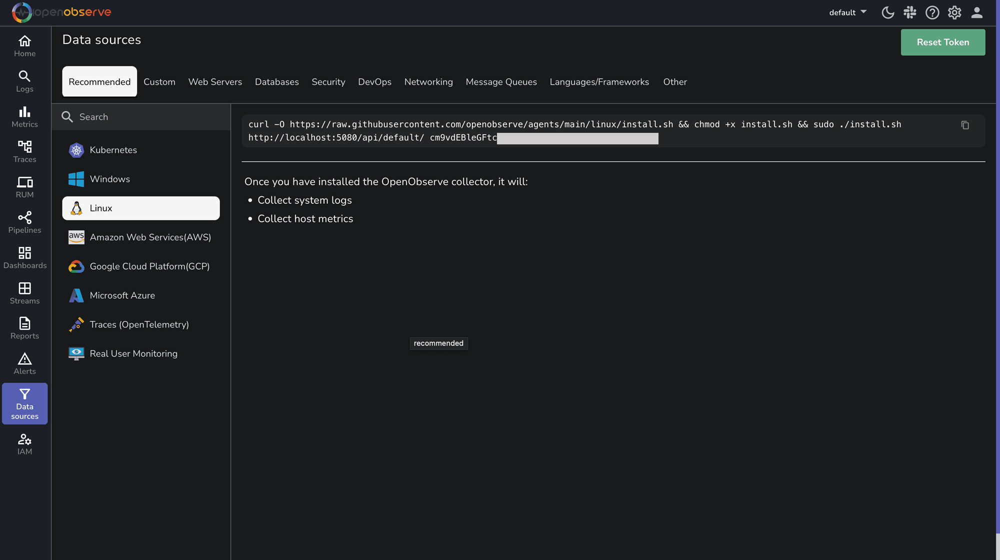

# Linux Server Monitoring - System Logs & Performance Metrics

Monitor Linux servers with comprehensive Linux server monitoring for collecting Linux system logs, server performance metrics, and infrastructure data. This guide explains how to integrate Linux systems with OpenObserve for Linux monitoring, server observability, and infrastructure monitoring using the OpenObserve Collector or OpenTelemetry Collector.

## Overview

Linux server monitoring requires collecting system logs and server performance metrics. Linux systems generate two primary types of monitoring data: system logs (syslog, journald) and performance metrics (CPU, memory, disk, network). Collecting and analyzing Linux monitoring data is essential for maintaining server health, Linux performance optimization, and server security.

---

## Installation Options

OpenObserve provides two approaches to monitor Linux systems:

- **OpenObserve Collector**: A simple, one-command installation recommended for most users.
- **OpenTelemetry Collector**: A flexible option for advanced or customized environments.

---

## Steps to integrate

=== "Using the OpenObserve Collector (Recommended)"

    **Prerequisites**

    - A Linux machine such as Ubuntu, Debian, CentOS, or RHEL
    - Root or sudo access to install and configure services
    - Access to an OpenObserve instance, either [cloud](https://openobserve.ai/docs/getting-started/#option-1-openobserve-cloud-setup) or [self-hosted](https://openobserve.ai/docs/getting-started/#option-2-self-hosted-installation)

    **Steps**

    1. Log in to your OpenObserve instance.
    2. Navigate to **Data Sources** > **Recommended** > **Linux**.
    3. Copy the provided installation command. The command includes your endpoint and API key. 
    4. Run the command in your terminal:
    ```
    curl -O https://raw.githubusercontent.com/openobserve/agents/main/linux/install.sh && chmod +x install.sh && sudo ./install.sh https://your-openobserve-instance.com/api/default/ YOUR_API_KEY
    ```
    
    

    What the OpenObserve Collector Does:

    - Installs as a systemd service
    - Collects system logs from journald or syslog
    - Collects host metrics including CPU, memory, disk, network, and process-level usage
    - Forwards all collected data to OpenObserve

=== "Using the OpenTelemetry Collector"
   
    **Steps** 

    1. Set Up the OpenTelemetry Collector
    Check for the latest version of the OpenTelemetry Collector on the official [releases page](https://github.com/open-telemetry/opentelemetry-collector-releases/releases).
    ```bash linenums="1"
    sudo mkdir -p /opt/otel-collector
    cd /opt/otel-collector
    curl -L https://github.com/open-telemetry/opentelemetry-collector-releases/releases/download/v0.115.0/otelcol-contrib_0.115.0_linux_amd64.tar.gz -o otelcol-contrib.tar.gz
    tar -xzf otelcol-contrib.tar.gz
    ```
    2. Configure the OpenTelemetry Collector
    Create a file named `config.yaml` in the `/opt/otel-collector` directory with the following content: 
    ```yaml linenums="1"
    receivers:
    filelog:
        include:
        - /var/log/syslog
        - /var/log/auth.log
        - /var/log/kern.log
        - /var/log/messages
        - /var/log/secure
        start_at: end
        include_file_path: true
        include_file_name: true
        operators:
        - type: regex_parser
            regex: '^(?P<time>[A-Z][a-z]{2}\s+\d{1,2}\s+\d{2}:\d{2}:\d{2})\s+(?P<host>[^\s]+)\s+(?P<service>[^\s\[]+)(\[(?P<pid>\d+)\])?:\s+(?P<message>.*)$'
            timestamp:
            parse_from: time
            layout: Jan 02 15:04:05
    
    hostmetrics:
        collection_interval: 30s
        scrapers:
        cpu:
            metrics:
            system.cpu.utilization:
                enabled: true
        memory:
            metrics:
            system.memory.utilization:
                enabled: true
        disk:
        filesystem:
        network:
        load:
        paging:
        process:
            mute_process_name_error: true
            metrics:
            process.cpu.utilization:
                enabled: true
            process.memory.utilization:
                enabled: true

    processors:
    batch:
        send_batch_size: 1024
        timeout: 10s
    resourcedetection:
        detectors: [system, env]
        system:
        hostname_sources: ["os"]

    exporters:
    otlphttp/openobserve:
        endpoint: "https://your-openobserve-instance.com/api/default"
        headers:
        Authorization: "Basic YOUR_API_KEY"
        stream-name: "linux-logs"
    debug:
        verbosity: detailed

    service:
    pipelines:
        logs:
        receivers: [filelog]
        processors: [resourcedetection, batch]
        exporters: [otlphttp/openobserve, debug]
        metrics:
        receivers: [hostmetrics]
        processors: [resourcedetection, batch]
        exporters: [otlphttp/openobserve, debug]
    telemetry:
        logs:
        level: "info"    
    ```
    Replace `https://your-openobserve-instance.com/api/default` with your OpenObserve endpoint and `YOUR_API_KEY` with your actual API key.
    3. Run the Collector

    ```bash
    sudo ./otelcol-contrib --config config.yaml
    ```

---

## Advanced Configuration Options
Here are some essential configurations to enhance your Linux monitoring:

??? "Security-Focused Monitoring"
    For enhanced security monitoring:
    ```bash linenums="1"
    filelog:
    include:
        - /var/log/auth.log
        - /var/log/secure
        - /var/log/audit/audit.log
    operators:
        # For SSH authentication events
        - type: router
        routes:
            - expr: 'includes(file.name, "auth.log") or includes(file.name, "secure")'
            output: auth-parser
        - type: regex_parser
        id: auth-parser
        regex: '(?P<time>[A-Z][a-z]{2}\s+\d{1,2}\s+\d{2}:\d{2}:\d{2})\s+(?P<host>[^\s]+)\s+sshd\[(?P<pid>\d+)\]:\s+(?P<message>.*)'
        timestamp:
            parse_from: time
            layout: Jan 02 15:04:05
    ```
    This configuration focuses on authentication logs to help detect unauthorized access attempts and potential security breaches.

??? "Using Journald Receiver"
    If you prefer to collect logs directly from journald instead of log files:
    ```bash linenums="1"
    journald:
    units:
        - ssh.service
        - systemd-logind.service
    priority: info
    ```
    The journald receiver requires systemd and only works on Linux systems using systemd as their init system.

## Troubleshooting

??? "OpenObserve Collector Installation Issues"
    - **Permission Denied**: Run the installation command with `sudo`.
    - **Service Not Starting**: Check status with `sudo systemctl status openobserve-agent` and look for error messages.
    - **Network Issues**: Verify connectivity with `curl -v https://your-openobserve-instance.com`.

??? "Log Collection Issues"
    - **Missing Logs**: Check file permissions and ensure the OpenObserve Collector has read access to log files.
    - **Journald Access**: For systemd-based systems, ensure the OpenObserve Collector has proper journal access.
    - **Log Format Problems**: If logs appear malformed, check timezone settings and log formats.
    
??? "Metrics Collection Issues"
    - **Missing Metrics**: Verify the OpenObserve Collector has permissions to access system metrics.
    - **Performance Impact**: If the OpenObserve Collector uses too many resources, adjust collection intervals.

??? "OpenTelemetry Collector Issues"
    - **Configuration Errors**: Validate your config.yaml syntax and check OpenTelemetry Collector logs.
    - **Export Failures**: Verify your endpoint URL and API key are correct.
    - **Resource Constraints**: Adjust batch settings if the OpenTelemetry Collector terminates unexpectedly.
    