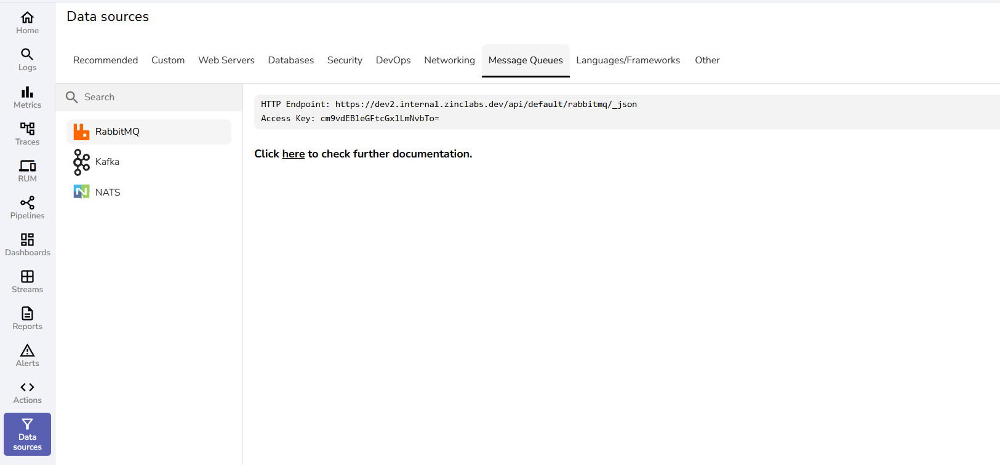

The following user guides provide step-by-step instructions to integrate **message brokers** with OpenObserve.  
These integrations allow you to collect logs, metrics, and events directly from your messaging and streaming platforms, enabling unified observability across your applications.
 
Each guide corresponds to a message queue that appears under the Message Queues tab in the OpenObserve user interface.

 
Learn more:

- [Kafka](kafka.md)

