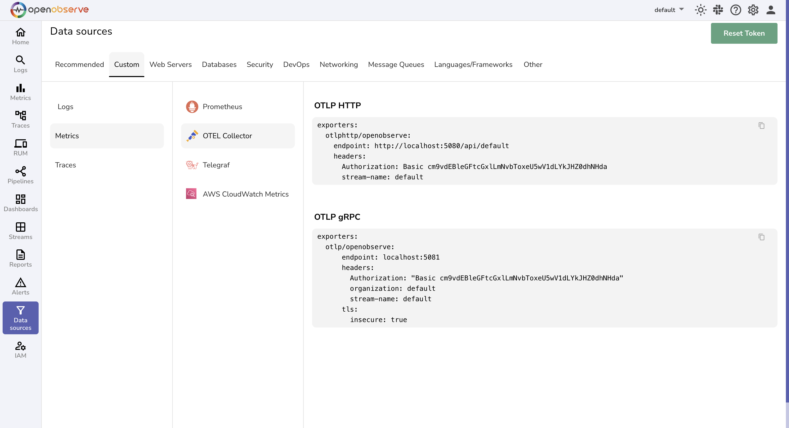
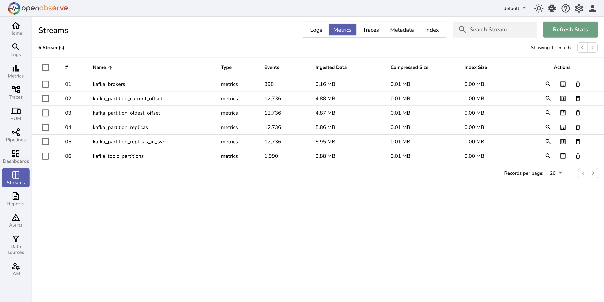

# Integration with Apache Kafka

This guide explains how to monitor **Apache Kafka** using the [OpenTelemetry Collector Contrib](https://github.com/open-telemetry/opentelemetry-collector-contrib) (`otelcol-contrib`) and export metrics to **OpenObserve** for visualization.

## Overview

Monitoring Kafka is essential for ensuring performance, reliability, and data integrity.With OpenTelemetry and OpenObserve, you gain **real-time visibility** into Kafka clusters, topics, consumers, and producers.

## Steps to Integrate

??? "Prerequisites"
    - OpenObserve account ([Cloud](https://cloud.openobserve.ai/web/) or [Self-Hosted](../../../quickstart/#self-hosted-installation))
    - Kafka running 

??? "Step 1: Create Test Kafka Topics (Optional)"

    1. Create test topics to simulate workloads:
        ```bash
        bin/kafka-topics.sh --create --topic quickstart-events-1 --partitions 3 --bootstrap-server localhost:9092
        bin/kafka-topics.sh --create --topic quickstart-events-2 --partitions 10 --bootstrap-server localhost:9092
        bin/kafka-topics.sh --create --topic openobserve --partitions 2 --bootstrap-server localhost:9092
        ```

    2. List topics to confirm:
        ```bash
        bin/kafka-topics.sh --list --bootstrap-server localhost:9092
        ```


??? "Step 2: Install OpenTelemetry Collector Contrib"

    Download and install the latest **otelcol-contrib**.

    ```bash
    wget https://github.com/open-telemetry/opentelemetry-collector-releases/releases/download/v0.116.1/otelcol-contrib_0.116.1_linux_amd64.deb
    sudo dpkg -i otelcol-contrib_0.116.1_linux_amd64.deb
    ```

    > **Note:** Replace version numbers in download links if a newer release is available. Always check the [GitHub Releases](https://github.com/open-telemetry/opentelemetry-collector-releases/releases) page.

??? "Step 3: Get OpenObserve URL and Access Key"

    1. In OpenObserve: go to **Data Sources → Custom → Metrics → Otel Collector **
    2. Copy the ingestion URL and Access Key
    

??? "Step 4: Configure OpenTelemetry Collector"

    1. Edit the configuration file:
        ```bash
        sudo vi /etc/otelcol-contrib/config.yaml
        ```
    2. Update config for Kafka metrics:

        ```yaml
        receivers:
        kafkametrics:
            brokers: localhost:9092
            protocol_version: 2.0.0
            scrapers:
            - brokers
            - topics
            - consumers

        exporters:
        otlphttp/openobserve:
            endpoint: OPENOBSERVE_ENDPOINT
            headers:
            Authorization: OPENOBSERVE_TOKEN
            stream-name: OPENOBSERVE_STREAM

        service:
        pipelines:
            metrics:
            receivers: [kafkametrics]
            exporters: [otlphttp/openobserve]
        ```

    Replace the following with your OpenObserve details:

    * `OPENOBSERVE_ENDPOINT` → API endpoint (e.g., `https://api.openobserve.ai`)
    * `OPENOBSERVE_TOKEN` → API token
    * `OPENOBSERVE_STREAM` → Stream name


??? "Step 5: Start OpenTelemetry Collector"

    1. Start and check status:
        ```bash
        sudo systemctl start otelcol-contrib
        sudo systemctl status otelcol-contrib
        ```
    2. Check logs:
        ```bash
        journalctl -u otelcol-contrib --no-pager -n 50
        ```

??? "Step 6: Visualize in OpenObserve"

    1. Go to **Streams** → select metrics. Expand on any metric stream to see the events.
    

!!! tip

    You can use **[prebuilt dashboards](https://openobserve-prod-website.s3.us-west-2.amazonaws.com/assets/kafka_dashboard_e2dc6c8569.json)** to quickly get started with Kafka monitoring. Browse and import dashboards from: [OpenObserve Community Dashboards](https://github.com/openobserve/dashboards)


## Troubleshooting


-  Collector Fails to Start: `failed to build pipelines: unknown receiver kafkametrics`
    - Cause: Using an older `otelcol-contrib` version that doesn’t support the `kafkametrics` receiver.
    - **Fix:** Upgrade to at least `v0.116.0` or newer from [GitHub Releases](https://github.com/open-telemetry/opentelemetry-collector-releases).
-  No Metrics Visible in OpenObserve
    - Double-check values in your `config.yaml` against your OpenObserve → Data Sources → Custom → Metrics → Otel Collector page.
- Kafka Connection Errors: `dial tcp 127.0.0.1:9092: connect: connection refused`  
    - **Cause:** Kafka broker not running or wrong address.  
    - **Fix:** Ensure Kafka is started and reachable. Run:
    ```bash
    bin/kafka-broker-api-versions.sh --bootstrap-server localhost:9092
    ```
