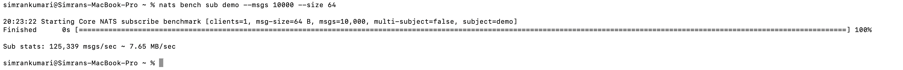
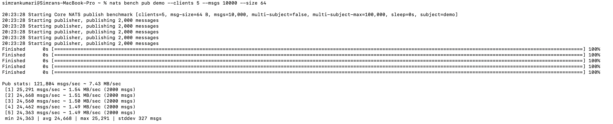
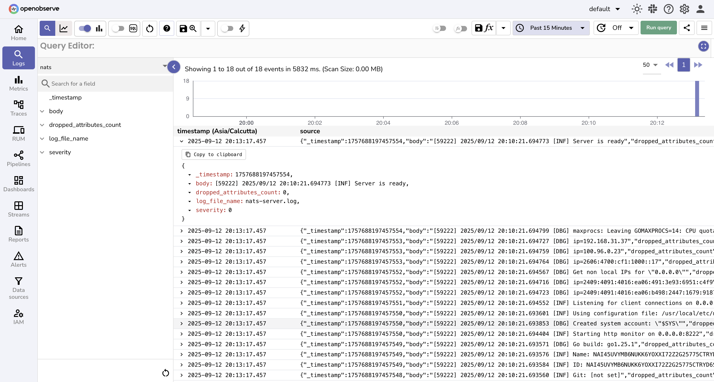
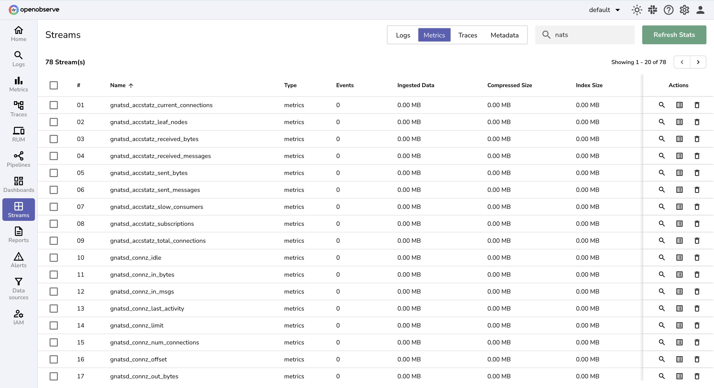

# Integration with NATS

This guide explains how to monitor **NATS** using the [OpenTelemetry Collector](https://opentelemetry.io/docs/collector/) (`otelcol`) and export both logs and metrics to **OpenObserve** for visualization.

## Overview

NATS is a high-performance, cloud-native messaging system widely used in **microservices, IoT, and distributed applications**. Monitoring NATS is critical to ensure seamless communication, security, and performance. With OpenTelemetry and OpenObserve, you gain **real-time visibility** into NATS logs, message throughput, errors, and system resource usage.

## Steps to Integrate

??? "Prerequisites"
    - Docker installed
    - OpenObserve account ([Cloud](https://cloud.openobserve.ai/web/) or [Self-Hosted](../../getting-started.md))
    - Basic understanding of Prometheus exporters

??? "Step 1: Install NATS"

    1. Install dependencies:
        ```bash
        sudo apt update && sudo apt upgrade -y
        sudo apt install -y wget unzip
        ```

    2. Download and install NATS server:
        ```bash
        wget https://github.com/nats-io/nats-server/releases/download/v2.10.26/nats-server-v2.10.26-linux-amd64.zip
        unzip nats-server-v2.10.26-linux-amd64.zip
        cd nats-server-v2.10.26-linux-amd64
        sudo mv nats-server /usr/local/bin/
        ```

    3. Start NATS with JetStream enabled:
        ```bash
        nats-server -js
        ```

??? "Step 2: Configure NATS Logging and Metrics"

    1. Create a configuration file:
        ```bash
        sudo mkdir -p /etc/nats
        sudo nano /etc/nats/nats.conf
        ```

        Add:
        ```yaml
        pid_file: "/var/run/nats-server.pid"
        http: 8222

        log_file: "/var/log/nats-server.log"
        logtime: true
        debug: true
        trace: true
        ```

    2. Start NATS with config file:
        ```bash
        nats-server -c /etc/nats/nats.conf
        ```

    3. Verify logs:
        ```bash
        tail -f /var/log/nats-server.log
        ```

    4. Start NATS Prometheus exporter:
        ```bash
        docker run -p 7777:7777 natsio/prometheus-nats-exporter:latest \
          -D -jsz=all -accstatz -connz_detailed -gatewayz -healthz \
          -connz -varz -subz \
          http://<NATS_SERVER_IP>:8222
        ```

        > Metrics are now exposed on port `7777`.

??? "Step 3: Install OpenTelemetry Collector"

    Download and install the latest **otelcol-contrib**.

    ```bash
    wget https://github.com/open-telemetry/opentelemetry-collector-releases/releases/download/v0.116.1/otelcol-contrib_0.116.1_linux_amd64.deb
    sudo dpkg -i otelcol-contrib_0.116.1_linux_amd64.deb
    ```

    > **Note:** Replace version numbers in download links if a newer release is available. Always check the [GitHub Releases](https://github.com/open-telemetry/opentelemetry-collector-releases/releases) page.


??? "Step 4: Configure OpenTelemetry Collector"

    1. Edit config file:
        ```bash
        sudo vi /etc/otelcol-config.yaml
        ```

    2. Add configuration:

        ```yaml
        receivers:
          filelog/std:
            include: [ /var/log/nats-server.log ]
            start_at: beginning
          prometheus:
            config:
              scrape_configs:
                - job_name: 'nats'
                  scrape_interval: 5s
                  static_configs:
                    - targets: ['localhost:7777']

        processors:
          batch:
            timeout: 5s

        exporters:
          otlphttp/openobserve:
            endpoint: OPENOBSERVE_ENDPOINT
            headers:
              Authorization: "OPENOBSERVE_TOKEN"
              stream-name: nats

        service:
          pipelines:
            metrics:
              receivers: [prometheus]
              processors: [batch]
              exporters: [otlphttp/openobserve]
            logs:
              receivers: [filelog/std]
              processors: [batch]
              exporters: [otlphttp/openobserve]
        ```

    Replace placeholders:

    - `OPENOBSERVE_ENDPOINT` → API endpoint (e.g., `https://api.openobserve.ai`)
    - `OPENOBSERVE_TOKEN` → Access token from data sources page

??? "Step 5: Restart OpenTelemetry Collector"

    ```bash
    sudo systemctl restart otel-collector
    journalctl -u otel-collector -f
    ```

    > Check logs to verify NATS logs and metrics are flowing.

??? "Step 6: Load Testing NATS (Optional)"

    Use `nats bench` to generate load:

    In Terminal 1:
        ```bash
        nats bench sub demo --msgs 10000 --size 64   
        ```
        
    In Terminal 2:
        ```bash
        nats bench pub demo --clients 5 --msgs 10000 --size 64
        ```
        


??? "Step 7: Visualize in OpenObserve"

    1. Log in to OpenObserve and explore the **NATS stream** under Logs.
        
    2. Explore the **NATS stream** under Metrics.
        


!!! tip
    You can use preconfigured [Dashboard](https://openobserve-prod-website.s3.us-west-2.amazonaws.com/assets/nats_dashboard_c317f090bb.json) in OpenObserve to to visualize real-time logs and metrics.

## Troubleshooting

- **No Logs in OpenObserve**  
   
    - Ensure `filelog` receiver points to `/var/log/nats-server.log`.
    - Verify OpenTelemetry Collector is running with correct config.

- **Metrics Not Visible**  
    
    - Check that Prometheus exporter is running on `localhost:7777`.
    - Confirm scrape target matches the exporter port.

- **Collector Fails to Start**  
 
  - Check config file syntax with:
    ```bash
    otelcol --config /etc/otelcol-config.yaml --dry-run
    ```
