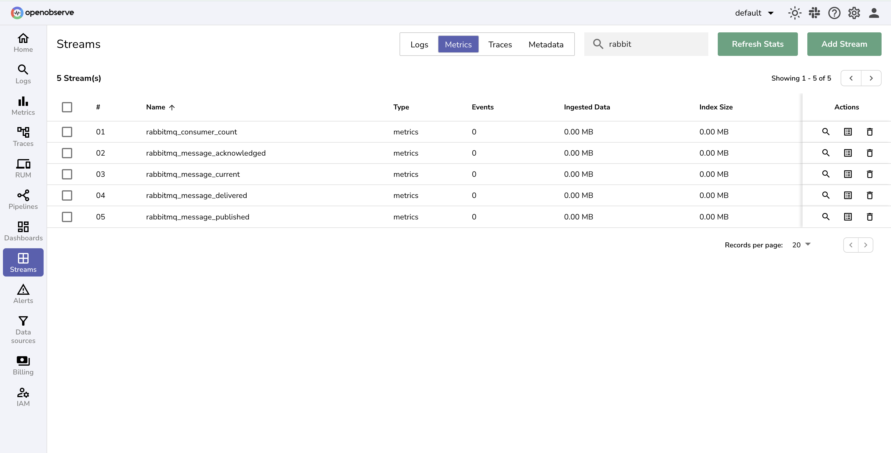

# Integration with RabbitMQ

This guide explains how to monitor **RabbitMQ** using the [OpenTelemetry Collector Contrib](https://github.com/open-telemetry/opentelemetry-collector-contrib) (`otelcol-contrib`) and export metrics to **OpenObserve** for visualization.

## Overview

RabbitMQ is a lightweight, open-source message broker that supports the **AMQP protocol**. It powers distributed systems by handling messaging between producers and consumers.With OpenTelemetry and OpenObserve, you can collect, visualize, and alert on RabbitMQ metrics such as message throughput, consumer count, and queue depth.


## Steps to Integrate

??? "Prerequisites"
    - OpenObserve account ([Cloud](https://cloud.openobserve.ai/web/) or [Self-Hosted](../../getting-started.md))
    - RabbitMQ running

??? "Step 1: Enable Management Plugin"

    1. Enable management plugin:
        ```bash
        rabbitmq-plugins enable rabbitmq_management
        ```

    2. Create monitoring user:

        ```bash
        rabbitmqctl add_user otel pass123
        rabbitmqctl set_user_tags otel monitoring
        rabbitmqctl set_permissions -p / otel ".*" ".*" ".*"
        ```

    > **Note:** The RabbitMQ receiver supports versions `3.8`, `3.9` and above.

??? "Step 2: Install OpenTelemetry Collector Contrib"

    Download and install the latest **otelcol-contrib**.

    For macOS (ARM64 example):

    ```bash
    curl --proto '=https' --tlsv1.2 -fOL \
    https://github.com/open-telemetry/opentelemetry-collector-releases/releases/download/v0.115.1/otelcol-contrib_0.115.1_darwin_arm64.tar.gz

    tar -xvf otelcol-contrib_0.115.1_darwin_arm64.tar.gz
    sudo mv otelcol-contrib /usr/local/bin/
    ```

    Verify installation:

    ```bash
    otelcol-contrib --version
    ```

??? "Step 3: Get OpenObserve URL and Access Key"

    1. In OpenObserve: go to **Data Sources → Custom → Metrics → Otel Collector**
    2. Copy the ingestion URL and Access Key  
    

??? "Step 4: Configure OpenTelemetry Collector"

    Create or edit the config file:

    ```yaml
    receivers:
      rabbitmq:
        endpoint: http://localhost:15672
        username: otel
        password: pass123
        collection_interval: 30s
        tls:
          insecure: true
          insecure_skip_verify: true

    processors:
      batch:
        send_batch_size: 10000
        timeout: 10s

    exporters:
      otlphttp/openobserve:
        endpoint: OPENOBSERVE_ENDPOINT
        headers:
          Authorization: OPENOBSERVE_TOKEN
          stream-name: OPENOBSERVE_STREAM

    service:
      pipelines:
        metrics:
          receivers: [rabbitmq]
          processors: [batch]
          exporters: [otlphttp/openobserve]
    ```

    Replace the following with your OpenObserve details:

    * `OPENOBSERVE_ENDPOINT` → API endpoint (e.g., `https://api.openobserve.ai`)
    * `OPENOBSERVE_TOKEN` → API token
    * `OPENOBSERVE_STREAM` → Stream name

??? "Step 5: Start OpenTelemetry Collector"

    Run the collector:

    ```bash
    otelcol-contrib --config otel-collector-config.yaml
    ```

    Logs should confirm metrics are being collected.

??? "Step 6: Generate Test Metrics (Optional)"

    1. Create a test queue
        ```
        rabbitmqadmin -u otel -p pass123 declare queue name=test-queue durable=true
        ```

    2. Publish some test messages
        ```
        rabbitmqadmin -u otel -p pass123 publish exchange=amq.default routing_key=test-queue payload="hello1"
        rabbitmqadmin -u otel -p pass123 publish exchange=amq.default routing_key=test-queue payload="hello2"
        rabbitmqadmin -u otel -p pass123 publish exchange=amq.default routing_key=test-queue payload="hello3"
        ```

    3. Consume messages
        ```
        rabbitmqadmin -u otel -p pass123 get queue=test-queue count=3
        ```
    > Use your own username and password `rabbitmqadmin -u <username> -p <password>` based on user created in step1

??? "Step 7: Visualize in OpenObserve"

    1. Go to **Streams** → search for RabbitMQ metrics → explore metrics.
    


!!! tip
    
    You can import **[prebuilt dashboards](https://github.com/openobserve/dashboards)** for quick monitoring.  


## Troubleshooting

- **Collector fails to start**:  
  Ensure you are using `otelcol-contrib` (not core `otelcol`).
  
- **No metrics in OpenObserve**:  
  Double-check endpoint, token, and stream configuration.
  
- **Authentication errors**:  
  Verify user tags and permissions:  
  ```bash
  rabbitmqctl list_users
  rabbitmqctl list_user_permissions otel
    ```

- **Connection refused**:
  Ensure ports `5672` (AMQP) and `15672` (Management API) are open.


