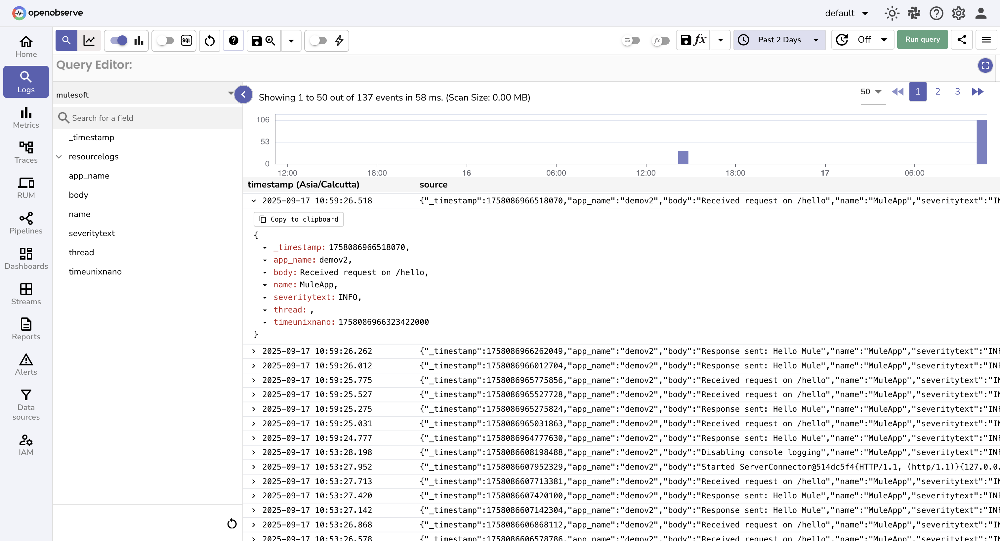

# Integrating MuleSoft AMC Logs with OpenObserve

## Introduction

MuleSoft’s Anypoint Monitoring Console (AMC) provides runtime logs for deployed Mule applications. While useful in the Anypoint platform, teams often want to centralize logs in an observability platform for better search, dashboards, and alerting.

## Overview

This guide shows how to stream **MuleSoft AMC logs into OpenObserve** using a small Python script.
The script authenticates to Anypoint with a username/password, fetches logs from AMC, and pushes them into OpenObserve.

## Steps to Integrate

??? "Prerequisites"

    * A running MuleSoft CloudHub deployment (or Runtime Manager application).
    * Python 3.8+ installed.
    * OpenObserve account ([Cloud](https://cloud.openobserve.ai/web/) or [Self-Hosted](../../getting-started/#self-hosted-installation))

??? "Step 1: Create the Script"

    1. Save the following script as `mulesoft_logs_to_openobserve.py`:

        ```python
        import datetime
        import requests
        import time
        import os, json

        # ------------------------------
        # Configuration
        # ------------------------------
        ANYPOINT_USERNAME = "YOUR_USERNAME"
        ANYPOINT_PASSWORD = "YOUR_PASSWORD"
        OPENOBSERVE_ENDPOINT = "https://<your-openobserve-endpoint>/api/default/mulesoft/_json"
        OPENOBSERVE_API_TOKEN = "BASE64_ENCODED_USER:PASSWORD"
        ANYPOINT_ORG_NAME = "o2"
        ANYPOINT_ENV_NAME = "Sandbox"
        ANYPOINT_APP_NAME = "demov2"
        STATE_FILE = "last_log_time.json"

        # ------------------------------
        # Authentication
        # ------------------------------
        def get_anypoint_token(username, password):
            url = "https://anypoint.mulesoft.com/accounts/login"
            headers = {"Content-Type": "application/json"}
            payload = {"username": username, "password": password}
            resp = requests.post(url, headers=headers, json=payload)
            resp.raise_for_status()
            return resp.json().get("access_token")

        # ------------------------------
        # Helpers to resolve Org/Env/Deployment
        # ------------------------------
        def get_org_id(token, org_name):
            url = "https://anypoint.mulesoft.com/accounts/api/me"
            resp = requests.get(url, headers={"Authorization": f"Bearer {token}"})
            resp.raise_for_status()
            orgs = resp.json()["user"]["memberOfOrganizations"]
            return next(o["id"] for o in orgs if o["name"] == org_name)

        def get_env_id(token, org_id, env_name):
            url = f"https://anypoint.mulesoft.com/accounts/api/organizations/{org_id}/environments"
            resp = requests.get(url, headers={"Authorization": f"Bearer {token}"})
            resp.raise_for_status()
            envs = resp.json()["data"]
            return next(e["id"] for e in envs if e["name"].lower() == env_name.lower())

        def get_deployment_id(token, org_id, env_id, app_name):
            url = f"https://anypoint.mulesoft.com/amc/application-manager/api/v2/organizations/{org_id}/environments/{env_id}/deployments"
            resp = requests.get(url, headers={"Authorization": f"Bearer {token}"})
            resp.raise_for_status()
            deps = resp.json()["items"]
            return next(d["id"] for d in deps if d["name"] == app_name)

        def get_spec_id(token, org_id, env_id, dep_id):
            url = f"https://anypoint.mulesoft.com/amc/application-manager/api/v2/organizations/{org_id}/environments/{env_id}/deployments/{dep_id}/specs"
            resp = requests.get(url, headers={"Authorization": f"Bearer {token}"})
            resp.raise_for_status()
            specs = resp.json()
            return specs[0].get("id") or specs[0].get("version")
        # ------------------------------
        # Log fetch + dedup state
        # ------------------------------
        def load_last_time():
            if os.path.exists(STATE_FILE):
                return json.load(open(STATE_FILE)).get("last_time")
            return None

        def save_last_time(ts):
            json.dump({"last_time": ts}, open(STATE_FILE, "w"))

        def fetch_amc_logs(access_token, org_id, env_id, dep_id, spec_id, start_time=None):
            headers = {"Authorization": f"Bearer {access_token}"}
            all_logs = []
            offset = 0
            size = 50  # fetch 50 logs per request

            while True:
                params = {"descending": "false", "size": size, "offset": offset}
                if start_time:
                    params["startTime"] = start_time

                resp = requests.get(
                    f"https://anypoint.mulesoft.com/amc/application-manager/api/v2/"
                    f"organizations/{org_id}/environments/{env_id}/deployments/{dep_id}/specs/{spec_id}/logs",
                    headers=headers,
                    params=params
                )
                resp.raise_for_status()
                resp_json = resp.json()
                # print("DEBUG log response:", resp_json)  # 👈 check what’s coming back
                
                logs = resp_json

                if not logs:
                    break

                all_logs.extend(logs)

                if len(logs) < size:
                    break
                offset += size

            return all_logs


        def parse_log(log):
            if isinstance(log, dict):
                return {
                    "timestamp": log.get("timestamp", ""),
                    "level": log.get("level", "INFO"),
                    "message": log.get("message", "")
                }
            else:
                parts = log.split(" ", 2)
                return {
                    "timestamp": parts[0] + " " + parts[1],
                    "level": parts[2].split(" ", 1)[0],
                    "message": parts[2].split(" ", 1)[1] if len(parts) >= 3 else log
                }

        # ------------------------------
        # Push to OpenObserve
        # ------------------------------
        def push_to_openobserve(logs, api_token, endpoint):
            headers = {"Authorization": f"Basic {api_token}", "Content-Type": "application/json"}
            for log_item in logs:
                log = parse_log(log_item)
                try:
                    dt = datetime.datetime.strptime(log["timestamp"], "%Y-%m-%d %H:%M:%S")
                    time_ns = int(dt.timestamp() * 1e9)
                    time_ms = int(dt.timestamp() * 1000)
                except:
                    now = time.time()
                    time_ns = int(now * 1e9)
                    time_ms = int(now * 1000)
                payload = {
                    "timeUnixNano": time_ns,
                    "severityText": log["level"],
                    "name": "MuleApp",
                    "body": log["message"],
                    "app_name": ANYPOINT_APP_NAME
                }
                resp = requests.post(endpoint, headers=headers, json=payload)
                resp.raise_for_status()
            # return last timestamp in epoch millis
            return time_ms

        # ------------------------------
        # Main Flow
        # ------------------------------
        def main():
            print("Authenticating...")
            token = get_anypoint_token(ANYPOINT_USERNAME, ANYPOINT_PASSWORD)

            print("Resolving Org / Env / Deployment / Spec IDs...")
            org_id = get_org_id(token, ANYPOINT_ORG_NAME)
            env_id = get_env_id(token, org_id, ANYPOINT_ENV_NAME)
            dep_id = get_deployment_id(token, org_id, env_id, ANYPOINT_APP_NAME)
            spec_id = get_spec_id(token, org_id, env_id, dep_id)

            last_time = load_last_time()

            print("Fetching logs...")
            logs = fetch_amc_logs(token, org_id, env_id, dep_id, spec_id, start_time=last_time)

            if logs:
                print(f"Pushing {len(logs)} logs to OpenObserve...")
                latest_ts = push_to_openobserve(logs, OPENOBSERVE_API_TOKEN, OPENOBSERVE_ENDPOINT)
                save_last_time(latest_ts)
            else:
                print("No new logs.")

            print("Done ✅")

        if __name__ == "__main__":
            main()

        ```

    2. Install Dependencies"

        ```bash
        python3 -m venv venv
        source venv/bin/activate
        pip install requests
        ```


    3. Edit the script and set:

        * `ANYPOINT_USERNAME` / `ANYPOINT_PASSWORD` → your MuleSoft account.
        * `ANYPOINT_ORG_NAME`, `ANYPOINT_ENV_NAME`, `ANYPOINT_APP_NAME`.
        * `OPENOBSERVE_ENDPOINT` → your OpenObserve API `_json` ingestion URL.
        * `OPENOBSERVE_API_TOKEN` → base64-encoded user\:password.

    4. Run Once

        ```bash
        python mulesoft_logs_to_openobserve.py
        ```

??? "Step 2: Verify Logs in OpenObserve"

    1. Go to **Streams → mulesoft** in OpenObserve to query logs. 
    

??? "Step 3: Automate"

    Run every 5 minutes with `cron`:

    ```cron
    */5 * * * * /path/to/venv/bin/python /path/to/mulesoft_logs_to_openobserve.py >> mule_logs.log 2>&1
    ```

    Because the script saves the last log timestamp in `last_log_time.json`, it **only pushes new logs** each run.


!!! tip 

    - **CloudHub Logs:** If your organization has enabled CloudHub, you can explore the [CloudHub API](https://anypoint.mulesoft.com/exchange/portals/anypoint-platform/f1e97bc6-315a-4490-82a7-23abe036327a.anypoint-platform/cloudhub-api/minor/1.0/console/method/%232640/) to fetch instance logs programmatically.  
    - **Custom Log Appenders:** For more reliable log extraction, consider using [Mule Custom Log Appenders](https://docs.mulesoft.com/cloudhub/custom-log-appender) instead of relying on the API. This allows you to push logs directly to OpenObserve or other observability platforms with minimal loss.  
    - **Pagination & Limits:** Always use pagination (`offset` + `limit`) when fetching logs to avoid missing older logs.  

## Troubleshooting

- **No logs fetched**
    - Verify AnyPoint credentials, org/env/app/spec names, and that the app is running. Use debug prints to check IDs.
- **Duplicate logs**
    - Ensure last_log_time.json is updated and start_time is passed when fetching logs.
- **Cron job not running**
    - Check syntax (*/5 * * * *) and Python path (which python3). Redirect output to a log file for debugging.
- **Python not found**
    - Use the full virtualenv Python path in cron.
- **API errors**
    - Print API responses to debug 401/404 issues.