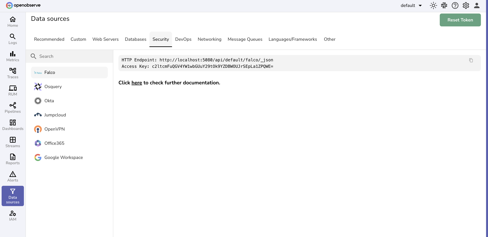

The following user guides provide step-by-step instructions to integrate **security data sources** with OpenObserve.  
These integrations allow you to centralize audit logs, identity activity, and security events, giving you unified visibility into compliance, authentication, and anomaly detection.

 
Each guide corresponds to a security integration that appears under the **Security** tab in the OpenObserve user interface.  
  
 

Learn more:

- [Microsoft 365](microsoft365.md)

