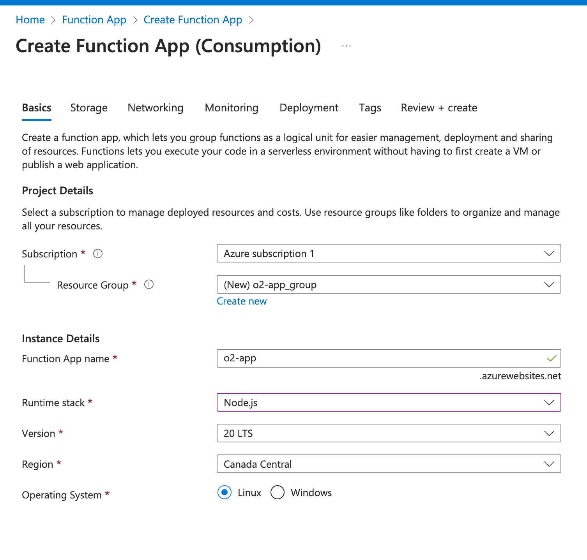

# Integration with Microsoft 365

Managing and analyzing logs from Microsoft 365 services (Graph APIs, audit logs, sign-ins, managed identities) is critical for security, compliance, and performance optimization.  

## Overview
While Microsoft 365 provides rich telemetry, collecting and centralizing these logs for real-time observability can be challenging without a scalable pipeline.  

This guide shows you how to stream Microsoft 365 logs into **OpenObserve** using **Azure Event Hub** and **Azure Functions**.

## Steps to Integrate

???  "Prerequisites"

    - Active **Azure subscription**  
    - Familiarity with **Azure Functions**  
    - [Visual Studio Code](https://code.visualstudio.com/) with Azure Functions extension installed  
    - OpenObserve account ([Cloud](https://cloud.openobserve.ai/web/) or [Self-Hosted](../../getting-started.md))

???  "Step 1: Create an Azure Event Hub"

    1. In the Azure Portal, search for **Event Hubs** → click **+ Add** to create a namespace.  

        - **Resource Group:** choose existing or create new  
        - **Namespace Name:** e.g., `m365-eventhub`  
        - **Pricing Tier:** select based on log volume  
        - Click **Review + Create**  

         {:style="height:500px"}

    2. Once the namespace is created, click **+ Event Hub** inside it.  

        - Name it (e.g., `o2`)  
        - Leave default settings for partitions and retention and Save  

            {:style="height:500px"}

    3. Under the namespace, go to **Shared Access Policies** → create a policy with **Manage** permission.

        - Save and note the **Connection String**  

       

???  "Step 2: Enable Microsoft 365 Diagnostics Logging"

    1. Navigate to the **Microsoft 365 Entra Admin Center**.  
    2. In the Azure Portal, go to **Monitoring health → Diagnostic Settings**.  
    3. Create a new diagnostic setting: 

        - Name: `m365-diagnostics`  
        - Categories: **AuditLogs**, **SignInLogs**, etc.  
        - Destination: **Stream to an Event Hub**  
        - Provide the Event Hub namespace and connection string  

        

???  "Step 3: Deploy Azure Functions to Process Logs"

    Use Azure Functions to forward logs from Event Hub into OpenObserve.

    1. In the Azure Portal, create a **Function App** 

        - Select runtime stack and pricing tier  
        - Deploy to your subscription  

        {:style="height:500px"}

    2. Clone the prebuilt function code from our [repository](https://github.com/openobserve/azure-function-openobserve/tree/feature/o365).  
    3. Open in **VS Code** and configure:  

        - `local.settings.json` → update with Event Hub Connection String  
        - In `index.js`, replace `<O2_ENDPOINT>` with your OpenObserve endpoint  
        - Add your OpenObserve **auth details** (`O2_USER`, `O2_PASSWORD`)  

        > Make sure to add your OpenObserve auth details in the App's environment.

    4. Deploy the function:  

        - In VS Code, click **Deploy to Function App**  
        - Select your subscription and resource group  

        > Follow the [deployment guide](https://learn.microsoft.com/en-us/azure/azure-functions/functions-develop-vs-code?tabs=node-v4%2Cpython-v2%2Cisolated-process%2Cquick-create&pivots=programming-language-javascript) for detailed instructions.

???  "Step 4: Validate and Ingest Logs into OpenObserve"

    - Ensure the Function is running and streaming logs.  
    - In OpenObserve, go to **Logs → Streams → m365** to query ingested logs.  
        

    >  Use tailored queries for categories like **AuditLogs** or **SignInLogs**.  

!!! tip "Pre-built Dashboards"
     You can [import dashboards from the OpenObserve community repository](https://github.com/openobserve/dashboards/tree/main/Microsoft_O365) for quick insights

## Troubleshooting

**1. No logs in OpenObserve** 

- Check Event Hub policy connection string  
- Verify Azure Function is running  
- Confirm your `<O2_ENDPOINT>` and auth details are correct  

**2. Authentication issues**  

- Ensure OpenObserve user has ingest permissions  

**3. High latency or dropped logs**  

- Scale Event Hub partitions or Function App plan  
- Use batching in your function code  

**4. Incorrect parsing**  

- Verify logs are being forwarded in JSON format  
- Update the function mapping if Microsoft 365 schema changes
