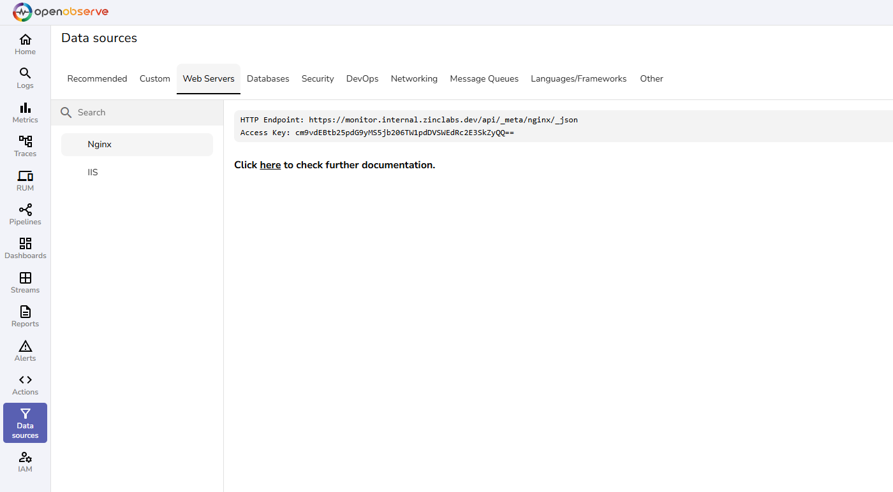

The following user guides provide step-by-step instructions to integrate server platforms and operating systems with OpenObserve. These integrations enable you to collect system logs, performance metrics, and events for comprehensive visibility into your server environments.
 
Each guide corresponds to a web server that appears under the Web Servers tab in the OpenObserve user interface.

 
Learn more:

- [Nginx](nginx.md)
