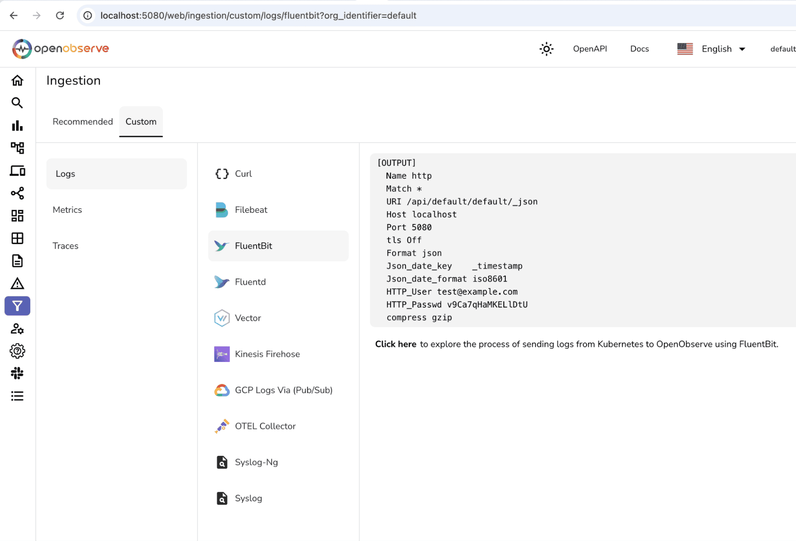
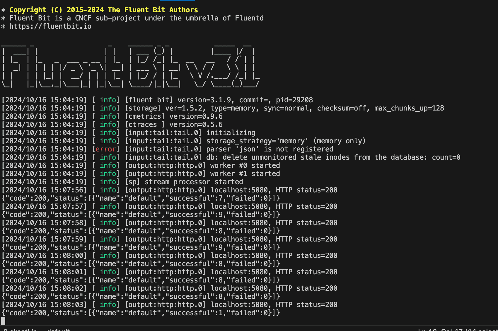
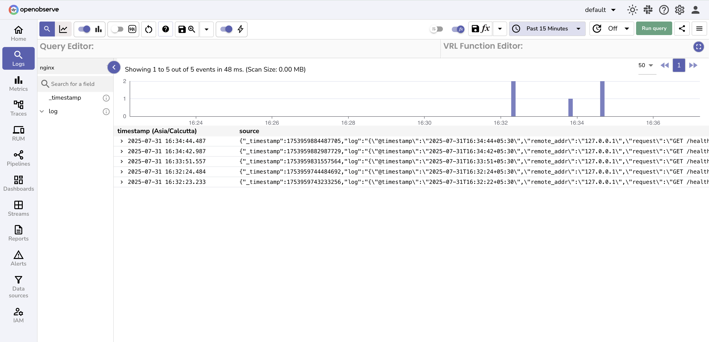

# NGINX Monitoring - Web Server Log Analysis & Performance Monitoring

Monitor NGINX web server with comprehensive NGINX monitoring for collecting NGINX access logs, error logs, and web server performance data. This guide walks you through setting up **real-time NGINX log monitoring** using Fluent Bit for NGINX log analysis, web server monitoring, and HTTP request tracking.

## Overview

NGINX web server monitoring requires structured log collection for effective log analytics. By default, NGINX logs in a custom format that isn't optimal for web server log analysis. This guide helps you convert NGINX logs into structured JSON format for NGINX access log analysis, error monitoring, and web server performance tracking using Fluent Bit.

## Steps to Integrate

??? "Prerequisites"

    - NGINX installed and running
    - OpenObserve account ([Cloud](https://cloud.openobserve.ai/web/) or [Self-Hosted](../../../getting-started/#self-hosted-installation))


??? "Step 1: Configure NGINX to Emit JSON Logs"

    1. **Open your NGINX configuration file**:
    ```bash
    sudo vi /etc/nginx/nginx.conf
    ```
    > On macOS: `/opt/homebrew/etc/nginx/nginx.conf`

    2. **Add the following `log_format` inside the `http` block**:
    ```nginx
    log_format json_combined escape=json '{"@timestamp":"$time_iso8601",'
    '"remote_addr":"$remote_addr",'
    '"request":"$request",'
    '"status":"$status",'
    '"body_bytes_sent":"$body_bytes_sent",'
    '"http_referer":"$http_referer",'
    '"http_user_agent":"$http_user_agent"}';

    access_log /var/log/nginx/access.log json_combined;
    ```
    > Adjust the path if needed (e.g., `/opt/homebrew/var/log/nginx/access.log` on macOS)

    3. **Restart or reload NGINX**:
    ```bash
    sudo systemctl reload nginx
    # or
    sudo nginx -s reload
    ```

??? "Step 2: Install Fluent Bit"

    1. **Install Fluent Bit**:
    ```bash
    # Ubuntu/Debian
    curl https://raw.githubusercontent.com/fluent/fluent-bit/master/install.sh | sh

    # macOS
    brew install fluent-bit
    ```

    2. **Verify installation**:
    ```bash
    fluent-bit --version
    ```

??? "Step 3: Configure Fluent Bit for NGINX Logs"

    1. **Create a config file**:
    ```bash
    vi nginx-fluent-bit.conf
    ```

    2. **Paste the configuration below**:
    ```ini
    [INPUT]
        Name tail
        Path /var/log/nginx/access.log
        Tag nginx-access
        DB /var/log/fluent-bit-nginx-access.db
        Mem_Buf_Limit 5MB
        Skip_Long_Lines On

    [OUTPUT]
        Name http
        Match *
        Host localhost
        Port 5080
        URI /api/default/default/_json
        Format json
        Json_date_key    _timestamp
        Json_date_format iso8601
        HTTP_User <YOUR_USERNAME>
        HTTP_Passwd <YOUR_PASSWORD>
        tls Off
        compress gzip
    ```
        - Adjust the access log path if you're using macOS (`/opt/homebrew/var/...`)
        - Replace `<YOUR_PASSWORD>` with your OpenObserve password.  
        


??? "Step 4: Start Fluent Bit"

    1. **Run Fluent Bit with your config**:
    ```bash
    fluent-bit -c nginx-fluent-bit.conf
    ```
        

    2. **Optionally, run in verbose mode** for debugging:
    ```bash
    fluent-bit -c nginx-fluent-bit.conf -vv
    ```

??? "Step 5: Verify Logs in Openobserve"

    1. In your Openobserve instance, Go to **Logs** → select your log stream → Set time range → Click **Run Query**
    2. **You should see logs in JSON format**, like:
    ```json
    {
      "_timestamp": 1729109276178847,
      "log": {
        "@timestamp": "2024-10-16T15:07:55-05:00",
        "remote_addr": "127.0.0.1",
        "request": "GET / HTTP/1.1",
        "status": "200",
        "body_bytes_sent": "615",
        "http_referer": "",
        "http_user_agent": "curl/8.7.1"
      }
    }
    ```
    
## Troubleshooting

??? "No logs appearing in OpenObserve?"

    - Check Fluent Bit is running and not erroring:  
      `fluent-bit -c nginx-fluent-bit.conf -vv`
    - Validate HTTP output settings (host, user, password, URI)
    - Confirm the log path exists and is readable

??? "NGINX access log not updating?"

    - Tail the log file to check for updates:
    ```bash
    tail -f /var/log/nginx/access.log
    ```

    - Ensure NGINX reloads after config changes
    - Use traffic generation script to populate logs

??? "Fluent Bit not reading logs?"

    - Check if `tail` input path is correct
    - Ensure permission to read the access log
    - Delete or reset the `.db` file if state is stale

