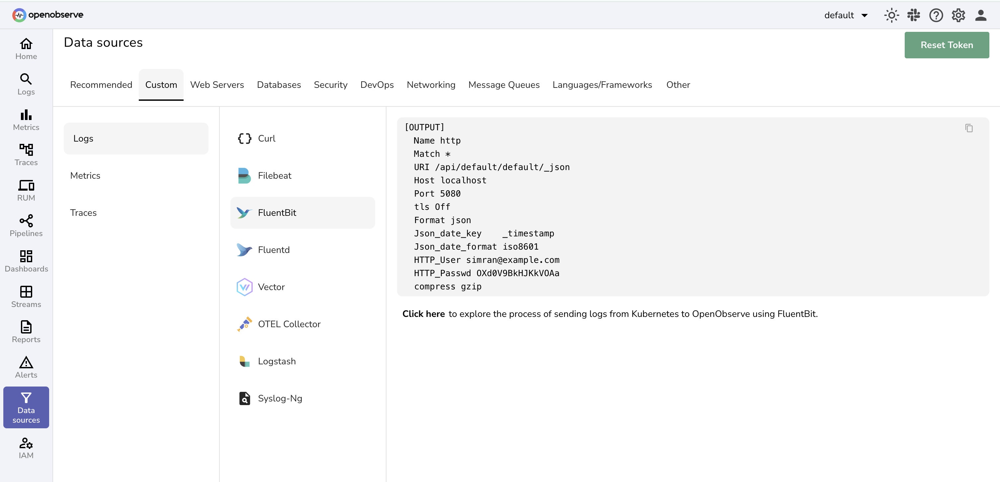
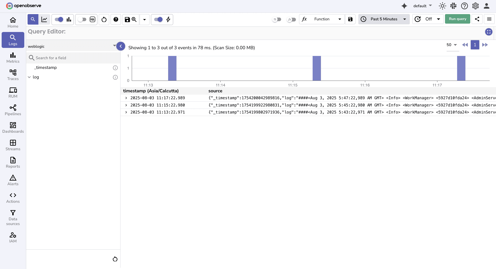
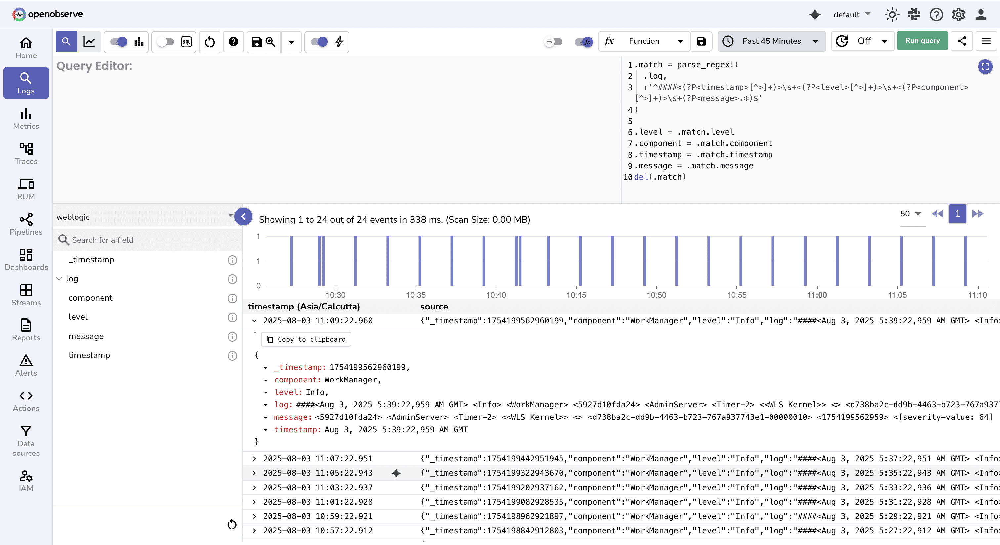

# Integration with Oracle WebLogic

This guide explains how to forward **Oracle WebLogic Server logs** to **OpenObserve** using Fluent Bit.  

## Overview

Oracle WebLogic Server is a Java EE application server for enterprise-scale apps, offering clustering, load balancing, and high availability. It generates logs such as **server logs** (`<server_name>.log`) for runtime events and **access logs** (`access.log`) for HTTP traffic. These logs are plain text, rotated locally, and often look like:

```
####<2025-08-04T09:00:00.123+0530> <Error> <Thread-12> <weblogic.servlet.internal.WebAppServletContext> <BEA-000000> <Failed to load class com.example.MyClass>
```

While rich in detail, native WebLogic logging was built for **manual inspection**, not observability. Logs remain scattered across servers, lack real-time streaming, use unstructured formats that are hard to parse, and offer limited alerting through WLDF. 

</br>

By combining **Fluent Bit** for collection with **OpenObserve VRL pipelines** for parsing, you can transform these raw logs into structured, searchable, and actionable data.


??? "Prerequisites"

    - An **OpenObserve account** (self-hosted or cloud)  
    - A running **Oracle WebLogic Server** (AdminServer or ManagedServer)  
    - Access to log files (`AdminServer.log`, `access.log`, etc.)  
    - **Fluent Bit installed** on the WebLogic host ([installation guide](https://docs.fluentbit.io/manual/installation))  


??? "Step 1: Collect OpenObserve Credentials"

    1. Move to **Data Sources** page.
    2. Under Custom tab → Logs → Fluentbit
    3. Copy the entire **output section** snippet for Fluent Bit.
    
        

??? "Step 2: Configure Fluent Bit"

    1. Create or edit `/etc/fluent-bit/fluent-bit.conf`:

        ```ini
        [SERVICE]
            Flush        5
            Log_Level    info

        [INPUT]
            Name         tail
            Path         /opt/weblogic/user_projects/domains/base_domain/servers/AdminServer/logs/AdminServer.log
            Tag          weblogic
            DB           /var/log/flb_adminserver.db

        [OUTPUT]
            Name http
            Match *
            URI /api/<org_name>/<stream_name>/_json
            Host <host>
            Port 5080
            tls Off
            Format json
            Json_date_key    _timestamp
            Json_date_format iso8601
            HTTP_User <openobserve_username>
            HTTP_Passwd <openobserve_password>
            compress gzip
        ```

        Replace:

        * `<org_name>` → your OpenObserve organization
        * `<stream_name>` → stream name (e.g. `weblogic-logs`)
        * `<host>` → OpenObserve hostname
        * `<openobserve_username>/<openobserve_password>` → your credentials

    2. Start Fluent Bit:

    ```bash
    fluent-bit -c /etc/fluent-bit/fluent-bit.conf
    ```

    Trigger WebLogic events (restart server, deploy app, etc.) to generate logs.


??? "Step 3: Verify Logs in OpenObserve"

    1. Navigate to **Streams → weblogic-logs** in OpenObserve.
    2. You should see raw entries like:

        ```json
        {
        "_timestamp": "2025-08-04T09:00:00.123+0530",
        "log": "####<2025-08-04T09:00:00.123+0530> <Error> <Thread-12> <weblogic.servlet.internal.WebAppServletContext> <BEA-000000> <Failed to load class com.example.MyClass>"
        }
        ```

    

??? "Step 4: Parse Logs with VRL"

    To make logs searchable, parse them using **VRL (Vector Remap Language)**:

    1. Go to **Streams → weblogic-logs → VRL Function Editor**
    2. Add the following VRL mapping:

        ```vrl
        .match = parse_regex!(
        .log,
        r'^####<(?P<timestamp>[^>]+)>\s+<(?P<level>[^>]+)>\s+<(?P<component>[^>]+)>\s+(?P<message>.*)$'
        )

        .level = .match.level
        .component = .match.component
        .timestamp = .match.timestamp
        .message = .match.message
        del(.match)
        ```

    Example

    - **Input:**

        ```
        ####<2025-08-04T09:00:00.123+0530> <Error> <Thread-12> <Failed to load class com.example.MyClass>
        ```

    - **Parsed Output:**

        ```json
        {
        "timestamp": "2025-08-04T09:00:00.123+0530",
        "level": "Error",
        "component": "Thread-12",
        "message": "Failed to load class com.example.MyClass"
        }
        ```

    
    Next you can:

    * Search by **level**, **component**, or **message**
    * Build dashboards (e.g., error rates, slow components)
    * Configure alerts (e.g., trigger on `Error` in specific component)


## Troubleshooting

- **No logs in OpenObserve**

    * Check Fluent Bit logs for errors
    * Ensure `URI` follows `/api/<org>/<stream>/_json` pattern
    * Verify credentials and org/stream names (case-sensitive)

- **Logs appear but fields missing**

    * Regex mismatch in VRL script — adjust for your log format

-  **Test ingestion manually**

  ```bash
  curl -X POST \
    -H "Authorization: Basic <AUTH_KEY>" \
    -H "Content-Type: application/json" \
    -d '[{"log": "test log"}]' \
    https://<OPENOBSERVE_HOST>/api/<ORG>/<STREAM>/_json
  ```

## Next Steps

* **[Search & Filter Logs](../../../example-queries)**: Query by error level, component, or keywords
* **[Customize VRL Pipelines](../../../user-guide/logs/logs/#transform-logs-with-vrl)**: Extract thread IDs, class names, or error codes
* **[Dashboards](../../../user-guide/dashboards/)**: Visualize WebLogic error trends and performance
* **[Alerts](../../../user-guide/alerts)**: Trigger notifications based on error volume or patterns