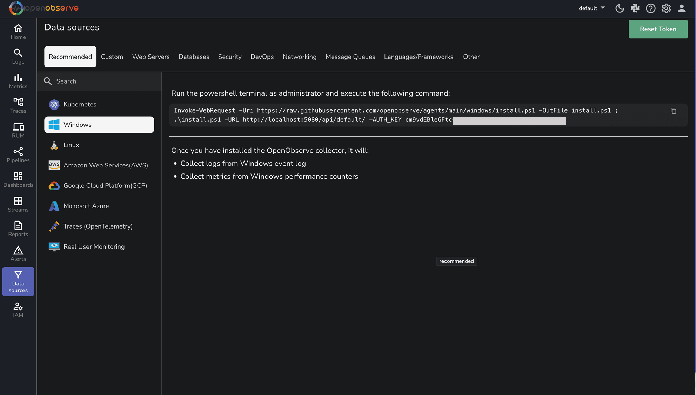

# Windows Server Monitoring - Event Logs & Performance Metrics

Monitor Windows servers with comprehensive Windows server monitoring for collecting Windows event logs, server performance metrics, and infrastructure data. This guide provides instructions to integrate Windows systems with OpenObserve for Windows monitoring, server observability, and infrastructure monitoring using OpenObserve Collector or OpenTelemetry.

## Overview
Windows server monitoring requires collecting event logs and server performance metrics that are essential for maintaining Windows system health and security. Windows Event Logs provide critical insights for IT operations, troubleshooting, auditing, and compliance. Windows Performance metrics such as CPU usage, memory consumption, disk I/O, network activity, and process-specific data help identify server bottlenecks, capacity issues, and resource constraints for effective Windows server monitoring.

--- 

## Installation Options
OpenObserve offers two powerful approaches for Windows monitoring:

- **OpenObserve Collector**: A streamlined, all-in-one solution for quick deployment
- **OpenTelemetry Collector**: A customizable approach for advanced configurations

--- 

## Steps to integrate
=== "Using the OpenObserve Collector (Recommended)"

    The OpenObserve Collector provides a simple, one-command installation that automatically collects both Windows Event Logs and Performance Metrics.

    **Prerequisites**

    Before we begin, ensure you have:

    - A Windows machine such as Windows 10/11 or Windows Server
    - Administrator access to install and configure services
    - Access to an OpenObserve instance, either [cloud](https://openobserve.ai/docs/getting-started/#option-1-openobserve-cloud-setup) or [self-hosted](https://openobserve.ai/docs/getting-started/#option-2-self-hosted-installation)

    **Steps**

    1. Log in to your OpenObserve instance. 
    2. Navigate to **Data Sources > Recommended > Windows**.
    
    3. Copy the provided PowerShell command. 
    4. Open PowerShell as Administrator and execute the command:

    ```bash 
    Invoke-WebRequest -Uri https://raw.githubusercontent.com/openobserve/agents/main/windows/install.ps1 -OutFile install.ps1 ; .\install.ps1 -URL https://your-openobserve-instance.com/api/default/ -AUTH_KEY YOUR_API_KEY
    ```

    Upon successful execution of the above command, the OpenObserve Collector will:

    - Install as a Windows service that starts automatically.
    - Collect logs from Windows Event Log such as Application, System, Security.
    - Collect metrics from Windows Performance Counters. 
    - Forward all data to your OpenObserve instance.

=== "Using the OpenTelemetry Collector"

    For more advanced configurations or if you're already using OpenTelemetry in your environment, you can use the OpenTelemetry Collector with the Windows Event Log Receiver.

    1. Setting Up the OpenTelemetry Collector
    First, set up the OpenTelemetry Collector: <br>
    **Create a directory for the collector**
    ```
    New-Item -Path "C:\otel-collector" -ItemType Directory -Force
    cd C:\otel-collector
    ```
    **Download the latest collector contrib distribution**
    ```
    Invoke-WebRequest -Uri "https://github.com/open-telemetry/opentelemetry-collector-releases/releases/download/v0.115.0/otelcol-contrib_0.115.0_windows_amd64.tar.gz" -OutFile "otelcol-contrib.tar.gz"
    ```
    **Extract the archive** 
    ```
    tar -xzf otelcol-contrib.tar.gz
    ```
    2. Configure the OpenTelemetry Collector
    Create a file named config.yaml in the `C:\otel-collector` directory with the following content:
    ```yaml linenums="1"
    receivers:
    windowseventlog/application:
        channel: application
    windowseventlog/system:
        channel: system
    windowseventlog/security:
        channel: security
    windowsperfcounters:
        collection_interval: 30s
        perfcounters:
        - object: "Processor"
            counters:
            - "% Processor Time"
            instances: ["*"]
        - object: "Memory"
            counters:
            - "Available Bytes"
            - "Committed Bytes"
            instances: [""]
        - object: "LogicalDisk"
            counters:
            - "% Free Space"
            - "Avg. Disk Queue Length"
            instances: ["*"]
        - object: "Network Interface"
            counters:
            - "Bytes Received/sec"
            - "Bytes Sent/sec"
            instances: ["*"]

    processors:
    batch:
        send_batch_size: 1024
        timeout: 10s
    resourcedetection:
        detectors: [system]
        system:
        hostname_sources: ["os"]

    exporters:
    otlphttp/openobserve:
        endpoint: "https://your-openobserve-instance.com/api/default"
        headers:
        Authorization: "Basic YOUR_API_KEY"
        stream-name: "windows-events"
    debug:
        verbosity: detailed

    service:
    pipelines:
        logs:
        receivers: [windowseventlog/application, windowseventlog/system, windowseventlog/security]
        processors: [resourcedetection, batch]
        exporters: [otlphttp/openobserve, debug]
        metrics:
        receivers: [windowsperfcounters]
        processors: [resourcedetection, batch]
        exporters: [otlphttp/openobserve, debug]
    telemetry:
        logs:
        level: "info"
    ```
    Replace https://your-openobserve-instance.com/api/default with your OpenObserve endpoint and YOUR_API_KEY with your actual API key.
    3. Run the OpenTelemetry Collector
    ```
    .\otelcol-contrib.exe --config "C:\otel-collector\config.yaml"
    ```
    To run the  OpenTelemetry Collector as a Windows service, you can use the New-Service PowerShell cmdlet or the SC command-line tool.

---

## Advanced Configuration Options
Here are some practical configurations to enhance your Windows monitoring:

??? "Filtering Security Events"
    Security logs can be voluminous. Focus on critical events by using XPath queries:
    ```
    windowseventlog/security:
    channel: security
    xpath_query: "*[System[(EventID=4624 or EventID=4625 or EventID=4634 or EventID=4648 or EventID=4672)]]"
    ```
    This configuration captures only login successes (4624), login failures (4625), logouts (4634), explicit credential uses (4648), and special privilege assignments (4672).

??? "Remote Collection for Multiple Servers"
    For centralized monitoring of multiple servers:
    ```
    receivers:
    # Local server logs
    windowseventlog/local_system:
        channel: system
    
    # Remote server logs
    windowseventlog/server1_system:
        channel: system
        remote:
        server: "server1.example.com"
        username: "${env:DOMAIN_USER}"
        password: "${env:DOMAIN_PASSWORD}"
        domain: "EXAMPLE"
    ```

---

## Troubleshooting
If you encounter issues with your Windows monitoring setup:

- **Verify OpenObserve Collector Installation**: Check if the OpenObserve Collector service is running with `Get-Service -Name "OpenObserveAgent"`.
- **Check Permissions**: The service account must have administrative privileges to access Windows Event Logs and Performance Counters.
- **Test Connectivity**: Ensure your server can reach your OpenObserve instance with `Test-NetConnection -ComputerName your-openobserve-instance.com -Port 443`.
- **Review Event Log Access**: For security logs, ensure the service account has the **Manage auditing and security log** right.