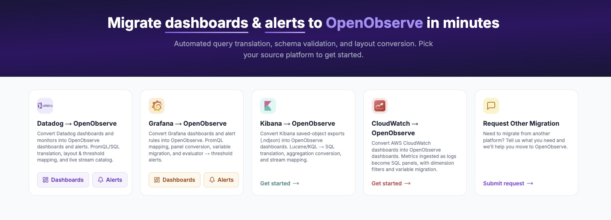
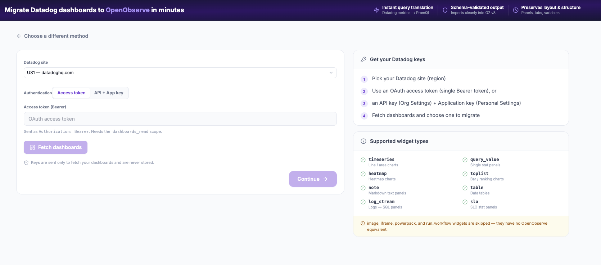
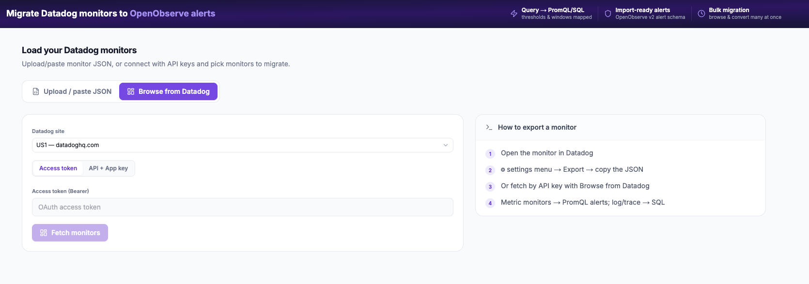

# Migrating Dashboards & Monitors

## Overview

Dashboards and monitors do not need to be rebuilt by hand. The **[OpenObserve migration tool](https://migration.openobserve.ai/)** converts them for you: it reads your Datadog dashboard and monitor JSON, translates the queries to PromQL or SQL, maps the layout and the thresholds, and produces output that imports cleanly into OpenObserve.

There are two separate paths, one for each object type:

| What you are moving | Tool | What it produces |
|---|---|---|
| Datadog **dashboards** | [Dashboards](https://migration.openobserve.ai/datadog-to-o2) | An OpenObserve v8 dashboard, with panels, tabs, and variables preserved |
| Datadog **monitors** | [Alerts](https://migration.openobserve.ai/datadog-monitors-to-o2) | OpenObserve v2 schema alerts, with thresholds and windows mapped |



Both paths accept either a JSON export or a live connection to your Datadog account. Neither stores your credentials: keys are used only to fetch the objects you select.

:::tip[Migrate less than you have]
Datadog dashboards and monitor lists accumulate panels and rules nobody looks at. The tool makes converting cheap, which makes it easy to move everything, including the stale parts. Before you convert, prune. Anything that has not been opened or has never usefully fired is a good candidate to leave behind.
:::

## Migrating Dashboards

### Step 1: Open the dashboard migration tool

Go to **[migration.openobserve.ai](https://migration.openobserve.ai/)** and choose **Datadog to OpenObserve → Dashboards**, or go straight to [the dashboard converter](https://migration.openobserve.ai/datadog-to-o2).

You can supply a dashboard in two ways:

- **Upload / paste JSON**, using a dashboard JSON you exported from Datadog.
- **Browse from Datadog**, connecting with keys so you can pick a dashboard from a list.

### Step 2: Connect to Datadog, or paste the JSON



To browse from Datadog:

1. Pick your **Datadog site**, which is the region your account lives in, for example `US1 (datadoghq.com)`.
2. Choose an authentication method:
    - **Access token**, a single OAuth Bearer token. It needs the `dashboards_read` scope.
    - **API + App key**, an API key from **Org Settings** plus an Application key from **Personal Settings**.
3. Select **Fetch dashboards** and choose one to migrate.

To export the JSON yourself instead, use the Datadog API:

```bash
curl -X GET "https://api.datadoghq.com/api/v1/dashboard" \
  -H "DD-API-KEY: $DD_API_KEY" \
  -H "DD-APPLICATION-KEY: $DD_APP_KEY" > dashboards.json
```

A static export is worth keeping regardless of which path you take. It is a record of what you had, which is useful when you reconcile the two sides later.

### Step 3: Review the conversion

The tool translates Datadog metric queries to PromQL, converts log queries to SQL panels, and preserves the dashboard's panels, tabs, and variables. The output is schema-validated, so it imports cleanly into OpenObserve v8 rather than failing on the first field mismatch.

**Widget types it converts:**

| Datadog widget | Becomes |
|---|---|
| `timeseries` | Line and area charts |
| `query_value` | Single stat panels |
| `heatmap` | Heatmap charts |
| `toplist` | Bar and ranking charts |
| `note` | Markdown text panels |
| `table` | Data tables |
| `log_stream` | Logs converted to SQL panels |
| `slo` | SLO stat panels |

**Widget types it skips:** `image`, `iframe`, `powerpack`, and `run_workflow`. These have no OpenObserve equivalent, so they are dropped rather than half-converted. If a dashboard leans on them, plan to replace that content another way.

### Step 4: Import into OpenObserve

Take the converted dashboard JSON and import it under **Dashboards** in OpenObserve. See the [dashboard documentation](https://openobserve.ai/docs/user-guide/analytics/dashboards/) for the import screen and for the panel editor if you want to adjust anything afterwards.

## Migrating Monitors

### Step 1: Open the monitor migration tool

Go to **[migration.openobserve.ai](https://migration.openobserve.ai/)** and choose **Datadog to OpenObserve → Alerts**, or go straight to [the monitor converter](https://migration.openobserve.ai/datadog-monitors-to-o2).



### Step 2: Load your monitors

Two options, the same shape as the dashboard flow:

- **Upload / paste JSON.** In Datadog, open the monitor, then use the settings menu and select **Export** to copy its JSON. Paste a single monitor or an array of them.
- **Browse from Datadog.** Pick your Datadog site, authenticate with an access token or an API and Application key pair, then select **Fetch monitors**. This is the path to use for bulk migration, since you can browse and convert many at once.

To pull every monitor at once from the API:

```bash
curl -X GET "https://api.datadoghq.com/api/v1/monitor" \
  -H "DD-API-KEY: $DD_API_KEY" \
  -H "DD-APPLICATION-KEY: $DD_APP_KEY" > monitors.json
```

### Step 3: Review the conversion

The tool maps the query, the threshold, and the evaluation window, and emits alerts in the OpenObserve v2 alert schema, ready to import.

| Datadog monitor type | Becomes in OpenObserve |
|---|---|
| Metric monitor | A PromQL alert |
| Log monitor | A SQL scheduled alert |
| APM and trace monitor | A SQL alert, or PromQL against RED metrics |
| Composite monitor | A [composite alert](../../user-guide/analytics/alerts/composite-alerts.md) referencing the constituent alerts |
| Anomaly and forecast monitor | An explicit threshold alert. Watchdog has no equivalent, see [What the tool does not cover](#what-the-tool-does-not-cover) |

### Step 4: Set up destinations before you import

Notification routing does not come across, because Datadog configures channels per monitor while OpenObserve configures a destination once and reuses it. Create your destinations first, so an imported alert has something to attach to and you can test end to end as you go.

OpenObserve supports **Slack, Email, PagerDuty, and Webhook**. See the [alerts documentation](../../user-guide/analytics/alerts/index.md) for setup.

### Step 5: Verify

1. Open **Alerts** in OpenObserve and confirm each imported rule shows as **Active**.
2. Check the **Last Evaluated** timestamp. Rules should update on their configured interval.
3. Temporarily lower a threshold to force a firing condition, or send a test notification, to confirm the destination works end to end.
4. Cross-reference your `monitors.json` against the imported alerts to confirm nothing was missed.

**Troubleshooting:**

- **Rule never fires.** Run the SQL or PromQL query directly in the Logs or Metrics explorer to confirm it returns data.
- **No notification received.** Test the destination independently, for example the Slack webhook URL, before attaching it to a rule.
- **PromQL returns no data.** Confirm metric and label names in the Metrics explorer. Datadog uses `.` in metric names where OpenObserve uses `_`, and the same applies to tags containing dashes.
- **Spurious fires after migration.** Datadog monitors carry implicit `no_data_timeframe` and `notify_no_data` behaviour. Configure the equivalent in OpenObserve so a missing-data state does not immediately page.

## What the tool does not cover

A few things need a decision from you rather than a conversion:

- **Skipped widgets.** `image`, `iframe`, `powerpack`, and `run_workflow` have no OpenObserve equivalent.
- **SLOs.** Datadog SLO objects do not port directly. OpenObserve has [native SLOs](../../user-guide/analytics/slos/index.md) with error budgets and burn-rate alerting, so define the objective there rather than translating the Datadog object field by field.
- **Watchdog.** Datadog's proprietary anomaly auto-detection has no equivalent. Migrate Watchdog alerts to explicit threshold rules. Most teams find the explicit rules clearer once they are forced to define what "anomaly" actually means for them.
- **Notification routing.** Recreate destinations in OpenObserve, as described above.

### Translating a query by hand

For anything you are rebuilding rather than converting, or when you want to check the tool's output, these are the common mappings.

Datadog metric queries to PromQL:

| Datadog | OpenObserve PromQL |
|---|---|
| `avg:system.cpu.user{*}` | `avg(system_cpu_user)` |
| `avg:system.cpu.user{host:web-01}` | `avg(system_cpu_user{host="web-01"})` |
| `sum:http.requests{service:api}.as_rate()` | `sum(rate(http_requests{service="api"}[1m]))` |
| `sum:http.requests{*} by {status_code}.as_rate()` | `sum by (status_code)(rate(http_requests[1m]))` |
| `p95:trace.servlet.request{*}` | `histogram_quantile(0.95, sum by (le)(rate(trace_servlet_request_bucket[5m])))` |
| `top(avg:cpu.user{*} by {host}, 10, 'mean', 'desc')` | `topk(10, avg by (host)(cpu_user))` |

Datadog log search to SQL:

| Datadog log query | OpenObserve SQL |
|---|---|
| `service:api status:error` | `SELECT * FROM default WHERE service = 'api' AND level = 'error'` |
| `service:api "timeout"` | `SELECT * FROM default WHERE service = 'api' AND match_all('timeout')` |
| `service:payments @duration:>500` | `SELECT * FROM default WHERE service = 'payments' AND duration > 500` |
| `service:api status:error \| count by status_code` | `SELECT status_code, count(*) FROM default WHERE service = 'api' AND level = 'error' GROUP BY status_code` |

:::tip[Use the AI Assistant]
For a one-off query, paste it into the **AI Assistant** in the OpenObserve UI and ask for the PromQL or SQL equivalent. It handles tag-name normalization, function mapping, and aggregation syntax in one shot, which is useful for complex multi-condition queries the tables above do not cover.
:::

## Next Steps

- [OpenObserve migration tool](https://migration.openobserve.ai/): the converter, including the Kibana and CloudWatch paths and a form to request a platform that is not listed yet
- [OpenObserve Alerts Documentation](../../user-guide/analytics/alerts/index.md): alert rule types, conditions, and notification channels
- [OpenObserve SLOs](../../user-guide/analytics/slos/index.md): objectives, error budgets, and burn-rate alerting
- [OpenObserve Dashboards Documentation](https://openobserve.ai/docs/user-guide/analytics/dashboards/): dashboard builder, panel types, and variables
- [OpenObserve Full-Text Search Functions](https://openobserve.ai/docs/reference/sql-functions/full-text-search/): SQL function reference for log queries (`match_all()`, `str_match()`, `re_match()`)

## Need Help?

- Join our [Community Slack](https://short.openobserve.ai/community)
- Or [Contact support](https://openobserve.ai/contactus/)
