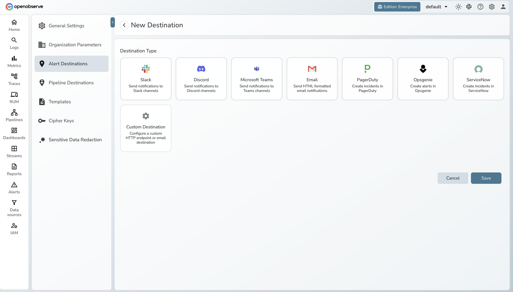

# Migrating Dashboards & Alerts

## Overview

There is no automatic converter for dashboards or alerts — both need to be manually recreated in OpenObserve. That said, the effort is lower than it sounds:

- **PromQL-based panels and alerts work as-is.** If your Grafana dashboards query Mimir metrics, the same PromQL query runs in OpenObserve unchanged.
- **LogQL needs to be translated to SQL.** OpenObserve uses SQL for log and trace queries. The logic is the same — the syntax is different.
- **The AI Assistant in OpenObserve can do the translation for you.** Instead of manually mapping LogQL to SQL, paste your query into the AI Assistant and ask it to convert. This removes the main friction point for both dashboards and alerts.

Think of this as a forced cleanup. Grafana dashboards and alert rule lists tend to accumulate panels and rules that nobody looks at anymore. Recreating from scratch is a good opportunity to keep only what's genuinely useful.

---

## Migrating Dashboards

### What Changes

| Element | Grafana (LGTM) | OpenObserve |
|---|---|---|
| Metrics panels (PromQL) | PromQL queries | Same PromQL — no changes needed |
| Log panels (LogQL) | LogQL queries | SQL with OpenObserve log functions |
| Trace panels | Trace explorer | Built-in trace explorer UI |
| Dashboard builder | Grafana UI | OpenObserve built-in dashboard builder |
| Variables / template vars | Grafana variables | OpenObserve dashboard variables |

### How to Approach It

**Step 1: Inventory your dashboards**

In Grafana, go to **Dashboards** and note all dashboards in use. For each one, identify:

- Which panels are actually used (remove the rest)
- Which data source each panel queries (Mimir, Loki, or Tempo)
- Whether the panel uses PromQL, LogQL, or both

**Step 2: Translate LogQL queries to SQL**

This is the only part that requires real work. For each LogQL panel, you need an equivalent SQL query.

LogQL → SQL translation examples:

| LogQL | OpenObserve SQL |
|---|---|
| `{service="api"} \|= "error"` | `SELECT * FROM default WHERE service = 'api' AND match_all('error')` |
| `count_over_time({service="api", level="error"}[5m])` | `SELECT count(*) FROM default WHERE service = 'api' AND level = 'error'` |
| `rate({job="nginx"} \|= "timeout"[5m])` | `SELECT count(*) / 300 FROM default WHERE job = 'nginx' AND match_all('timeout')` |

!!! tip "Use the AI Assistant"
    Instead of translating queries by hand, use the **AI Assistant** (available in the OpenObserve UI) to convert LogQL to SQL. Paste your existing LogQL query and ask: *"Convert this LogQL query to OpenObserve SQL."* It handles the function mapping and syntax differences accurately and quickly, especially for complex filter and aggregation patterns.

**Step 3: Recreate in OpenObserve**

OpenObserve has a built-in drag-and-drop dashboard builder with 18+ chart types. For each panel:

1. Open **Dashboards** → **New Dashboard** in the OpenObserve UI.
2. Add a panel and select the signal type (Logs, Metrics, or Traces).
3. Paste your translated query (or PromQL if it's a metrics panel).
4. Configure the visualization type, axes, and thresholds.

---

## Migrating Alerts

### What Changes

| Alert Type | Grafana | OpenObserve |
|---|---|---|
| Metric alerts (PromQL) | Grafana-managed or Mimir ruler rules | Same PromQL — create as a metric alert |
| Log alerts (LogQL) | LogQL threshold alerts | SQL-based scheduled alert |
| Notification channels | Alertmanager config | Built-in destinations (Slack, Email, PagerDuty, Webhook) |

### Step 1: Inventory Your Current Alerts

In Grafana, go to **Alerting → Alert Rules** and export or record all active rules. For each rule, note:

- The query it uses (PromQL or LogQL)
- The evaluation interval and threshold
- The notification channel (Slack, PagerDuty, email, webhook)
- Whether the alert is still useful — now is a good time to drop alerts nobody acts on

### Step 2: Set Up Notification Channels

Set up your notification destinations in OpenObserve before recreating rules, so you can test end-to-end as you go.

OpenObserve supports: **Slack, Email, PagerDuty, and Webhook**.

See the [OpenObserve Alerts Documentation](https://openobserve.ai/docs/user-guide/alerts/) for setup instructions.

### Step 3: Recreate Alert Rules

**PromQL metric alerts — direct port, no changes:**

| Grafana Alert (PromQL) | OpenObserve |
|---|---|
| `rate(http_requests_total{status=~"5.."}[5m]) > 0.1` | Same PromQL — create as a metric alert |
| `node_memory_MemAvailable_bytes / node_memory_MemTotal_bytes < 0.1` | Same PromQL |

**LogQL log alerts — translate to SQL:**

| Grafana Alert (LogQL) | OpenObserve Alert (SQL) |
|---|---|
| `count_over_time({level="error", service="api"}[5m]) > 100` | `SELECT count(*) FROM default WHERE level = 'error' AND service = 'api'` with threshold > 100 |
| `rate({service="payments"} \|= "timeout"[5m]) > 0.05` | `SELECT count(*) / 300 FROM default WHERE service = 'payments' AND match_all('timeout')` with threshold > 0.05 |

!!! tip "Use the AI Assistant"
    The same AI Assistant that converts LogQL for dashboards works here too. Paste your LogQL alert query and ask it to produce the OpenObserve SQL equivalent. This is faster and less error-prone than translating complex multi-condition LogQL by hand.

   

### Step 4: Verify Alerts

1. Open **Alerts** in the OpenObserve UI and confirm each rule shows an **Active** or **Normal** status.
2. Check the **Last Evaluated** timestamp — rules should update on their configured interval.
3. Temporarily lower a threshold to force a firing condition, or use OpenObserve's built-in test to send a test notification.
4. Cross-reference your original alert inventory against the recreated rules to confirm nothing was missed.

**Troubleshooting:**

- **Rule never fires:** Run the SQL query in the Logs or Metrics explorer first to confirm it returns data before using it in an alert.
- **No notification received:** Test the notification channel config (Slack webhook URL, SMTP settings) independently before attaching it to a rule.
- **PromQL returns no data:** Check that the metric name and label values are present in the Metrics explorer — case mismatch is the most common cause.

---

## Next Steps

- [OpenObserve Alerts Documentation](https://openobserve.ai/docs/user-guide/alerts/) — full reference for alert rule types, conditions, and notification channels
- [OpenObserve Dashboards Documentation](https://openobserve.ai/docs/user-guide/dashboards/) — dashboard builder, panel types, and variables
- [OpenObserve Full-Text Search Functions](https://openobserve.ai/docs/sql-functions/full-text-search/) — complete SQL function reference for log queries (`match_all()`, `str_match()`, `re_match()`)
- [OpenObserve Scheduled Pipelines](https://openobserve.ai/docs/user-guide/pipelines/create-and-use-scheduled-pipeline/) — pre-aggregate expensive queries, equivalent to Mimir recording rules

---

[Back to Overview](index.md) | Previous: [Migrating Logs](logs.md)
