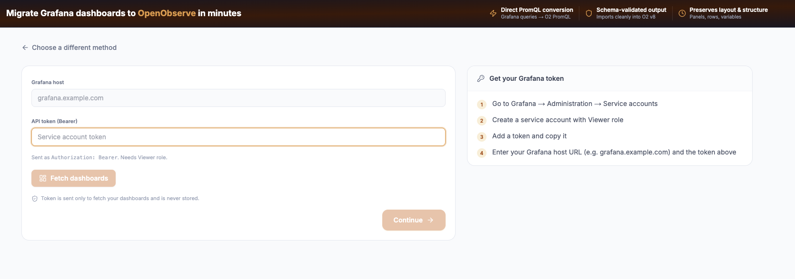
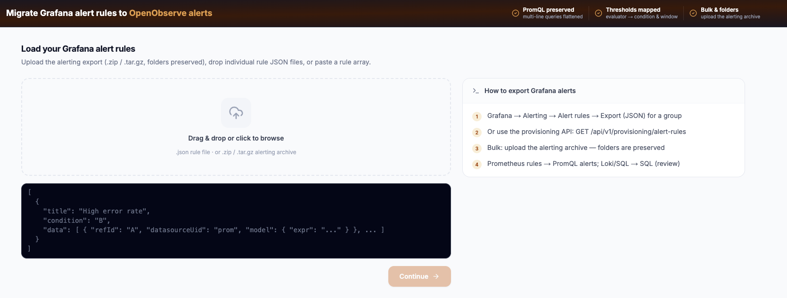
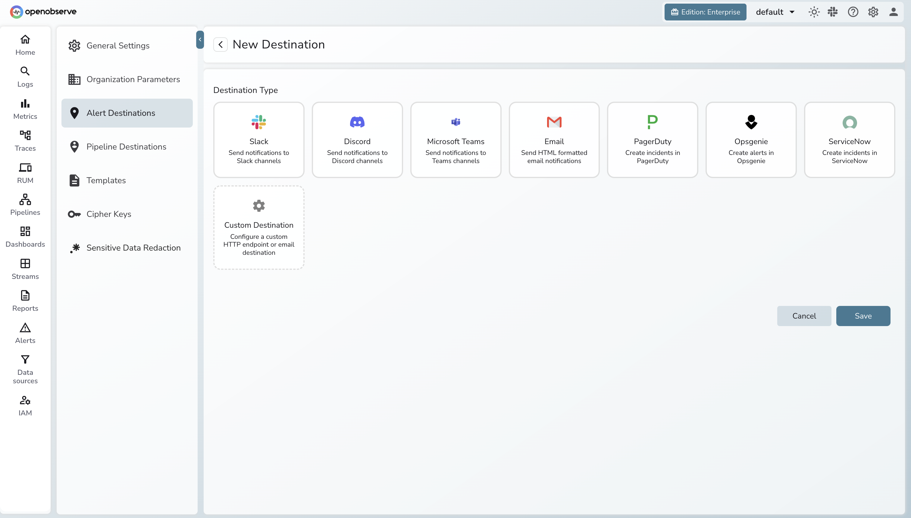

# Migrating Dashboards & Alerts

## Overview

Dashboards and alert rules do not need to be rebuilt by hand. The **[OpenObserve migration tool](https://migration.openobserve.ai/)** converts them for you: it reads your Grafana dashboard JSON and alert rules, maps the queries, preserves the layout, and produces output that imports cleanly into OpenObserve.

There are two separate paths, one for each object type:

| What you are moving | Tool | What it produces |
|---|---|---|
| Grafana **dashboards** | [Dashboards](https://migration.openobserve.ai/grafana-to-o2) | An OpenObserve v8 dashboard, with panels, rows, and variables preserved |
| Grafana **alert rules** | [Alerts](https://migration.openobserve.ai/grafana-alerts-to-o2) | OpenObserve alerts, with the evaluator mapped to a condition and a window |


PromQL comes across intact, which is the bulk of most LGTM dashboards. If your panels query Mimir or Prometheus, the query itself does not change. Loki queries are converted to SQL and are the part worth reviewing.

:::tip[Migrate less than you have]
Grafana dashboards and alert rule lists accumulate panels and rules nobody looks at. The tool makes converting cheap, which makes it easy to move everything, including the stale parts. Before you convert, prune. Anything that has not been opened or has never usefully fired is a good candidate to leave behind.
:::

## Migrating Dashboards

### Step 1: Open the dashboard migration tool

Go to **[migration.openobserve.ai](https://migration.openobserve.ai/)** and choose **Grafana to OpenObserve → Dashboards**, or go straight to [the dashboard converter](https://migration.openobserve.ai/grafana-to-o2).

You can supply a dashboard in two ways:

- **Upload / paste JSON**, using a dashboard JSON you exported from Grafana.
- **Browse from Grafana**, connecting with an API token so you can pick a dashboard from a list.

### Step 2: Connect to Grafana, or paste the JSON



To browse from Grafana, create a read-only service account token:

1. In Grafana, go to **Administration → Service accounts**.
2. Create a service account with the **Viewer** role. Viewer is enough, since the tool only reads.
3. Add a token and copy it.
4. In the migration tool, enter your **Grafana host**, for example `grafana.example.com`, and the token. It is sent as `Authorization: Bearer` and is never stored.
5. Select **Fetch dashboards** and choose one to migrate.

To export the JSON yourself instead, open the dashboard in Grafana and use **Share → Export → Save to file**.

### Step 3: Review the conversion

The tool converts Grafana queries to OpenObserve PromQL and preserves the dashboard's panels, rows, and variables. The output is schema-validated, so it imports cleanly into OpenObserve v8 rather than failing on the first field mismatch.

What to expect by data source:

| Panel queries | What happens |
|---|---|
| Mimir or Prometheus (PromQL) | Carried over directly. The query is the same on both sides. |
| Loki (LogQL) | Converted to SQL. Worth reviewing, since the log query languages differ more than the metric ones do. |
| Tempo (traces) | Point the panel at the OpenObserve trace explorer. Review after import. |

### Step 4: Import into OpenObserve

Take the converted dashboard JSON and import it under **Dashboards** in OpenObserve. See the [dashboard documentation](https://openobserve.ai/docs/user-guide/analytics/dashboards/) for the import screen and for the panel editor if you want to adjust anything afterwards.

## Migrating Alerts

### Step 1: Open the alert migration tool

Go to **[migration.openobserve.ai](https://migration.openobserve.ai/)** and choose **Grafana to OpenObserve → Alerts**, or go straight to [the alert converter](https://migration.openobserve.ai/grafana-alerts-to-o2).



### Step 2: Load your alert rules

Three input formats, so you can move one rule or the whole estate:

- **An alerting archive**, `.zip` or `.tar.gz`. This is the bulk path, and **folders are preserved**, so your existing organization survives the move.
- **Individual rule JSON files**, dragged in or browsed for.
- **A pasted rule array**.

To get the export out of Grafana, either:

- go to **Alerting → Alert rules → Export (JSON)** for a group, or
- call the provisioning API:

```bash
curl -H "Authorization: Bearer $GRAFANA_TOKEN" \
  "https://grafana.example.com/api/v1/provisioning/alert-rules" > alert-rules.json
```

### Step 3: Review the conversion

The tool maps the rule's evaluator to an OpenObserve condition and window, and preserves the query.

| Grafana rule | What happens |
|---|---|
| Prometheus rules (PromQL) | PromQL is preserved. Multi-line queries are flattened into one. |
| Loki or SQL rules | Converted to SQL. Review these before enabling them. |
| Evaluator (`IS ABOVE 100`, `IS BELOW 0.1`) | Mapped to the OpenObserve threshold condition and evaluation window |
| Folders | Preserved when you upload the alerting archive |

### Step 4: Set up destinations before you import

Notification routing does not come across, because Grafana routes through Alertmanager configuration while OpenObserve configures a destination once and reuses it. Create your destinations first, so an imported alert has something to attach to and you can test end to end as you go.

OpenObserve supports **Slack, Email, PagerDuty, and Webhook**.



See the [alerts documentation](../../user-guide/analytics/alerts/index.md) for setup.

### Step 5: Verify

1. Open **Alerts** in OpenObserve and confirm each imported rule shows as **Active** or **Normal**.
2. Check the **Last Evaluated** timestamp. Rules should update on their configured interval.
3. Temporarily lower a threshold to force a firing condition, or send a test notification, to confirm the destination works end to end.
4. Cross-reference your original rule export against the imported alerts to confirm nothing was missed.

**Troubleshooting:**

- **Rule never fires.** Run the SQL or PromQL query in the Logs or Metrics explorer first, to confirm it returns data before relying on it in an alert.
- **No notification received.** Test the destination independently, for example the Slack webhook URL or the SMTP settings, before attaching it to a rule.
- **PromQL returns no data.** Check that the metric name and label values are present in the Metrics explorer. A case mismatch is the most common cause.

## What the tool does not cover

- **Notification routing.** Recreate destinations in OpenObserve, as described above. Alertmanager routing trees, silences, and inhibition rules do not have a one-to-one equivalent.
- **Loki and SQL query conversions** are produced automatically but flagged for review. Check them before you enable the alert or trust the panel.
- **Tempo trace panels** should be pointed at the OpenObserve trace explorer after import.

### Translating LogQL by hand

For anything you are rebuilding rather than converting, or when you want to check the tool's output on a Loki query:

| LogQL | OpenObserve SQL |
|---|---|
| `{service="api"} \|= "error"` | `SELECT * FROM default WHERE service = 'api' AND match_all('error')` |
| `count_over_time({service="api", level="error"}[5m])` | `SELECT count(*) FROM default WHERE service = 'api' AND level = 'error'` |
| `rate({job="nginx"} \|= "timeout"[5m])` | `SELECT count(*) / 300 FROM default WHERE job = 'nginx' AND match_all('timeout')` |

:::tip[Use the AI Assistant]
For a one-off query, paste it into the **AI Assistant** in the OpenObserve UI and ask: *"Convert this LogQL query to OpenObserve SQL."* It handles the function mapping and syntax differences accurately, especially for complex filter and aggregation patterns the table above does not cover.
:::


## Next Steps

- [OpenObserve migration tool](https://migration.openobserve.ai/): the converter, including the Kibana and CloudWatch paths and a form to request a platform that is not listed yet
- [OpenObserve Alerts Documentation](../../user-guide/analytics/alerts/index.md): alert rule types, conditions, and notification channels
- [OpenObserve Dashboards Documentation](https://openobserve.ai/docs/user-guide/analytics/dashboards/): dashboard builder, panel types, and variables
- [OpenObserve Full-Text Search Functions](https://openobserve.ai/docs/reference/sql-functions/full-text-search/): SQL function reference for log queries (`match_all()`, `str_match()`, `re_match()`)
- [OpenObserve Scheduled Pipelines](https://openobserve.ai/docs/user-guide/data-processing/pipelines/create-and-use-scheduled-pipeline/): pre-aggregate expensive queries, the equivalent of Mimir recording rules

[Back to Overview](index.md) | Previous: [Migrating Logs](logs.md)
