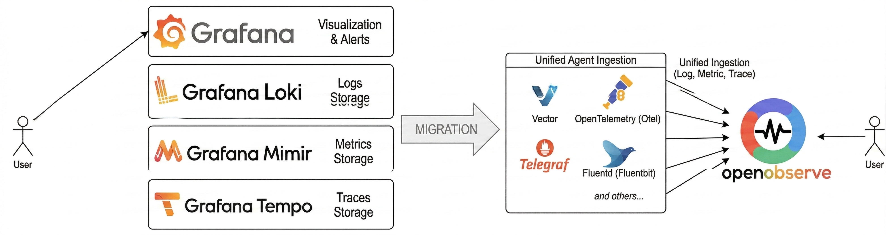
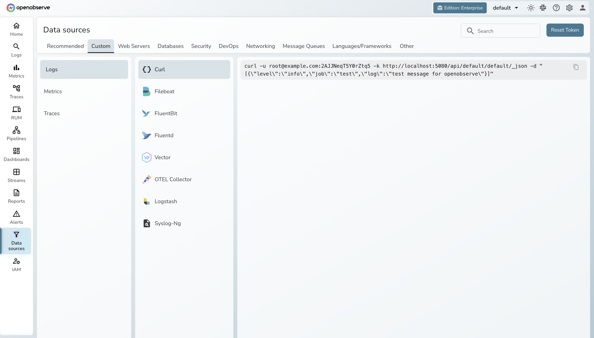

# Migrate from Grafana (LGTM Stack) to OpenObserve

If you're currently running your observability stack on LGTM — Loki for logs, Grafana for dashboards, Tempo for traces, Mimir (or Prometheus) for metrics and want to move to OpenObserve, this guide walks you through the entire migration, signal by signal, data source by data source.

## Table of Contents

1. [Overview](index.md) — why migrate and what changes
2. [Architecture & Terminology](architecture.md) — how the stack maps across
3. [Migrating Metrics](metrics.md) — migrate from Mimir or Prometheus remote write
4. [Migrating Traces](traces.md) — migrate from Tempo
5. [Migrating Logs](logs.md) — migrate from Loki
6. [Migrating Dashboards & Alerts](dashboards-and-alerts.md) — recreate Grafana dashboards and Alertmanager rules

---

## Why Migrate?

The LGTM stack is a solid observability setup. But running it means operating 4–6 separate distributed systems — each with its own storage, scaling model, config format, and upgrade cycle. Over time, that operational overhead compounds.

### Multiple systems, multiple problems

Each component in the LGTM stack is a distinct distributed system:

- **Loki** — stores logs in chunks with a custom index
- **Mimir** — horizontally-scaled Prometheus backend with its own series cardinality model
- **Tempo** — completely different storage layout for traces

Each one needs separate capacity planning, separate tuning, and separate monitoring (yes — you need to monitor your monitoring). When something breaks at 3am, you need to know which of four systems is the culprit.

### Storage fragmentation

Your logs, metrics, and traces live in three different backends. Correlating across signals means switching query languages:

| Signal | Query Language |
|---|---|
| Logs | LogQL |
| Metrics | PromQL |
| Traces | TraceQL |

Jumping from a log line to the related trace to the relevant metric spike is possible, but clunky — different UIs, different syntax, different mental models.

### Scaling is per-component

Each system has a completely different scaling profile:

- **Loki** — bottlenecks on ingestion streams and chunk storage
- **Mimir** — bottlenecks on series cardinality and query concurrency
- **Tempo** — bottlenecks on trace storage and block compaction

You become an involuntary expert in four different distributed systems architectures.

## What OpenObserve Changes

| | LGTM Stack | OpenObserve |
|---|---|---|
| **Components to run** | 4–6 (Loki + Mimir + Tempo + Grafana + Alloy + object storage) | 1 binary or 1 Helm chart |
| **Storage backends** | Separate per signal | Single unified store (local disk, S3, GCS, Azure Blob) |
| **Storage cost** | High — separate storage per signal | Up to 140x lower storage costs |
| **Query languages** | LogQL + PromQL + TraceQL | SQL + PromQL (for metrics) |
| **Built-in visualization** | No — Grafana is a separate deployment | Yes — UI included |
| **OpenTelemetry support** | Requires per-component config | Native single OTLP endpoint for all signals |
| **Operational complexity** | High — each component has its own failure modes | Low — one system to monitor, upgrade, and scale |

## Before You Start

Before changing any configs, note what you're running:

- **Data sources:** What is sending data? (OTel Collector, Prometheus, Grafana Agent/Alloy, Telegraf, Fluent Bit, Vector, application SDKs, cloud integrations)
- **Active signals:** Which signals are in use? (Metrics to Mimir, Logs to Loki, Traces to Tempo)
## Set Up OpenObserve

Before migrating signal by signal, get OpenObserve running:

> "OpenObserve Cloud"

Sign up at [cloud.openobserve.ai](https://cloud.openobserve.ai) — no infrastructure to manage.

After logging in, navigate to **Data Sources** to find your ingestion credentials and endpoint URLs.

    
  

> "Self-Hosted"

Download OpenObserve for your platform from the [downloads page](https://openobserve.ai/downloads/).

After installation, access the UI at `http://localhost:5080` and navigate to **Data Sources** to find your ingestion credentials and ready-to-use configuration snippets.

## Next Steps

- [Architecture & Migration Path](architecture.md) — how the stack maps across and what terminology changes
- [Migrating Metrics](metrics.md) — migrate from Mimir or Prometheus remote write
- [Migrating Traces](traces.md) — migrate from Tempo
- [Migrating Logs](logs.md) — migrate from Loki
- [Migrating Dashboards & Alerts](dashboards-and-alerts.md) — recreate Grafana dashboards and Alertmanager rules
