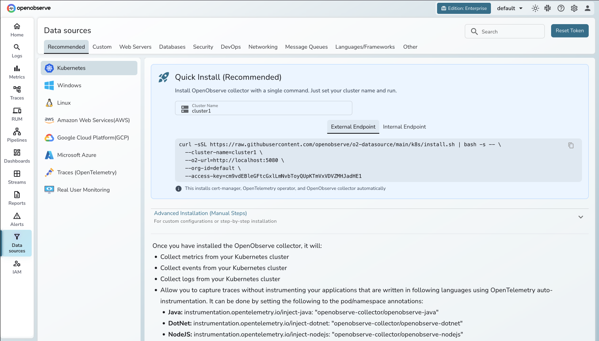
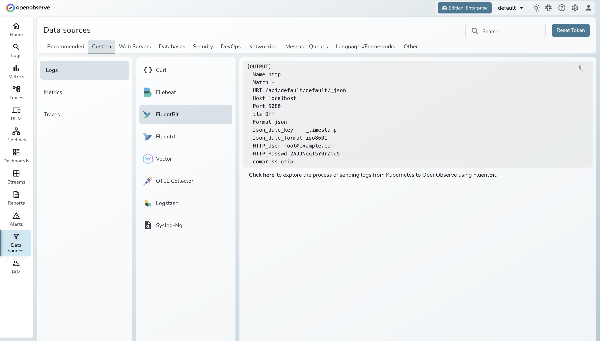
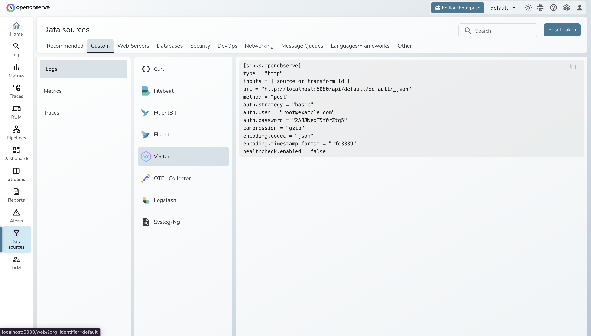
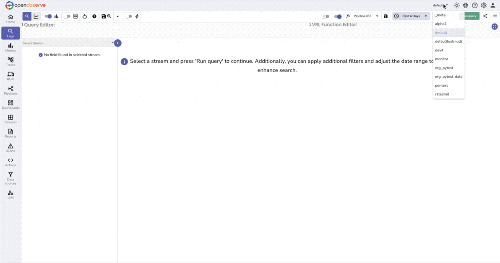
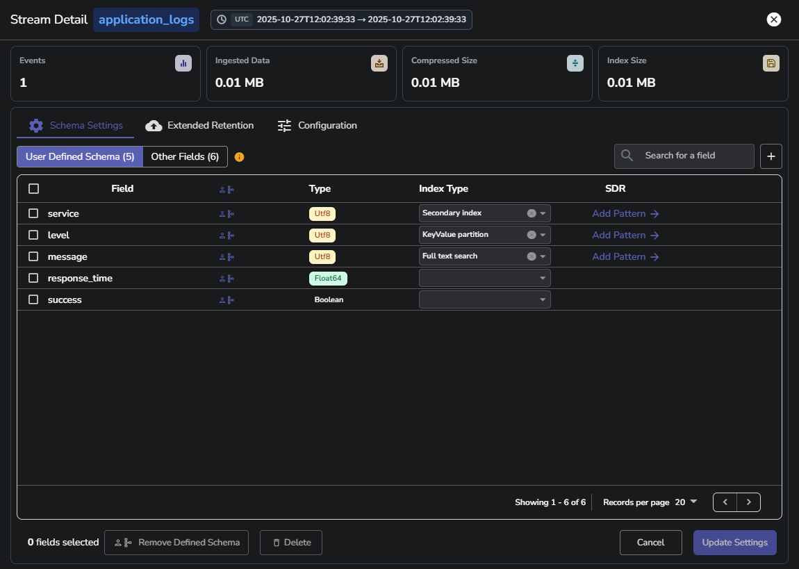

# Migrating Logs

## Overview

This section walks you through migrating logs from Loki to OpenObserve. You will:

1. Assess how logs currently reach Loki
2. Identify the migration path for each source type
3. Update configs to point at OpenObserve
4. Validate that logs are flowing correctly

## Step 1: Assess Your Current Log Sources

Check how logs currently reach Loki. Common setups:

- Promtail running as a DaemonSet, tailing container logs
- OTel Collector with the `loki` exporter
- Grafana Agent/Alloy with a `logs` block
- Fluent Bit or Vector with a Loki output
- Applications sending logs directly via HTTP

## Step 2: Categorize Your Sources

| Source Type | Migration Path |
|---|---|
| **OTel Collector with `loki` exporter** | [Switch to `otlphttp` exporter](#from-otel-collector) |
| **Promtail** | [Update endpoint (Loki push API supported)](#from-promtail) |
| **Grafana Agent / Alloy** | [Update endpoint](#from-grafana-agent--alloy) |
| **Fluent Bit** | [Change output from `loki` to `http`](#from-fluent-bit) |
| **Vector** | [Change sink from `loki` to `http`](#from-vector) |
| **Telegraf** | [See dedicated guide](#from-telegraf) |
| **AWS CloudWatch logs** | [See dedicated guide](#from-aws-cloudwatch-logs) |
| **Kubernetes container logs** | [Use OpenObserve Collector Helm chart](#from-kubernetes-container-logs) |

## Step 3: Migrate Each Source

### From OTel Collector

The `loki` exporter in the OTel Collector has been deprecated since July 2024 (Loki v3+ supports native OTLP ingestion). The exporter still exists in `opentelemetry-collector-contrib` but emits deprecation warnings and is scheduled for removal. Use `otlphttp` instead.

**Current config:**
```yaml
exporters:
  loki:
    endpoint: http://loki:3100/loki/api/v1/push
```

Copy the exact updated configuration from the **Data Sources UI** in OpenObserve.


---

### From Promtail

Promtail speaks the Loki push API, which OpenObserve supports natively. You can keep Promtail and just change the endpoint:

**Updated config:**
```yaml
clients:
  - url: http://openobserve:5080/api/{org}/loki/api/v1/push
    basic_auth:
      username: admin@example.com
      password: Complexpass#123
```

Replace `{org}` with your OpenObserve organization name (e.g. `default`).

Alternatively, replace Promtail with the [OpenObserve Collector](https://github.com/openobserve/openobserve-helm-chart/blob/main/charts/openobserve-collector/README.md) or Fluent Bit for a more modern, OTel-native setup.

Copy the exact command to deploy O2 Collector from the **Data Sources UI** in OpenObserve.




---

### From Grafana Agent / Alloy

**Current config:**
```yaml
logs:
  configs:
    - name: default
      clients:
        - url: http://loki:3100/loki/api/v1/push
```

**Updated config**:

```yaml
logs:
  configs:
    - name: default
      clients:
        - url: http://openobserve:5080/api/default/_json
          basic_auth:
            username: admin@example.com
            password: Complexpass#123
```
Or replace with [OpenObserve Collector](https://github.com/openobserve/openobserve-helm-chart/blob/main/charts/openobserve-collector/README.md).

---

### From Fluent Bit

**Current config:**
```ini
[OUTPUT]
    Name loki
    Match *
    Host loki
    Port 3100
    Labels job=fluentbit
```

Change the output plugin from `loki` to `http` and point it at OpenObserve. 


*You can copy the exact Fluent Bit configuration from the OpenObserve Data Sources UI*

---

### From Vector

**Current config:**
```toml
[sinks.loki]
  type = "loki"
  inputs = ["logs"]
  endpoint = "http://loki:3100"
  labels.job = "vector"
```

Change the sink type from `loki` to `http` and point it at OpenObserve.


*You can copy the exact Vector configuration from the OpenObserve Data Sources UI*

---

### From Telegraf

For detailed steps on ingesting data into OpenObserve using Telegraf, see the dedicated guide:


> **Dedicated guide :** [Telegraf → OpenObserve](https://openobserve.ai/blog/how-to-set-up-telegraf-for-http-metrics-collection/)

---

### From AWS CloudWatch Logs

For detailed steps on ingesting AWS CloudWatch logs into OpenObserve, see the dedicated guide:


> **Dedicated guide:** [AWS CloudWatch Logs → OpenObserve](https://openobserve.ai/blog/how-to-send-aws-cloudwatch-logs-to-s3-using-kinesis-data-firehose/)

---

### From Kubernetes Container Logs

Use the OpenObserve Collector Helm chart to replace Promtail as a DaemonSet. 


*You can copy the exact collector installation command from the OpenObserve Data Sources UI*

---

## Step 4: How to Verify


### Check in the UI

1. Open the OpenObserve UI → **Logs** in the left sidebar.
2. Confirm each log stream from your source inventory appears in the stream list.
3. Run a test query against a known stream: `SELECT * FROM "default"` 
4. Verify field names look correct — especially that structured fields (like `level`, `service`, `trace_id`) are parsed as columns, not buried in a raw string.




*OpenObserve Logs Explorer — verify log streams and field parsing after migration*





### Verify Field Parsing

If your logs are JSON, OpenObserve auto-parses them into columns. Check that expected fields appear as filterable columns in the Logs explorer. If a field is missing, check whether the raw log line is actually valid JSON.

### Troubleshooting

- **No streams visible:** Check your collector's output logs for HTTP errors. Confirm the URI path matches your org — `/api/default/` for the default org.
- **Fields not parsed:** If logs aren't JSON, add a parsing processor in your collector (e.g. `logstransform` or `json` parser) before the exporter.
- **Auth errors:** Regenerate the Base64 credential string — whitespace in the original input will break it.

## Next Steps

- [OpenObserve Logs User Guide](https://openobserve.ai/docs/user-guide/logs/) — exploring streams, running queries, and configuring stream settings in the UI
- [OpenObserve Full-Text Search Functions](https://openobserve.ai/docs/sql-functions/full-text-search/) — complete reference for `match_all()`, `str_match()`, `re_match()`, and more

---

[Back to Overview](index.md) | Previous: [Migrating Traces](traces.md) | Next: [Migrating Dashboards & Alerts](dashboards-and-alerts.md)
