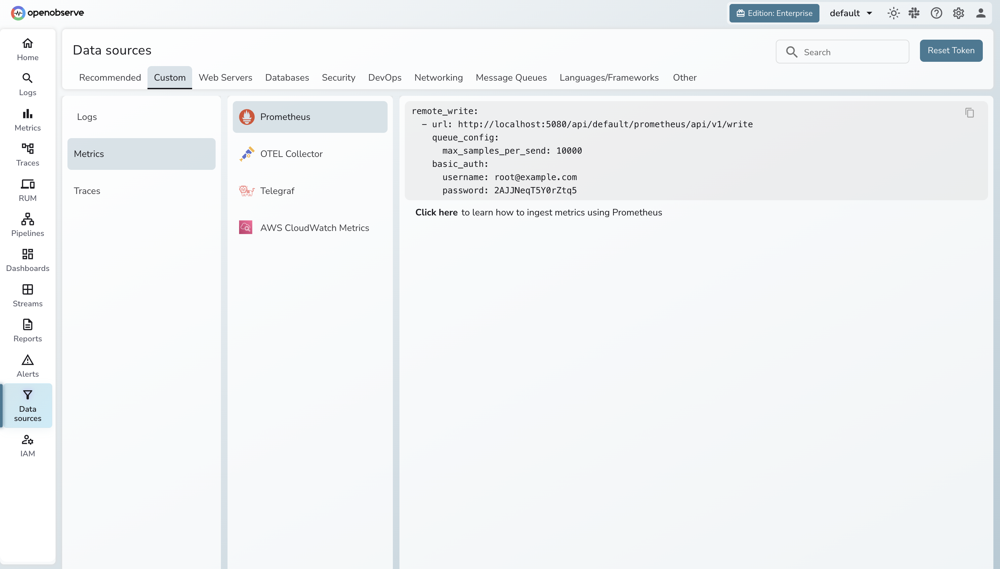
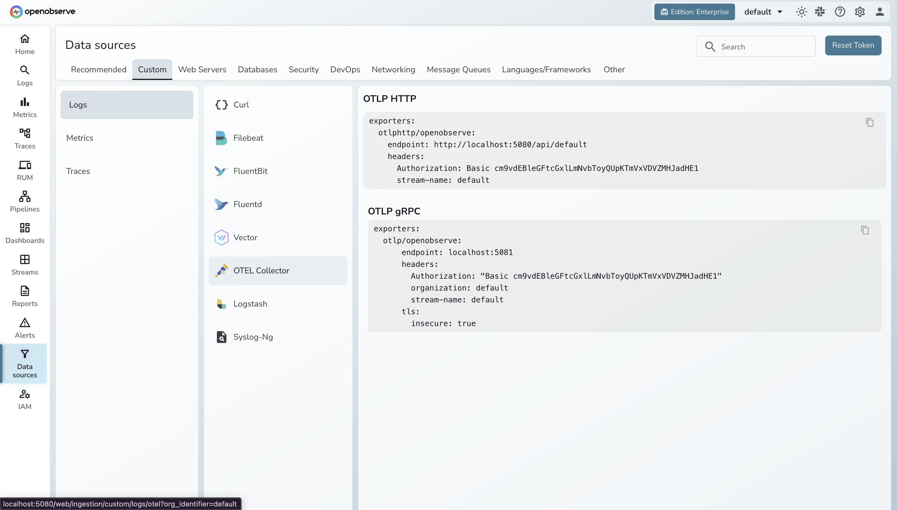
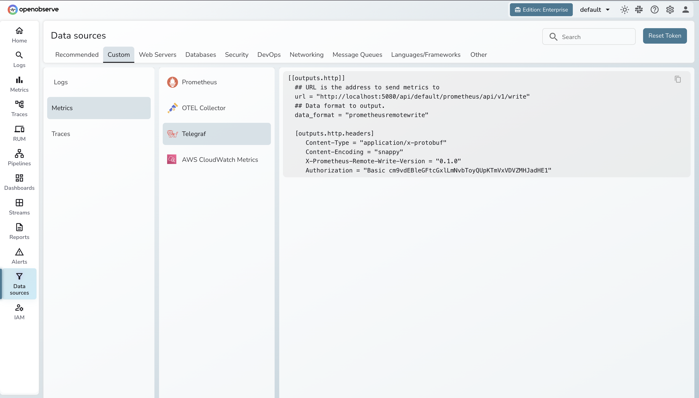
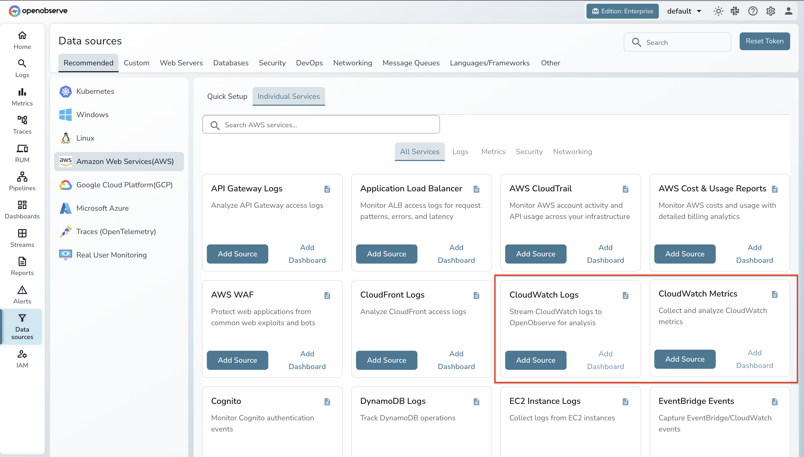
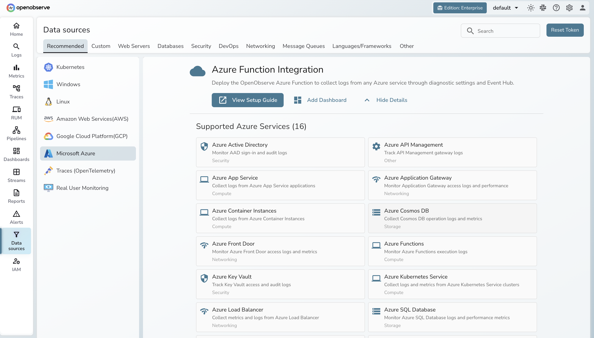
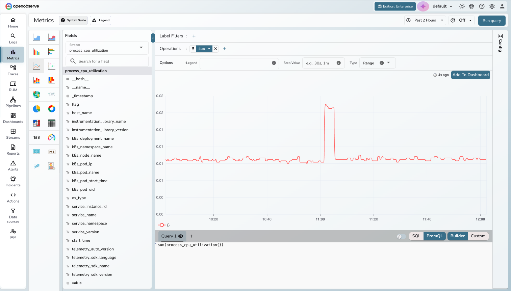

# Migrating Metrics

## Overview

This section walks you through migrating metrics from Mimir (or Prometheus) to OpenObserve. You will:

1. Assess what metric sources you currently have
2. Identify the migration path for each source type
3. Update configs to point at OpenObserve
4. Validate that metrics are flowing correctly

OpenObserve supports Prometheus remote write natively and accepts OTLP metrics, so migration typically involves changing an endpoint URL in your collector or Prometheus config.

## Step 1: Assess Your Current Metric Sources

Run this PromQL query in Grafana (against your Mimir/Prometheus data source) to see what's active:

```promql
count({__name__=~".+"}) by (job)
```

This gives you a list of jobs (e.g. `node_exporter`, `kubernetes-pods`, `myapp`) and series count for each.

## Step 2: Categorize Your Sources

Group your metrics by how they're currently collected:

| Source Type | Examples | Migration Path |
|---|---|---|
| **Prometheus server with remote_write to Mimir** | Scraping exporters, K8s service discovery | [Update remote_write URL](#from-prometheus-server) |
| **OTel Collector sending to Mimir** | `prometheusremotewrite` exporter | [Switch to otlphttp exporter](#from-otel-collector) |
| **Grafana Agent / Alloy** | Agent `metrics` block with `remote_write` | [Update endpoint](#from-grafana-agent--alloy) |
| **Telegraf** | `outputs.http` with `prometheusremotewrite` | [Update output URL](#from-telegraf) |
| **Kubernetes (kube-prometheus-stack)** | Prometheus Operator, ServiceMonitors | [Update remoteWrite in Helm values](#from-kubernetes-kube-prometheus-stack) |
| **AWS CloudWatch metrics** | CloudWatch → OTel Collector or Telegraf | [See dedicated guide](#from-aws-cloudwatch) |
| **Azure Monitor metrics** | Azure Event Hub → OTel Collector | [See dedicated guide](#from-azure-monitor) |

## Step 3: Migrate Each Source

### From Prometheus Server

If you're running Prometheus with `remote_write` to Mimir, update the destination URL:

**Current config:**
```yaml
# prometheus.yml
remote_write:
  - url: http://mimir:9009/api/v1/push
```

Update the `url` to the OpenObserve remote write endpoint and add your credentials.


*You can copy the exact Prometheus remote write configuration from the OpenObserve Data Sources UI*

Reload Prometheus after updating (no restart needed):
```bash
curl -X POST http://localhost:9090/-/reload
```

Your Prometheus exporters (node_exporter, cAdvisor, kube-state-metrics, mysqld_exporter, etc.) don't change at all — they expose metrics, and Prometheus scrapes them the same way. Only the `remote_write` destination changes.

---

### From OTel Collector

If you're using the OTel Collector with the `prometheusremotewrite` exporter to send metrics to Mimir, switch to the `otlphttp` exporter.

**Current config:**
```yaml
exporters:
  prometheusremotewrite:
    endpoint: http://mimir:9009/api/v1/push
```

Copy the exact updated configuration from the **Data Sources UI** in OpenObserve.




---

### From Grafana Agent / Alloy

Grafana Agent reached EOL on November 1, 2025, replaced by Grafana Alloy.

**Current Grafana Agent config:**
```yaml
metrics:
  configs:
    - name: default
      remote_write:
        - url: http://mimir:9009/api/v1/push
```

**Updated config**:

```yaml
logs:
  configs:
    - name: default
      clients:
        - url: http://openobserve:5080/api/default/_json
          basic_auth:
            username: admin@example.com
            password: Complexpass#123
```


Update the `remote_write` URL to the OpenObserve endpoint. Copy the exact configuration from the **Data Sources UI** in OpenObserve.

Or replace with [OpenObserve Collector](https://github.com/openobserve/openobserve-helm-chart/blob/main/charts/openobserve-collector/README.md).


---

### From Telegraf

**Current config:**
```toml
[[outputs.http]]
  url = "http://mimir:9009/api/v1/write"
  data_format = "prometheusremotewrite"
```

Update the output URL to the OpenObserve endpoint. Copy the exact configuration from the **Data Sources UI** in OpenObserve.




> **Dedicated guide :** [Telegraf → OpenObserve](https://openobserve.ai/blog/how-to-set-up-telegraf-for-http-metrics-collection/)

---

### From Kubernetes (kube-prometheus-stack)

If you deployed Prometheus via the `kube-prometheus-stack` Helm chart with `remoteWrite` to Mimir:

**Create the secret first:**
```bash
kubectl create secret generic openobserve-secret \
  --from-literal=username=admin@example.com \
  --from-literal=password=Complexpass#123 \
  -n monitoring
```

**Update your Helm values:**
```yaml
prometheus:
  prometheusSpec:
    remoteWrite:
      - url: http://openobserve:5080/api/default/prometheus/api/v1/write
        basicAuth:
          username:
            name: openobserve-secret
            key: username
          password:
            name: openobserve-secret
            key: password
```

**Apply the changes:**
```bash
helm upgrade kps1 prometheus-community/kube-prometheus-stack -f values.yaml -n monitoring
```

---

### From AWS CloudWatch

For detailed steps on ingesting AWS CloudWatch metrics into OpenObserve, see the dedicated guide:




> **Dedicated guide:** [AWS CloudWatch Metrics → OpenObserve](https://openobserve.ai/blog/monitor-aws-rds-with-cloudwatch-metrics/)

---

### From Azure Monitor

For detailed steps on ingesting Azure Monitor metrics into OpenObserve, see the dedicated guide:




> **Dedicated guide:** [Azure Monitor Metrics → OpenObserve](https://openobserve.ai/blog/azure-monitor-metrics/)

---

## Step 4: How to Verify


### Check in the UI

1. Open the OpenObserve UI → **Metrics** in the left sidebar.
2. Verify each job from your source inventory appears.
3. Run a test query — `sum(process_cpu_utilization{})` or any counter you know is active.
4. Confirm the values and timestamps match what you'd expect from the source.



*OpenObserve Metrics Explorer — verify metrics are flowing after migration*

### Troubleshooting

- **No data:** Check collector logs for connection errors or auth failures. Confirm the `remote_write` or `otlphttp` exporter URL is correct and reachable.
- **Missing labels:** Ensure your collector isn't stripping labels. Remote write passes all Prometheus labels through by default.
- **Case mismatch in PromQL:** OpenObserve label matching is case-sensitive. Confirm label values match exactly as ingested.

## PromQL Compatibility

OpenObserve supports PromQL for metrics queries. Common functions — `rate()`, `histogram_quantile()`, `sum by()`, `avg_over_time()`, and label matchers — work as expected.

## Next Steps

- [Migrating Traces](traces.md) — migrate your trace sources next
- [Migrating Logs](logs.md) — migrate your log sources

---

[Back to Overview](index.md) | Previous: [Architecture & Terminology](architecture.md) | Next: [Migrating Traces](traces.md)
