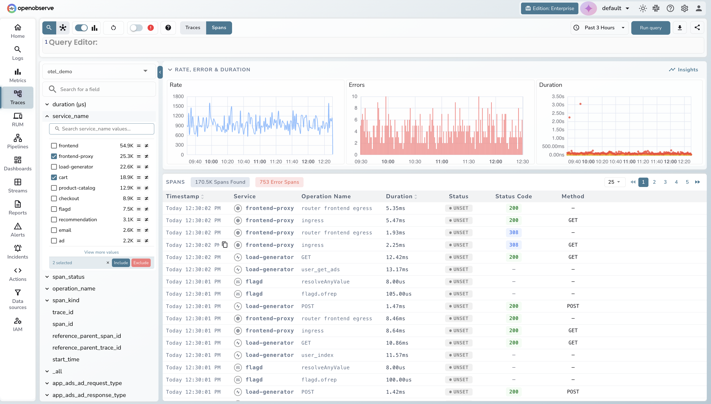
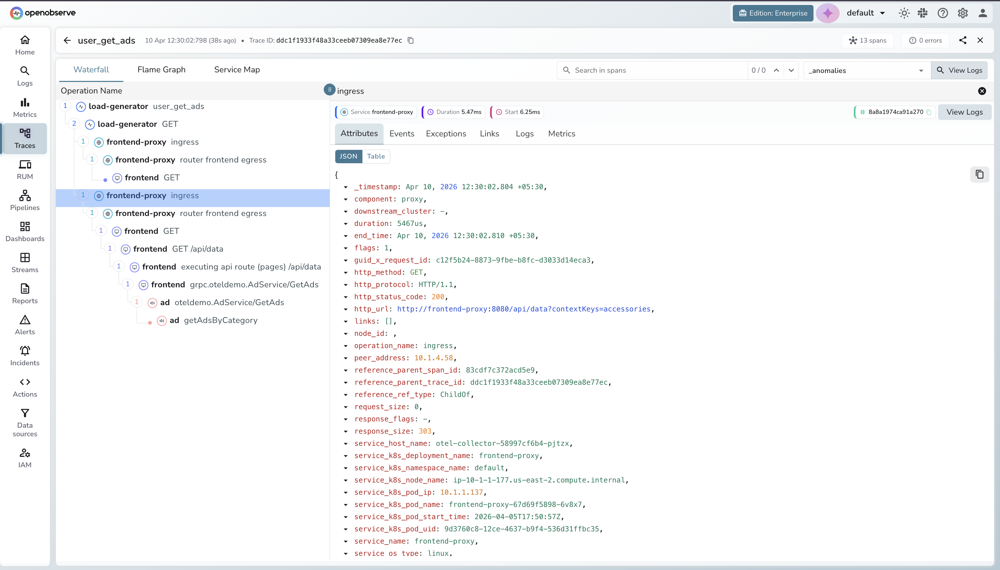

# Migrating Traces

## Overview

This section walks you through migrating distributed traces from Tempo to OpenObserve. You will:

1. Assess how traces currently reach Tempo
2. Identify the migration path for each source type
3. Update configs to point at OpenObserve
4. Validate that traces are flowing correctly

Trace migration is typically the **easiest signal to migrate**. Most modern setups already use OTLP to send traces to Tempo, so migration is often just changing the endpoint URL.

## Step 1: Assess Your Current Trace Sources

Check how traces currently reach Tempo. Common setups:

- OTel Collector forwarding OTLP spans to Tempo
- Application SDKs (OpenTelemetry SDK for Go, Java, Python, Node.js, etc.) sending directly via OTLP
- Jaeger Agent or Jaeger Collector → Tempo
- Zipkin → Tempo via the OTel Collector

To see what's sending traces, query Tempo or look at your collector config for exporters pointing to port `4317` (OTLP gRPC) or `4318` (OTLP HTTP).

## Step 2: Categorize Your Sources

| Source Type | Migration Path |
|---|---|
| **OTel Collector with `otlp` exporter to Tempo** | [Update OTLP exporter endpoint](#from-otel-collector) |
| **Application SDK sending OTLP directly to Tempo** | [Update SDK endpoint config](#from-application-sdks) |
| **Jaeger Agent / Jaeger Collector** | [See dedicated guide](#from-jaeger) |
| **Zipkin** | [See dedicated guide](#from-zipkin) |

## Step 3: Migrate Each Source

### From OTel Collector

This is the most common setup. The OTel Collector receives traces and forwards them to Tempo using the `otlp` exporter.

**Current config:**
```yaml
exporters:
  otlp:
    endpoint: tempo:4317
    tls:
      insecure: true
```

Copy the exact updated configuration from the **Data Sources UI** in OpenObserve.


!!! tip "Send all signals through one exporter"
    If you're already migrating metrics or logs, you can consolidate all signals (metrics, logs, traces) into a single `otlphttp/openobserve` exporter — one endpoint, one auth header, all signals.

---

### From Application SDKs

If your application sends traces directly to Tempo using an OpenTelemetry SDK, only the endpoint URL needs to change — no code changes required. See the dedicated guides for complete configuration examples per language:

- [Go traces ingestion guide](https://openobserve.ai/docs/ingestion/traces/go/)
- [Node.js traces ingestion guide](https://openobserve.ai/docs/ingestion/traces/nodejs/)
- [Python traces ingestion guide](https://openobserve.ai/docs/ingestion/traces/python/)
- [Rust traces ingestion guide](https://openobserve.ai/docs/ingestion/traces/rust/)


---

### From Jaeger

For detailed steps on migrating from Jaeger to OpenObserve, see the dedicated guide:

> **Dedicated guide:** [Jaeger → OpenObserve](https://openobserve.ai/blog/tracing-made-easy-a-beginners-guide-to-jaeger-and-distributed-systems/)

---

### From Zipkin

If applications use older Zipkin SDKs, use the OTel Collector as a protocol translation layer - no application code changes needed:

```yaml
receivers:
  zipkin:
    endpoint: 0.0.0.0:9411

exporters:
  otlphttp/openobserve:
    endpoint: http://openobserve:5080/api/default
    headers:
      Authorization: "Basic <base64-creds>"

service:
  pipelines:
    traces:
      receivers: [zipkin]
      processors: [batch]
      exporters: [otlphttp/openobserve]
```

When you're ready, consider switching the SDKs themselves to OpenTelemetry - the Jaeger project itself recommends this.


---


## Step 4: How to Verify


### Check in the UI

1. Open the OpenObserve UI → **Traces** in the left sidebar.
2. Select a trace stream and set a time range 
3. Filter by `service.name` to find your services.
4. Click into a trace to verify spans, durations, and attributes are intact.


*OpenObserve Traces Explorer — verify traces are flowing after migration*



*OpenObserve trace detail view showing spans and timing*

### Troubleshooting

- **No traces visible:** Check that the OTel Collector is running and the exporter shows no errors in its logs. Confirm the endpoint URL and auth header are correct.
- **Spans missing attributes:** If you switched from gRPC to HTTP, confirm you're using the correct port (`5081` for gRPC, `5080` for HTTP).
- **Service not appearing:** Ensure your spans have the `service.name` resource attribute set — this is required for traces to appear in the service list.
- **Auth errors (401):** Regenerate the Base64 credential string.

## Next Steps

- [Migrating Logs](logs.md) — migrate your log sources next
- [OpenObserve Traces Documentation](https://openobserve.ai/docs/user-guide/traces/) — exploring traces, filtering spans, and configuring trace settings in the UI

---

[Back to Overview](index.md) | Previous: [Migrating Metrics](metrics.md) | Next: [Migrating Logs](logs.md)
