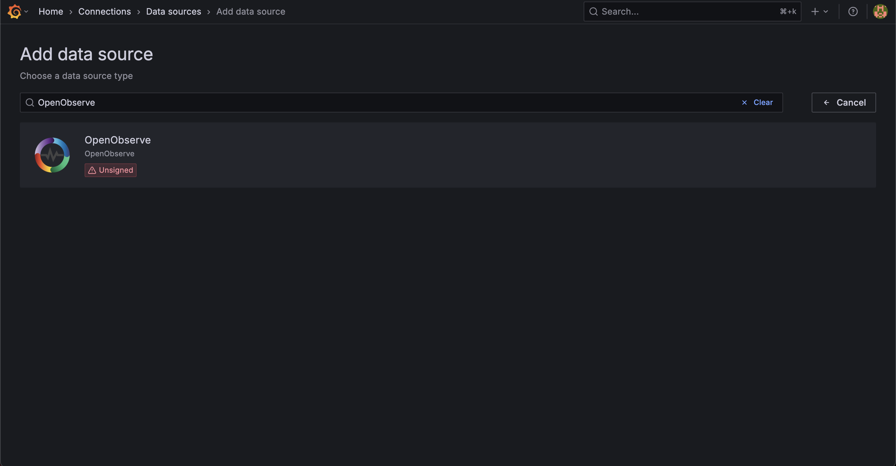
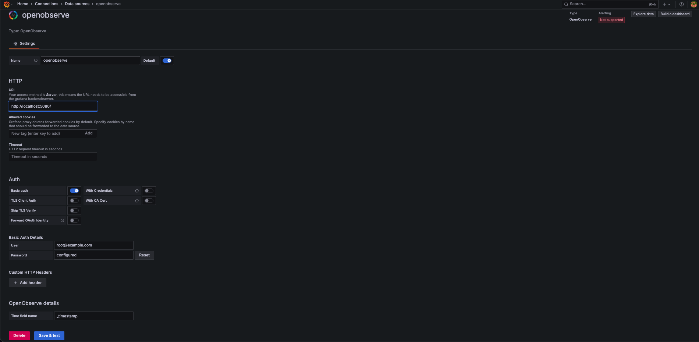
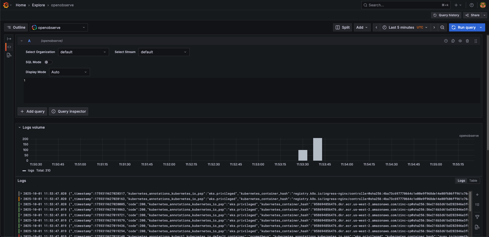

# OpenObserve Plugin for Grafana
This guide walks you through installing and configuring the openobserve plugin in Grafana within a Kubernetes environment. If you are not using Kubernetes, you can adapt these steps for your environment.

## Overview
Grafana is an open-source platform for creating dashboards and visualizations. 
OpenObserve provides its own interface for [logs](../features/logs.md), [metrics](../features/metrics.md), [tracing](../features/distributed-tracing.md), [frontend monitoring](../features/frontend.md), [dashboards](../user-guide/dashboards/dashboards-in-openobserve.md), and [alerting and notifications](../user-guide/alerts/alerts.md). 

The OpenObserve plugin for Grafana is an optional integration. It enables OpenObserve to be added as a Grafana data source, making it possible to use existing Grafana dashboards or combine OpenObserve data with other monitoring systems.

!!! note "Plugin maintenance status"
    OpenObserve actively maintains this Grafana plugin.

!!! note "Quick start"
    If you are familiar with the Grafana plugin installation process, proceed to download the plugin from [here](https://zincsearch-releases.s3.us-west-2.amazonaws.com/zo_gp/zo_gp.tar.gz) and move to [this](#use-grafana-plugin) step. 


## Install the OpenObserve plugin in Grafana

??? "Prerequisite"
    **Storage Requirements** <br>
    Grafana requires persistent storage for two things: configuration and data.

    - Configuration can be stored in a ConfigMap or Secret.
    - Data must be stored in a database. Grafana supports SQLite, MySQL, and PostgreSQL.
    Most Grafana installations run on a single node with SQLite.
  

    **Deployment method** <br>
    In Kubernetes, you deploy applications using either a Deployment or StatefulSet. Since Grafana needs persistent storage for its data, your choice depends on which database you use:

    - **SQLite** stores data files inside the pod itself. Use a `StatefulSet` to preserve this data when the pod restarts.
    - **MySQL or PostgreSQL** store data in an external database. Use a `Deployment` since the data persists outside the pod.

    !!! note "Note"
        This guide uses a StatefulSet with SQLite.

??? "Step 1: Create the configuration file"
    Create a `grafana.ini` file with the following configurations. 

    ```ini title="grafana.ini" linenums="1" hl_lines="4 9"
    [date_formats]
    default_timezone = UTC
    [server]
    root_url = https://grafana.yourdomain.com

    [plugins]
    enable_alpha = true
    app_tls_skip_verify_insecure = false
    allow_loading_unsigned_plugins = openobserve
    ```

    **Important**:

    - In `Line 4`, you must update the `root_url` with the root URL of your Grafana installation. This is the URL that you will use to access grafana. For example, `https://grafana.yourdomain.com`. 
    - In `Line 9`, you must specify that Grafana should use the unsigned plugin `openobserve`.You will install this plugin using the `init container` in the `statefulset`.


??? "Step 2: Create a Kubernetes secret"
    Once you have created the file, you can create a Kubernetes secret using the below command.

    ```bash linenums="1"
    kubectl create secret generic grafana-config --from-file=grafana.ini
    ```
    This secret is mounted into the Grafana container in the following StatefulSet YAML.

??? "Step 3: Create `grafana_statefulset.yaml`"     
    This file includes an init container that downloads and configures the `openobserve` plugin for the Grafana container.

    ```yaml title="grafana_statefulset.yaml" linenums="1"
    apiVersion: apps/v1
    kind: StatefulSet
    metadata:
      name: grafana
    spec:
      serviceName: "grafana"
      replicas: 1
      selector:
        matchLabels:
          app: grafana
      template:
        metadata:
          labels:
            app: grafana
        spec:
          securityContext:
            fsGroup: 2000
            runAsUser: 10000
            runAsGroup: 3000
          initContainers:
            - name: openobserve-plugin-loader
              image: wbitt/network-multitool
              imagePullPolicy: IfNotPresent
              command:
                [
                  "sh",
                  "-c",
                  "curl -o /var/lib/grafana/plugins/zo_gp.tar.gz https://zincsearch-releases.s3.us-west-2.amazonaws.com/zo_gp/zo_gp.tar.gz && cd /var/lib/grafana/plugins &&  tar -zxvf zo_gp.tar.gz",
                ]
              volumeMounts:
                - name: grafana-base
                  mountPath: /var/lib/grafana
                - name: grafana-plugins
                  mountPath: /var/lib/grafana/plugins
          containers:
            - name: grafana
              image: grafana/grafana:latest
              ports:
                - containerPort: 3000
                  name: grafana
              volumeMounts:
                - name: grafana-base
                  mountPath: /var/lib/grafana
                - name: grafana-plugins
                  mountPath: /var/lib/grafana/plugins
                - name: grafana-config
                  mountPath: /etc/grafana
          volumes:
            - name: grafana-base
              persistentVolumeClaim:
                claimName: grafana-base
            - name: grafana-plugins
              persistentVolumeClaim:
                claimName: grafana-plugins
            - name: grafana-config
              secret:
                defaultMode: 420
                secretName: grafana-config
      volumeClaimTemplates:
        - metadata:
            name: grafana-base
          spec:
            accessModes: ["ReadWriteOnce"]
            resources:
              requests:
                storage: 1Gi
        - metadata:
            name: grafana-plugins
          spec:
            accessModes: ["ReadWriteOnce"]
            resources:
              requests:
                storage: 1Gi
    ---
    apiVersion: v1
    kind: Service
    metadata:
      name: grafana
    spec:
      ports:
        - port: 3000
          targetPort: 3000
      selector:
        app: grafana

    ```
??? "Step 4: Deploy the `openobserve` plugin"
    Run the following `kubectl apply` command to deploy the plugin:
    ```bash linenums="1"
    kubectl apply -f grafana_statefulset.yaml
    ```

## Use the OpenObserve plugin in Grafana

??? "Step 1: Set up data source" 
    From the Grafana interface, go to the **Data Sources** section and search for `openobserve`. 
    

??? "Step 2: Add OpenObserve data source server details"
    1. In the data source configuration screen, update the following fields: 

        - In the **HTTP** section, add the **URL**. 
        - In the **Auth** section, enable **Basic Auth** toggle. 
        - Under **Basic Auth Details**, add the User ID and password. 
    2. Click **Save and Test** to save the changes. <br>
    
    If everything is correct you should see a success message.

??? "Step 3: Explore logs"
    1. Click the **Explore** menu and select `openobserve` as the data source.
    2. Select appropriate organization, stream, and time range. 
    3. Click **Run Query**. <br>
    You should now be able to see the results.
    


!!! note "Note"
    If you want to explore metrics from OpenObserve in Grafana, you can set up OpenObserve as a Prometheus-compatible data source using an endpoint like [https://api.openobserve.ai/api/org_name/prometheus](https://api.openobserve.ai/api/org_name/prometheus). You do not need the plugin for this, as Grafana supports Prometheus natively.


