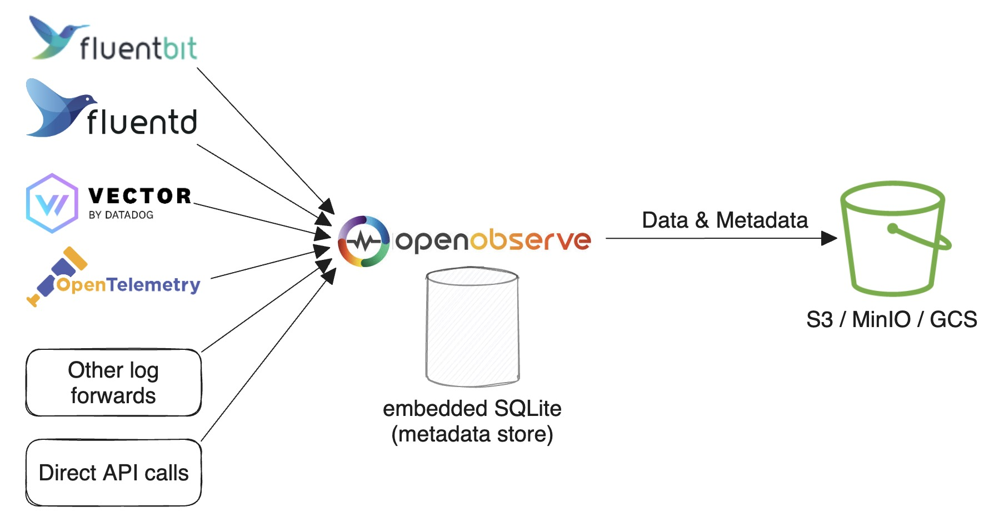
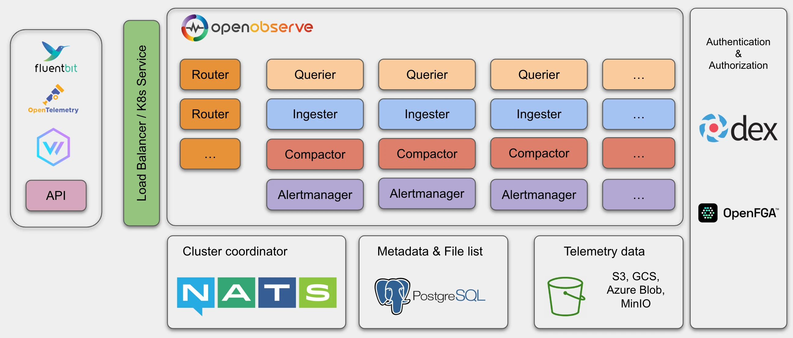
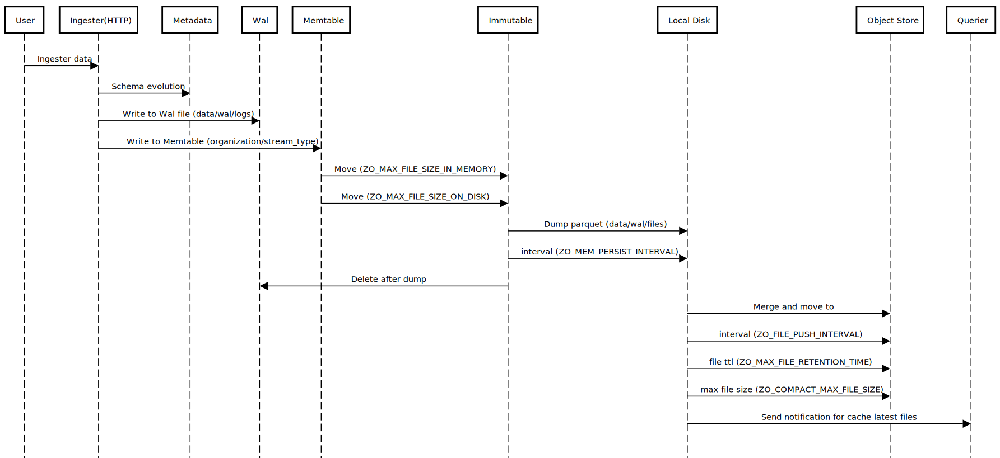
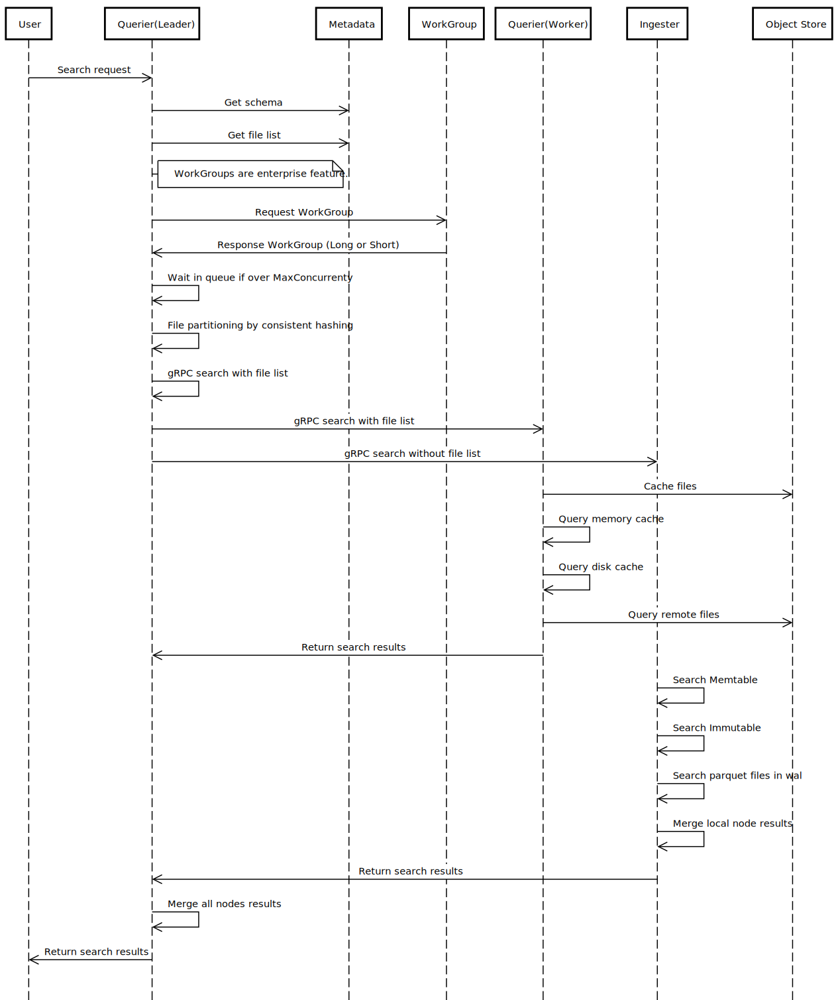

> Applicable to open source & enterprise version
# Architecture and deployment modes

OpenObserve can be run in single node or in HA mode in a cluster. 

## Single Node

Please refer to [quickstart](../quickstart.md) for single node deployments.

### SQLite and Local disk

Use this mode for light usage and testing or if HA is not a requirement for you. (You could still ingest and search over 2 TB on a single machine per day. On a mac M2 in our tests, you can ingest at ~31 MB/Second or 1.8 GB/Min or 2.6 TB/Day with default configuration). This is the default mode for running OpenObserve. Check [Quickstart](../quickstart.md) to find various ways to get this setup done.

### SQLite and Object storage

## High Availability (HA) mode

Local disk storage is not supported in HA mode. Please refer to [HA Deployment](../ha_deployment.md) for cluster mode deployment.

Router, Querier, Ingester, Compactor and AlertManager nodes both can be horizontally scaled to accommodate for higher traffic.

NATS is used as cluster coordinator and store the nodes information. it also used for cluster events.

MySQL / PostgreSQL is used to store metadata like organization, users, functions, alert rules, stream schema and file list (a index of parquet files).

Object Storage (e.g. s3, minio, gcs, etc...) stores all the data of parquet files.

## Durability

Astute users may notice that, on ingesters data is stored temporarily for batching before being sent to highly durable s3 (s3 is designed for 99.999999999% durability). There is only 1 copy of the data temporarily on the ingester and it may seem that this lends data to be vulnerable to loss in case of the disk failure before it is sent to s3. That is not entirely true though and there are ways to handle the lack of redundancy here. Most distributed systems that have been built in past were built in an era where storage was much less reliable than it is today and you would make 2-3 copies to ensure that you do not loose data. 

In addition to that, in environments like AWS replicating data across multiple availability zones results in the penalty of cross AZ data transfer (2 cents per GB - 1 cent in each direction). In fact Amazon EBS volumes are already replicated within an AZ providing you with a highly durable storage. Standard GP3 EBS volumes provide 99.8% durability which is very high compared to regular disks. io2 volumes that OpenObserve team uses for its cloud service provides 99.999% durability which is even higher and at this level you don't really need to make multiple copies for durability.

For self hosted scenarios we recommend to use RAID-1 to ensure that you have redundancy at the disk level.

By choosing to build the system this way we are able to build a much more cost effective and simpler solution without having to manage ongoing replication of data across multiple nodes and the costs (money and complexity) associated with it.

## Components

### Ingester

Ingester is used to receive ingest request and convert data into parquet format and store it in object storage. They store data temporarily in WAL before transferring it to object storage.

The data ingestion flow is:

1. receive data from HTTP / gRPC API request.
1. parse data line by line.
1. check if there are any functions (ingest functions) used to transform data, call each ingest function by the function order
1. check for timestamp field, convert timestamp to microseconds; set current timestamp, if timestamp field isn't present in record.
1. check stream schema to identify if schema needs evolution. Here if we find the schema need to be updated for addition of new fields or change of data type for existing fields, acquire `lock` to update schema.
1. evaluate real time alerts if any defined for the stream.
1. write to WAL file by timestamp in hourly buckets and then convert records in a request to Arrow RecordBatch and write into Memtable. 

    1. Create Memtable per `organization/stream_type`, if data is being ingested for `logs` only there would be only one Memtable.
    1. The WAL file and Metable are created in pair , one WAL file has one Memtable.WAL files are located at `data/wal/logs`.

1. As the Memtable size reaches `ZO_MAX_FILE_SIZE_IN_MEMORY=256` MB or the WAL file reached `ZO_MAX_FILE_SIZE_ON_DISK=128` MB ,we will move the Memtable to Immutable and create a new Memtable & WAL file for writing data.
1. Every `ZO_MEM_PERSIST_INTERVAL=5` seconds will dump Immutable to local disk. One Immutable will result in multiple parquet files as it may contain multiple streams and multiple partitions, the parquet files are located at `data/wal/files`.
2. Every `ZO_FILE_PUSH_INTERVAL=10` seconds we check local parquet files if any partition total size is above  `ZO_MAX_FILE_SIZE_ON_DISK=128` MB or any file has been `ZO_MAX_FILE_RETENTION_TIME=600` seconds ago all such small files in a partition will be merged into a big file (each big file will be maximum `ZO_COMPACT_MAX_FILE_SIZE=256` MB) , which will be moved to object storage.

**Ingester has three parts of data:**

1. data in Memtable
1. data in Immutable
1. parquet files in `wal` haven't upload to object storage.

All of these need to be queried.

### Querier

Querier is used to query data. Queriers nodes are fully stateless.

The data query flow is:

1. receive search request using http API. The node receiving the query request becomes `LEADER querier for the query`. Other queriers are `WORKER queriers for query`.
1. `LEADER` parses and verifies SQL.
1. `LEADER` finds the data time range and gets file list from file list index.
1. `LEADER` fetches querier nodes from cluster metadata.
1. `LEADER` partitions list of files to be queried by each querier. e.g. If 100 files needs to be queried and there are 5 querier nodes, each querier gets to query 20 files `LEADER` works on 20 files, `WORKERS` work on 20 files each.
1. `LEADER` calls gRPC service running on each `WORKER` querier to dispatch search query to the querier node. Inter querier communication happens using gRPC.
1. `LEADER` collects, merges and sends the result back to the user.

Tips:

1. The queriers will cache parquet files in memory by default. You can configure the amount of memory used by a querier for caching using environment variable `ZO_MEMORY_CACHE_MAX_SIZE`.  Default caching is done with 50% of the memory available to the particular querier.
1. In distributed environment each querier node will just cache a part of the data.
1. We also have an option to enable caching latest parquet files in memory. The ingester will notify queriers to cache the file when ingester generates a new parquet file and uploads it to object storage.

#### Federated Search > `Applicable to enterprise version`

The federated search spans over multiple OpenObserve cluster:

1. receive search request on one of the clusters, the node receiving the query request is called `LEADER cluster for the query`. Other clusters are `WORKER clusters for that query`.
2. `LEADER cluster` finds all the clusters using super cluster metadata.
3. `LEADER cluster` calls gRPC service on each `WORKER cluster` with same query payload as input.
4. `WORKER cluster` execute query as described above, one of the node becomes a `LEADER querier` in every cluster and call other `WORKER queriers` in same cluster and results from all workers & leader are merged by `LEADER cluster`.
5. `LEADER cluster` collects, merges and sends the result back to the user.

### Compactor

Compactor merges small files into a big files to make searches more efficient. Compactor also enforces data retention policy, full stream deletion and updating of file list index.

### Router

Router dispatches requests to ingester or querier. It also responds with the GUI in the browser. Router is a super simple proxy to send appropriate requests between ingester and querier.

### AlertManager

AlertManager runs the Standard alert queries, report jobs and sends notification.
