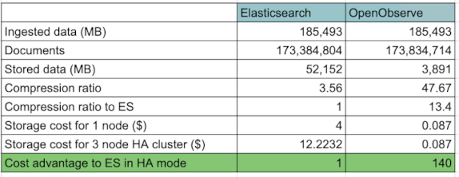

## How does OpenObserve compare to Elasticsearch

Elasticsearch is a general purpose search engine which can be used for app search or log search. OpenObserve is built specifically for log search. If you are looking for a lightweight alternative to Elasticsearch then you should take a look at ZincSearch.

#### Technical Advantages
OpenObserve provides ability to index data in multiple ways to make it faster yet keep storage size low. It uses a combination of:

- Partitioning
- Bloom filters
- Inverted indexes
- Caching
- Columnar storage

[Uber found 80% of queries in their production environment to be aggregation queries](https://www.uber.com/en-IN/blog/logging/) and columnar data storage of OpenObserve means that aggregation queries will typically be much faster than Elasticsearch.

#### Storage Cost Comparison

Below is the result when we sent real life log data from our kubernetes cluster to both Elasticsearch and OpenObserve using fluentbit. This only pertains to storage. Cost of EBS volume is [8 cents/GB/Month (GP3)](https://aws.amazon.com/ebs/pricing/), cost of s3 is [2.3 cents/GB/month](https://aws.amazon.com/s3/pricing/). In HA mode in Elasticsearch you generally have 1 primary node and 2 replicas. You don't need to replicate s3 for data durability/availability as [AWS redundantly stores your objects on multiple devices across a minimum of three Availability Zones (AZs) in an Amazon S3 Region](https://aws.amazon.com/s3/faqs/).

OpenObserve offers significant advantage of 140x lower storage costs compared to Elasticsearch in the above scenario. Your actual results may vary depending on how compressible your specific log data is. This doesn't even consider additional unused EBS volume capacity and monitoring overhead.

#### Operational Advantages

- `Stateless Architecture`: Scale horizontally without data replication or corruption challenges
- `No Index Mapping`: Hassle-free cluster management without index mapping complexities
- `Lower Operational Cost`: Significantly reduced effort in managing clusters
- `Built-in GUI`: Eliminates need for additional components like Kibana
- `Rust Performance`: Awesome performance without JVM challenges
- `Purpose-Built`: Built from ground up as observability tool, not general-purpose search

## Elasticsearch compatibility

OpenObserve `_bulk` API endpoint is elasticsearch compatible and can be used by log forwarders like fluentbit, fluentd and vector. Filebeat is supported through zPlane.

Search and aggregation API compatibility with Elasticsearch is provided through zPlane.

zPlane is the enterprise product offered by ZincLabs that among other things provides Elasticsearch search and aggregation compatibility. Learn more about it at [zPlane docs](zplane)